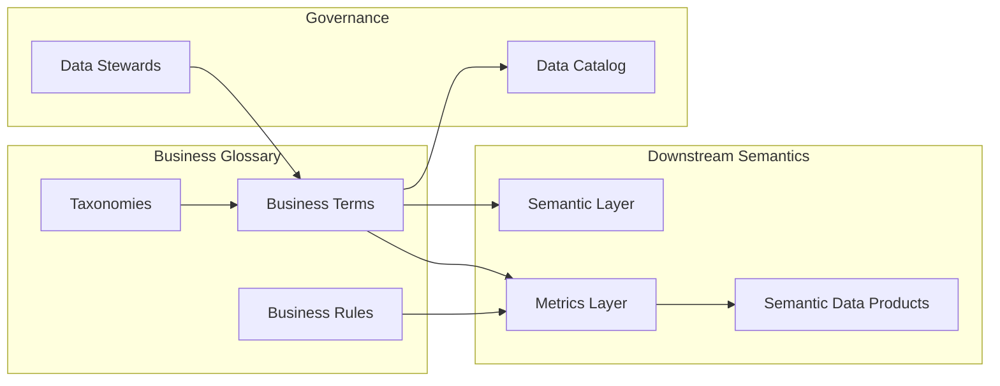

# Business Glossary

## Context

Business stakeholders, data engineers, and analysts use the same words to mean different things—"customer," "active user," "revenue," "churn"—because no shared vocabulary exists. A **business glossary** is the foundational artifact of enterprise semantics: a governed catalog of business terms with clear definitions, ownership, and relationships to data and metrics.

This document is the **canonical reference** for glossary structure and content. Enterprise-wide governance processes are documented in [Business Definition Governance](../../../00_Architecture_Governance/10_Data_Governance_And_Metadata/01_Metadata_Management/Semantic_Governance/Business_Definition_Governance.md); BI-facing usage patterns are in [Business Definitions](../../../06_Analytics_Architecture/01_BI_Architecture/Semantic_Layer_Architecture/Business_Definitions.md).

## Definition

A **business glossary** is a curated, enterprise-managed dictionary of business terms—each with a unique identifier, preferred definition, synonyms, antonyms, related terms, business owner, and optional links to physical data elements, metrics, and policies.

## Scope

| In scope | Out of scope |
| --- | --- |
| Glossary structure, term types, and relationships | Technical schema registry (column-level metadata) |
| Stewardship and approval workflow (modeling view) | Ontology and knowledge-graph modeling |
| Linkage to metrics and semantic models | Industry reference model content (TM Forum SID, BIAN) |
| Synonym and hierarchy management | Translation/localization workflows |

## Core concepts

### Term types

| Type | Description | Example |
| --- | --- | --- |
| **Business concept** | Core entity or idea in the domain | Customer, Product, Policy |
| **Business attribute** | Property of a concept | Customer Lifetime Value, Policy Effective Date |
| **Business process** | Activity or workflow | Claims Adjudication, Order Fulfillment |
| **Business rule** | Constraint or policy statement | "Active customer has transacted in last 90 days" |
| **Metric term** | Named measure; links to [Metrics Layer](02_Metrics_Layer.md) | Net Revenue, Churn Rate |

### Term metadata model

| Field | Purpose |
| --- | --- |
| `term_id` | Stable identifier (e.g., `CUST.ACTIVE`) |
| `preferred_name` | Canonical business label |
| `definition` | Authoritative plain-language meaning |
| `synonyms` | Alternate names used in source systems or departments |
| `related_terms` | Parent, child, or associative relationships |
| `domain` | Bounded context or business domain owner |
| `steward` | Person accountable for definition quality |
| `status` | proposed / approved / deprecated |
| `linked_metrics` | References to certified metrics |
| `linked_data_elements` | Optional mapping to physical columns or entities |

### Hierarchies and relationships

Glossaries support navigable structures:

- **Taxonomy**: `Customer` → `Retail Customer` → `Premium Retail Customer`
- **Association**: `Policy` ↔ `Claim` (related concepts)
- **Derivation**: `Churn Rate` derived from `Active Customer` and `Churned Customer`

Hierarchies must not duplicate conflicting definitions at parent and child levels; child terms **extend** parent definitions with additional constraints.

## Architecture pattern

The glossary is **upstream** of metrics and semantic models. Metrics reference glossary terms in their definitions; semantic layers expose glossary-aligned labels to consumers.

## Stewardship model

| Role | Responsibility |
| --- | --- |
| **Business owner** | Approves meaning; resolves domain disputes |
| **Data steward** | Maintains glossary entry quality, links, and status |
| **Data architect** | Ensures alignment with canonical and semantic models |
| **Consumer** | Uses approved terms; proposes new terms via intake process |

Detailed enterprise workflow: [Business Definition Governance](../../../00_Architecture_Governance/10_Data_Governance_And_Metadata/01_Metadata_Management/Semantic_Governance/Business_Definition_Governance.md).

## Business use cases

- **Onboarding**: New analysts search the glossary before building reports.
- **Data catalog integration**: Catalog columns inherit business term labels and definitions.
- **Metric certification**: Metric owners must cite glossary terms in metric definitions.
- **Cross-domain alignment**: Merging acquisitions requires mapping local terms to enterprise glossary entries.
- **AI grounding**: Agents and copilots retrieve glossary definitions to reduce hallucinated business language.

## Implementation guidance

1. **Start with high-conflict terms**—the 20–30 words that cause the most reporting disputes.
2. **One preferred definition per term**; capture synonyms separately, never as duplicate entries.
3. **Require business owner approval** before setting status to `approved`.
4. **Link every certified metric** to at least one glossary term.
5. **Integrate with the data catalog** so physical metadata inherits semantic labels.
6. **Review quarterly**; deprecate unused terms rather than leaving ambiguous entries.

## Anti-patterns

| Anti-pattern | Why it fails |
| --- | --- |
| IT-owned glossary without business sign-off | Definitions lack authority; adoption stalls |
| Duplicate terms per department | Defeats the purpose of enterprise semantics |
| Glossary disconnected from metrics/BI | Terms become documentation shelfware |
| Over-granular initial scope | Hundreds of draft terms; none reach approved status |

## Related topics

- [Metrics Layer](02_Metrics_Layer.md) — measures that reference glossary terms
- [Semantic Layer](03_Semantic_Layer.md) — exposes glossary-aligned labels to consumers
- [Business Semantic Model](04_Business_Semantic_Model.md) — entity-relationship view of business concepts
- [Semantic Standards](06_Semantic_Standards.md) — naming and definition conventions
- [Business Definition Governance](../../../00_Architecture_Governance/10_Data_Governance_And_Metadata/01_Metadata_Management/Semantic_Governance/Business_Definition_Governance.md) — enterprise approval workflow
- [Business Definitions](../../../06_Analytics_Architecture/01_BI_Architecture/Semantic_Layer_Architecture/Business_Definitions.md) — how analytics tools surface definitions

## ADR reference

- [ADR 009 Semantic Governance Strategy](../../../00_Architecture_Governance/03_Architecture_Decision_Records/Governance_And_Metadata/ADR_009_Semantic_Governance_Strategy.md)
