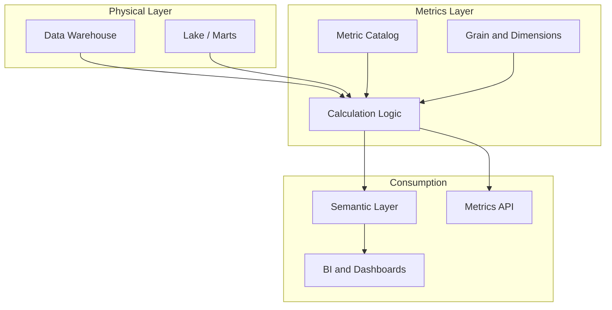

# Metrics Layer

## Context

Enterprises define the same business measure in multiple places—spreadsheets, BI tools, data marts, and operational reports—producing conflicting numbers for revenue, churn, or active customers. A **metrics layer** centralizes the **definition, calculation logic, and governance** of business measures so every consumer derives the same result from the same inputs.

This document is the **canonical modeling reference** for metrics. Analytics platform rollout patterns live in [Enterprise Metrics Layer](../../../06_Analytics_Architecture/01_BI_Architecture/Semantic_Layer_Architecture/Enterprise_Metrics_Layer.md); KPI standardization in analytics context is covered in [KPI Standardization](../../../06_Analytics_Architecture/01_BI_Architecture/Semantic_Layer_Architecture/KPI_Standardization.md).

## Definition

A **metrics layer** is a governed catalog of business measures—each with a unique identifier, business definition, dimensional context, calculation expression, grain, and ownership—that sits above physical data stores and below consumption tools (dashboards, APIs, agents).

## Scope

| In scope | Out of scope |
| --- | --- |
| Metric types, grain, and calculation patterns | BI tool-specific modeling (LookML, DAX, etc.) |
| Relationship to dimensions and semantic models | Physical ETL/ELT pipeline design |
| Metric ownership and lifecycle | Real-time streaming metric engines |
| Certified vs exploratory metrics | Vendor platform selection |

## Core concepts

### Metric types

| Type | Description | Example |
| --- | --- | --- |
| **Simple** | Aggregation over a single fact column | `SUM(order_amount)` |
| **Derived** | Arithmetic on other metrics | `Revenue - Cost = Gross_Margin` |
| **Ratio** | Numerator / denominator with guardrails | `Churned_Customers / Active_Customers` |
| **Cumulative** | Running total over ordered time | `YTD_Revenue` |
| **Semi-additive** | Additive across some dimensions only | `Account_Balance` (not additive across time) |
| **Non-additive** | Requires recalculation at query grain | `Distinct_Active_Users` |

### Grain and dimensional context

Every metric must declare its **grain**—the smallest combination of dimensions at which the measure is meaningful.

- **Atomic grain**: one row per event (e.g., order line)
- **Snapshot grain**: one row per entity per period (e.g., daily account balance)
- **Period grain**: aggregated to day, week, month, quarter, or fiscal period

A metric without an explicit grain invites misinterpretation when users slice across incompatible dimensions.

### Certified vs exploratory metrics

| Class | Governance | Use |
| --- | --- | --- |
| **Certified** | Approved by data steward and business owner; versioned | Executive reporting, regulatory filings, external disclosures |
| **Exploratory** | Draft or team-local; may change without enterprise notice | Ad hoc analysis, prototyping, sandbox dashboards |

Only certified metrics may appear in enterprise semantic layers and semantic data products.

## Architecture pattern

The metrics layer does not replace the semantic layer—it **feeds** it. The semantic layer exposes certified metrics with dimensions, filters, and access controls; the metrics layer owns **what** is measured and **how** it is calculated.

## Metric metadata model

Each metric entry should capture at minimum:

| Field | Purpose |
| --- | --- |
| `metric_id` | Stable enterprise identifier (e.g., `FIN.REVENUE.NET`) |
| `display_name` | Business-friendly label |
| `definition` | Plain-language meaning; link to [Business Glossary](01_Business_Glossary.md) terms |
| `formula` | Machine-readable expression or reference to semantic model measure |
| `grain` | Dimensional context and time aggregation |
| `owner` | Business owner and data steward |
| `status` | draft / certified / deprecated |
| `source_systems` | Upstream tables or data products |
| `related_kpis` | Parent or child KPI relationships |

## Business use cases

- **Single source of truth**: Finance and sales both report the same quarterly revenue without reconciliation meetings.
- **Self-service analytics**: Analysts compose dashboards from certified metrics instead of redefining SQL aggregations.
- **Regulatory reporting**: Auditors trace a published figure back to a versioned metric definition and lineage.
- **AI and agents**: LLM tools query a metrics API with governed definitions instead of hallucinating calculations.

## Implementation guidance

1. Start with a **small certified set** (10–20 metrics) covering the highest-conflict measures.
2. Map each metric to glossary terms in [Business Glossary](01_Business_Glossary.md) before certifying.
3. Express calculation logic once—in the semantic layer or a metrics store—and prohibit duplicate definitions in downstream tools.
4. Version metric changes; deprecate rather than silently alter certified definitions.
5. Publish lineage from metric → semantic model → physical table for impact analysis.

## Related topics

- [Business Glossary](01_Business_Glossary.md) — term definitions referenced by metrics
- [Semantic Layer](03_Semantic_Layer.md) — consumption abstraction over metrics and dimensions
- [Semantic Data Products](09_Semantic_Data_Products.md) — packaging certified metrics for domains
- [Semantic Governance](07_Semantic_Governance.md) — modeling-side ownership and change process
- [Enterprise Metrics Layer](../../../06_Analytics_Architecture/01_BI_Architecture/Semantic_Layer_Architecture/Enterprise_Metrics_Layer.md) — analytics rollout
- [Enterprise Semantics](../../../00_Architecture_Governance/10_Data_Governance_And_Metadata/01_Metadata_Management/Semantic_Governance/Enterprise_Semantics.md) — enterprise governance operating model

## ADR reference

- [ADR 007 Semantic Layer Strategy](../../../00_Architecture_Governance/03_Architecture_Decision_Records/Data_Architecture/ADR_007_Semantic_Layer_Strategy.md)
- [ADR 002 Semantic Layer Strategy](../../../00_Architecture_Governance/03_Architecture_Decision_Records/Analytics_Architecture/ADR_002_Semantic_Layer_Strategy.md)
