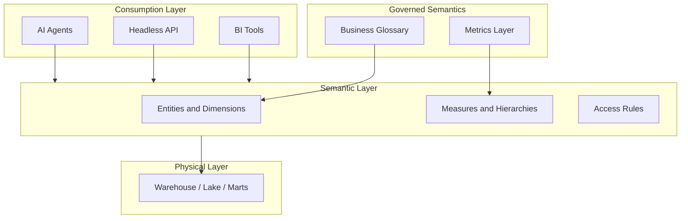

# Semantic Layer

## Context

Analysts and applications should not need to understand warehouse table layouts, join paths, or SQL dialects to answer business questions. A **semantic layer** provides a logical, business-oriented view of data—entities, dimensions, measures, filters, and relationships—mapped to physical sources. It is the primary consumption abstraction between governed semantics and BI tools, APIs, and AI agents.

This document defines the **semantic layer as a modeling pattern**. Platform strategy, vendor selection, and headless BI patterns are covered under [Semantic Layer Architecture](../../../06_Analytics_Architecture/01_BI_Architecture/Semantic_Layer_Architecture/).

## Definition

A **semantic layer** is a governed logical data model that exposes business-friendly objects (entities, dimensions, measures, hierarchies) with pre-defined relationships and calculations, abstracting consumers from physical storage and query complexity.

## Scope

| In scope | Out of scope |
| --- | --- |
| Logical model structure (entities, dimensions, measures) | Physical warehouse schema design |
| Mapping semantic objects to physical tables | ETL/ELT transformation logic |
| Access control and row-level security concepts | Tool-specific implementation (LookML, Tabular, etc.) |
| Relationship to metrics layer and glossary | Real-time OLAP engine internals |

## Core concepts

### Semantic layer components

| Component | Description |
| --- | --- |
| **Entity** | Business object (Customer, Order, Product) |
| **Dimension** | Descriptive attribute for slicing (Region, Product Category, Time) |
| **Measure** | Quantitative value; references [Metrics Layer](01_Metrics_Layer.md) definitions |
| **Hierarchy** | Ordered dimension levels (Year → Quarter → Month) |
| **Filter** | Reusable predicate (e.g., `status = 'Active'`) |
| **Relationship** | Join logic between entities (one-to-many, many-to-many with bridge) |

### Layering model

### Single definition principle

Calculation logic for certified measures must be defined **once** in the semantic layer (or metrics layer that feeds it). Downstream tools consume—not redefine—measures. Duplicate definitions in individual dashboards are an architectural violation.

## Semantic model structure

A well-formed semantic model documents:

1. **Entities and keys** — grain and primary identifiers
2. **Relationships** — cardinality, join keys, and fan-out risk
3. **Dimensions** — attributes with glossary-linked labels
4. **Measures** — certified metrics with aggregation rules
5. **Hierarchies** — drill paths for time, geography, organization
6. **Named filters** — standard business slices (fiscal year, active only)
7. **Physical mapping** — source tables/views without exposing them to consumers

See also [Semantic Model](05_Semantic_Model.md) and [Business Semantic Model](04_Business_Semantic_Model.md).

## Business use cases

- **Self-service BI**: Analysts drag dimensions and certified measures without writing joins.
- **Consistent reporting**: Every dashboard uses the same revenue definition.
- **Headless analytics**: Applications query a semantic API instead of raw SQL.
- **Multi-tool consumption**: One semantic model feeds Power BI, Looker, and custom apps.
- **AI copilots**: Agents query governed semantic objects with business labels.

## Design principles

| Principle | Rationale |
| --- | --- |
| **Glossary-aligned labels** | Dimension and measure names match [Business Glossary](02_Business_Glossary.md) preferred terms |
| **Certified measures only** | Exploratory calculations stay in sandbox models |
| **Explicit grain** | Every entity declares its grain to prevent fan-out |
| **Versioned changes** | Breaking changes require migration plan and consumer notification |
| **Least privilege** | Row-level and object-level security applied at semantic layer |

## Anti-patterns

| Anti-pattern | Consequence |
| --- | --- |
| Semantic layer per dashboard | Fragmented definitions; metric drift |
| Skipping metrics layer | Business logic embedded only in BI tools |
| Exposing raw table names to users | Leaks physical complexity; breaks on schema changes |
| Unbounded many-to-many joins | Inflated aggregations; wrong totals |

## Related topics

- [Metrics Layer](01_Metrics_Layer.md) — upstream measure definitions
- [Business Glossary](02_Business_Glossary.md) — term definitions for labels
- [Business Semantic Model](04_Business_Semantic_Model.md) — enterprise entity-relationship view
- [Semantic Model](05_Semantic_Model.md) — detailed model structure
- [Semantic Data Products](09_Semantic_Data_Products.md) — packaging semantics for domains
- [Semantic Layer Strategy](../../../06_Analytics_Architecture/01_BI_Architecture/Semantic_Layer_Architecture/Semantic_Layer_Strategy.md) — platform and rollout strategy
- [Semantic Layer Platforms](../../../06_Analytics_Architecture/01_BI_Architecture/Semantic_Layer_Architecture/Semantic_Layer_Platforms.md) — tool-specific implementation
- [Headless BI Architecture](../../../06_Analytics_Architecture/01_BI_Architecture/Semantic_Layer_Architecture/Headless_BI_Architecture.md) — API-driven consumption

## ADR reference

- [ADR 007 Semantic Layer Strategy](../../../00_Architecture_Governance/03_Architecture_Decision_Records/Data_Architecture/ADR_007_Semantic_Layer_Strategy.md)
- [ADR 002 Semantic Layer Strategy](../../../00_Architecture_Governance/03_Architecture_Decision_Records/Analytics_Architecture/ADR_002_Semantic_Layer_Strategy.md)
