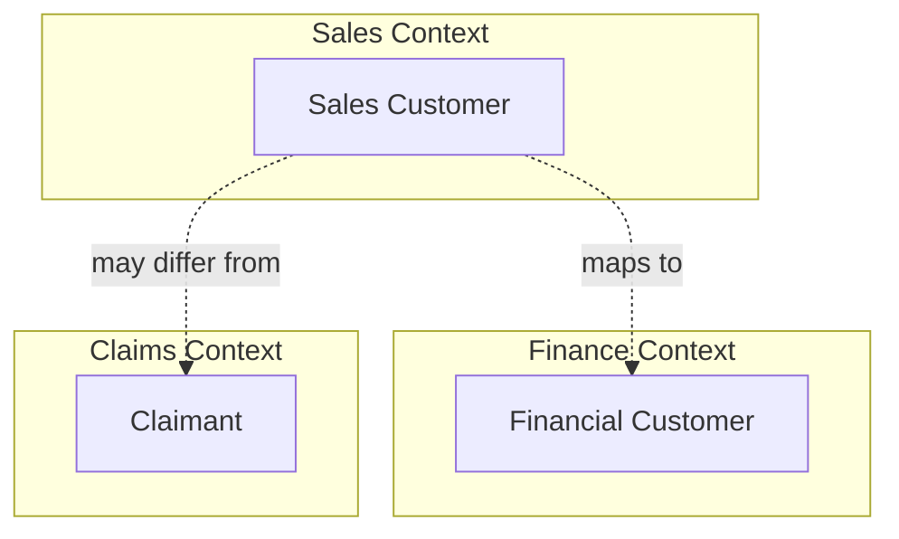
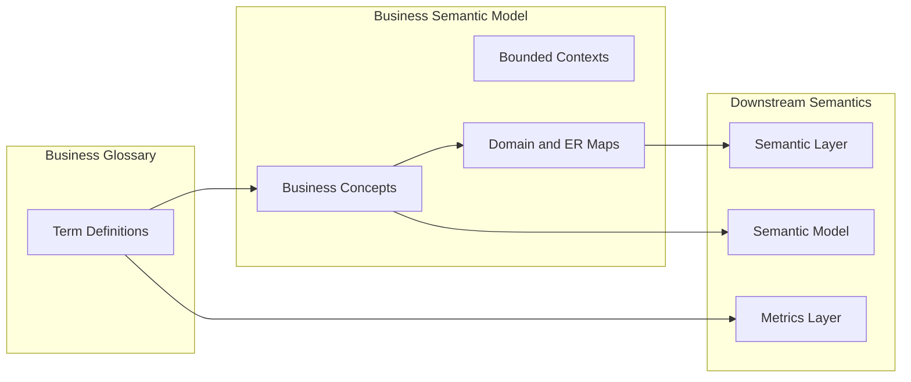

# Business Semantic Model

## Context

A glossary defines *what terms mean*; a semantic layer defines *how data is consumed*. Between them sits a gap: **how business concepts relate to each other** in domain language—without formal ontology notation or physical schema detail. A **business semantic model** captures entity-relationship views, domain maps, and bounded contexts that business stakeholders and domain architects can read and validate.

This document defines business-concept modeling from a **data modeling perspective**. Formal class/property structures are in [Semantic Model](05_Semantic_Model.md); RDF and graph deployment are in [Knowledge Graph Modeling](../03_Knowledge_Graph_Modeling/README.md).

## Definition

A **business semantic model** is a governed, business-readable representation of concepts, their attributes, and relationships within a domain or bounded context—linked to glossary terms and downstream semantic models, but independent of physical storage or formal ontology syntax.

## Scope

| In scope | Out of scope |
| --- | --- |
| Business-concept ER diagrams and domain maps | Formal ontology classes and axioms ([05](05_Semantic_Model.md)) |
| Bounded context boundaries and context maps | RDF triples and graph storage ([KG section](../03_Knowledge_Graph_Modeling/README.md)) |
| Concept-to-glossary linkage | Physical warehouse schema design |
| TOGAF-style business information maps | Industry reference model content (cross-link to [Industry Reference Models](../04_Industry_Reference_Models/README.md)) |
| Relationship to semantic layer entities | BI tool-specific modeling |

## Core concepts

### Model components

| Component | Description | Example |
| --- | --- | --- |
| **Business concept** | Named idea in the domain; maps to glossary term | Customer, Policy, Claim |
| **Concept attribute** | Descriptive or identifying property of a concept | Policy Effective Date, Customer Segment |
| **Relationship** | Business association between concepts | Customer *holds* Policy; Policy *generates* Claim |
| **Bounded context** | Scope where a concept has one unambiguous meaning | Sales context vs. Finance context for "Customer" |
| **Domain map** | Visual overview of contexts and their relationships | Context map across Sales, Billing, Claims |

### Concept-to-glossary linkage

Every concept in a business semantic model must reference a **glossary term ID** from [Business Glossary](01_Business_Glossary.md). The model adds **structural context** (relationships, cardinality, context boundaries); the glossary holds the **authoritative definition**.

| Glossary provides | Business semantic model adds |
| --- | --- |
| Preferred name and definition | Relationships to other concepts |
| Synonyms and hierarchies | Cardinality and optionality |
| Steward and status | Bounded context assignment |
| Linked metrics | Concept groupings and domain boundaries |

### Bounded contexts

When the same word means different things in different domains, model them as **separate concepts in separate contexts** rather than forcing a single overloaded definition.

Context maps document **upstream/downstream** and **partnership** relationships between domains (aligned with domain-driven design context mapping).

## Architecture pattern

## Modeling guidelines

### ER diagram conventions

- Use **business language** labels; avoid physical table or column names.
- Show **cardinality** (1:1, 1:N, N:M) at the business level.
- Distinguish **identifying** vs. **descriptive** attributes.
- Mark concepts that span contexts with explicit context labels.

### Domain map conventions

- One map per **bounded context** or **subdomain**.
- Show **context relationships**: shared kernel, customer-supplier, conformist, anti-corruption layer.
- Link each context to its **glossary domain** and **steward**.

### Alignment with TOGAF

Business semantic models support TOGAF **Phase B (Business Architecture)** information maps: they describe business entities and relationships that inform data architecture without prescribing implementation.

## Related sections

- [Business Glossary](01_Business_Glossary.md) — authoritative term definitions
- [Semantic Layer](03_Semantic_Layer.md) — logical consumption model derived from concepts
- [Semantic Model](05_Semantic_Model.md) — formal class/property structure
- [Industry Reference Models](../04_Industry_Reference_Models/README.md) — vertical reference alignment
