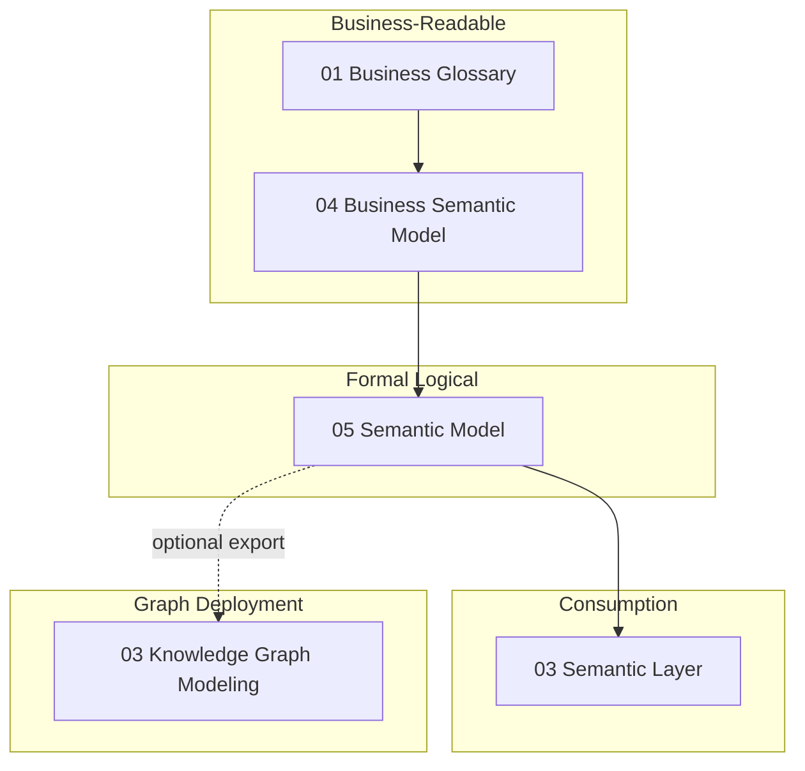

# Semantic Model

## Context

Business semantic models express concepts in domain language; consumption layers expose entities for BI and APIs. A **formal semantic model** adds logical precision: classes, properties, constraints, and derivation rules that can be validated, versioned, and—when needed—serialized to RDF or other exchange formats. This is the **logical structure** of meaning, not the **physical graph** that stores it.

This document defines formal semantic modeling. Graph storage, SPARQL, and triple-store operations belong in [Knowledge Graph Modeling](../03_Knowledge_Graph_Modeling/README.md).

## Definition

A **semantic model** is a governed logical specification of classes (concepts), properties (attributes and relationships), constraints, and derivation rules that formalize business meaning—versioned, auditable, and optionally exportable to W3C RDF/OWL or SKOS without requiring graph deployment.

## Scope

| In scope | Out of scope |
| --- | --- |
| Class, property, and constraint definitions | Triple-store selection and graph database ops |
| Logical axioms and derivation rules | SPARQL query patterns and inference engines |
| Versioning and change semantics | Ontology reasoner configuration |
| SKOS/RDF serialization adjacency | Full ontology engineering lifecycle ([KG Ontology](../03_Knowledge_Graph_Modeling/01_Ontology.md)) |
| Mapping to business semantic model and glossary | Industry ontology content (FIBO, etc.—see [Industry Reference Models](../04_Industry_Reference_Models/README.md)) |

## Core concepts

### Model elements

| Element | Description | Example |
| --- | --- | --- |
| **Class** | Formal concept with intensional definition | `Customer`, `InsurancePolicy` |
| **Property** | Attribute or relationship on a class | `hasEffectiveDate`, `heldBy` |
| **Constraint** | Rule limiting valid instances | `Policy.effectiveDate ≤ Policy.expirationDate` |
| **Derivation rule** | Logical rule inferring new facts | `ActiveCustomer ≡ Customer ∧ hasTransactionWithin(90d)` |
| **Enumeration** | Closed value set for a property | `PolicyStatus: {Active, Lapsed, Cancelled}` |

### Layering relative to adjacent artifacts



### Boundary to Knowledge Graph Modeling

| Concern | Semantic Model (this document) | Knowledge Graph Modeling |
| --- | --- | --- |
| **Purpose** | Define logical meaning | Deploy and query meaning in graph form |
| **Artifact** | Class/property/constraint spec | RDF/OWL files, triple stores, property graphs |
| **Validation** | Logical consistency, constraint checks | Reasoning, graph algorithms, SPARQL |
| **Consumers** | Modelers, integrators, catalog tools | Graph engineers, search, linked data apps |

Formal models **may be exported** to RDF/OWL/SKOS; graph sections document **how to store, query, and operate** those exports.

## Architecture pattern

### Class hierarchy example

```
Thing
├── Party
│   └── Customer
│       ├── RetailCustomer
│       └── CorporateCustomer
└── Agreement
    └── InsurancePolicy
        ├── hasEffectiveDate (date)
        ├── hasStatus (PolicyStatus)
        └── heldBy → Customer (1..1)
```

### Constraint types

| Type | Purpose | Example |
| --- | --- | --- |
| **Cardinality** | Limit property occurrences | Customer may hold 0..* policies |
| **Domain/range** | Valid class for property ends | `heldBy` domain: Policy, range: Customer |
| **Value constraint** | Restrict property values | Status must be in enumerated set |
| **Temporal** | Time-bound validity | Definition effective from approval date |
| **Cross-class** | Relate multiple classes | Lapsed policy cannot have open claims |

## Modeling guidelines

### Versioning

- Semantic models are **versioned artifacts** (e.g., `sem-model-customer-v2.1`).
- Breaking changes (class rename, constraint tightening) require governance review per [Semantic Governance](07_Semantic_Governance.md).
- Maintain **deprecation mappings** from retired classes/properties to successors.

### SKOS/RDF adjacency

When exporting to W3C formats:

- **SKOS** for concept schemes and term relationships (see [Semantic Interoperability](08_Semantic_Interoperability.md)).
- **RDFS/OWL** for class hierarchies and formal constraints when graph deployment is planned.
- Keep the **logical model canonical**; treat RDF as an export view, not the source of truth, unless the organization adopts graph-native authoring (then coordinate with KG section).

### Single meaning principle

Each class must trace to exactly one **glossary term** or explicitly document **context-specific subclasses** aligned with [Business Semantic Model](04_Business_Semantic_Model.md) bounded contexts.

## Related sections

- [Business Semantic Model](04_Business_Semantic_Model.md) — business-concept views and context maps
- [Semantic Interoperability](08_Semantic_Interoperability.md) — cross-domain mappings and SKOS patterns
- [Knowledge Graph Modeling](../03_Knowledge_Graph_Modeling/README.md) — RDF, ontology deployment, graph storage
- [Semantic Standards](06_Semantic_Standards.md) — ISO/IEC 11179 registry alignment
