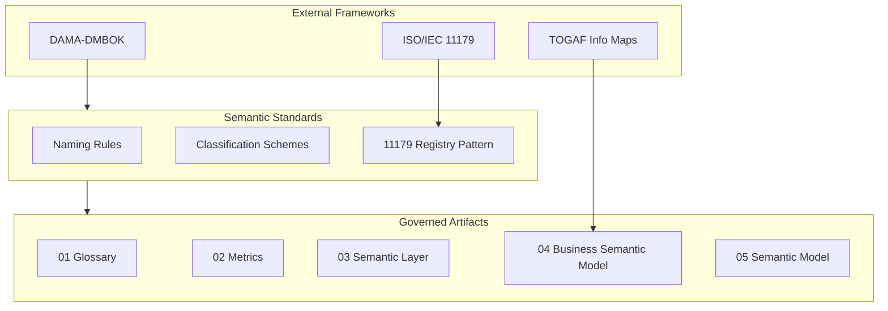

# Semantic Standards

## Context

Without consistent naming, classification, and metadata registration rules, glossaries fragment, metrics diverge, and semantic models become impossible to integrate. **Semantic standards** define the conventions and registry patterns that keep enterprise meaning artifacts consistent, discoverable, and aligned with recognized frameworks.

This document covers **modeling-side standards**. Enterprise governance operating models are in [Architecture Governance](../../../00_Architecture_Governance/10_Data_Governance_And_Metadata/01_Metadata_Management/Semantic_Governance/); platform-specific conventions live under [Analytics](../../../06_Analytics_Architecture/01_BI_Architecture/Semantic_Layer_Architecture/).

## Definition

**Semantic standards** are the enterprise-adopted rules for naming business terms, registering metadata elements, classifying concepts, and structuring semantic artifacts—aligned with ISO/IEC 11179, DAMA-DMBOK, and TOGAF information architecture practices.

## Scope

| In scope | Out of scope |
| --- | --- |
| ISO/IEC 11179-aligned registry patterns | Vendor tool configuration |
| Naming and abbreviation conventions | Physical database naming standards (see data modeling foundations) |
| Classification and taxonomy schemes | Industry ontology content (cross-link to [Industry Reference Models](../04_Industry_Reference_Models/README.md)) |
| Metadata element registration | Enterprise council charters ([Architecture Governance](../../../00_Architecture_Governance/10_Data_Governance_And_Metadata/01_Metadata_Management/Semantic_Governance/)) |
| DAMA metadata management conventions | Legal/compliance policy text |

## Core concepts

### ISO/IEC 11179 alignment

ISO/IEC 11179 defines a framework for **metadata registries**. Map enterprise artifacts as follows:

| 11179 concept | Enterprise artifact | Topic file |
| --- | --- | --- |
| **Object class** | Business concept (glossary term type) | [01 Business Glossary](01_Business_Glossary.md) |
| **Property** | Attribute or relationship on a concept | [04 Business Semantic Model](04_Business_Semantic_Model.md), [05 Semantic Model](05_Semantic_Model.md) |
| **Data element concept** | Combination of object class + property with meaning | Glossary + formal model linkage |
| **Value domain** | Permitted values for a property | Enumerations in [05 Semantic Model](05_Semantic_Model.md) |
| **Data element** | Physical representation (optional link) | Semantic layer mappings in [03 Semantic Layer](03_Semantic_Layer.md) |

Registration workflow: propose concept → define in glossary → classify → approve → publish to registry with stable ID.

### Naming principles

| Rule | Guideline | Example |
| --- | --- | --- |
| **Preferred name** | Singular noun phrase, business language | `Active Customer` not `act_cust_flag` |
| **Stable ID** | Domain-prefixed, immutable after approval | `CUST.ACTIVE`, `POL.STATUS` |
| **Synonym handling** | Synonyms never replace preferred name in certified artifacts | "Client" → synonym of `Customer` |
| **Abbreviation** | Avoid in definitions; register if used in systems | `CLV` → synonym with expansion |
| **Hierarchy depth** | Limit taxonomy depth to maintain usability | Typically ≤ 5 levels |
| **Locale** | One authoritative language per term; translations as metadata | `definition_en`, `definition_de` |

### Classification schemes

| Scheme type | Purpose | Example |
| --- | --- | --- |
| **Domain taxonomy** | Group terms by business domain | Finance, Sales, Operations |
| **Sensitivity classification** | Data handling tier | Public, Internal, Confidential, Restricted |
| **Criticality** | Impact of incorrect definition | Tier 1 (regulatory), Tier 2 (executive), Tier 3 (operational) |
| **Lifecycle state** | Maturity of semantic artifact | Draft, Proposed, Approved, Deprecated |
| **Standard alignment** | Mapping to external frameworks | SID entity, BIAN service domain |

### DAMA-DMBOK conventions

Apply DAMA metadata management practices to semantic artifacts:

- **Metadata categories**: business (glossary), technical (semantic layer mappings), operational (usage metrics), process (governance workflows).
- **Metadata lineage**: trace glossary term → metric → semantic entity → physical column.
- **Stewardship roles**: align with DAMA RACI—business steward, data steward, custodian—detailed in [Semantic Governance](07_Semantic_Governance.md).

## Architecture pattern

## Implementation guidelines

### Registry minimum metadata

Every registered semantic artifact should include:

| Field | Required | Notes |
| --- | --- | --- |
| Stable identifier | Yes | Immutable after first approval |
| Preferred name | Yes | Business language |
| Definition | Yes | Plain language, unambiguous |
| Classification | Yes | Domain + sensitivity at minimum |
| Steward | Yes | Named accountable role |
| Status | Yes | Lifecycle state |
| Version | Yes | Semantic version or date stamp |
| Source / authority | Recommended | Regulation, policy, or council decision |
| Related artifacts | Recommended | Cross-links to metrics, models, products |

### TOGAF alignment

Semantic standards support TOGAF **Architecture Repository** content: registered definitions feed information maps (Phase B) and data architecture catalogs (Phase C). Document which repository stores each artifact type (glossary tool, model repository, catalog platform).

## Related sections

- [Semantic Governance](07_Semantic_Governance.md) — approval workflows and certification gates
- [Business Glossary](01_Business_Glossary.md) — term structure and metadata model
- [Semantic Interoperability](08_Semantic_Interoperability.md) — cross-domain mapping standards
- [Industry Reference Models](../04_Industry_Reference_Models/README.md) — external framework alignment
