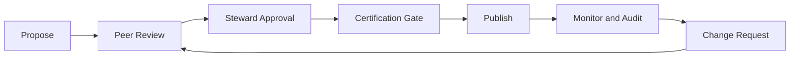
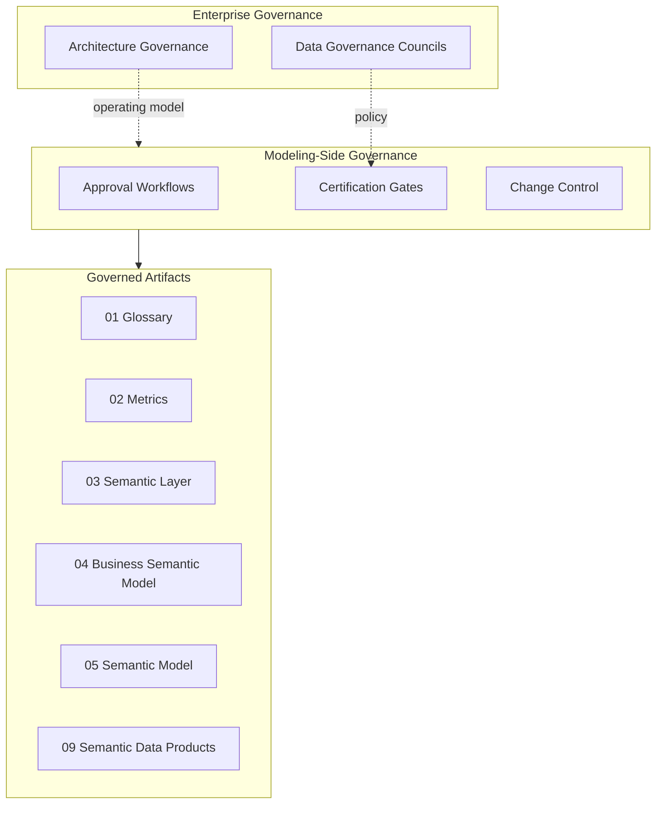

# Semantic Governance

## Context

Semantic artifacts—terms, metrics, models—change constantly as business evolves. Without modeling-side governance, definitions drift, certified metrics multiply, and consumers lose trust in reported numbers. **Semantic governance** defines the approval workflows, change control, and certification gates for semantics **from a modeling perspective**.

This document covers **modeling-side stewardship**. Enterprise operating models—councils, RACI matrices, policy frameworks—are documented in [Semantic Governance (Architecture Governance)](../../../00_Architecture_Governance/10_Data_Governance_And_Metadata/01_Metadata_Management/Semantic_Governance/).

## Definition

**Semantic governance** is the set of modeling-side processes, roles, and gates that control the lifecycle of business glossary terms, certified metrics, semantic models, and related artifacts—from proposal through approval, publication, change, and deprecation.

## Scope

| In scope | Out of scope |
| --- | --- |
| Modeling-side approval workflows | Enterprise data governance council charters |
| Change control for semantic artifacts | Legal/regulatory compliance programs |
| Certification gates (glossary, metrics, models) | Platform access control and IAM |
| Steward roles in modeling context | Tool vendor selection |
| Impact assessment for semantic changes | Industry reference model licensing |
| Deprecation and migration procedures | Full metadata platform operations |

## Core concepts

### Boundary to Architecture Governance

| Concern | Semantic Governance (this document) | Architecture Governance |
| --- | --- | --- |
| **Focus** | How semantic *artifacts* are created, reviewed, approved | Enterprise *operating model* for data governance |
| **Audience** | Data modelers, stewards, domain architects | CDO office, governance councils, policy owners |
| **Artifacts** | Workflows, gates, certification criteria | Council charters, RACI, policy documents |
| **Example** | "Metric must pass metrics council before certification" | "Metrics council composition and meeting cadence" |

Cross-link; do not duplicate council structure or enterprise policy text here.

### Stewardship roles (modeling view)

| Role | Responsibility |
| --- | --- |
| **Business steward** | Authoritative business definition; approves term meaning |
| **Data steward** | Ensures quality, consistency, and registry compliance |
| **Domain architect** | Maintains business semantic models and bounded contexts |
| **Enterprise data architect** | Maintains formal semantic models and cross-domain alignment |
| **Metrics owner** | Accountable for certified metric definitions and grain |
| **Semantic product owner** | Lifecycle of packaged semantic products |

### Certification gates

| Gate | Artifact | Minimum criteria |
| --- | --- | --- |
| **Glossary approval** | Business term | Clear definition, steward assigned, no duplicate preferred name in domain |
| **Metric certification** | Certified measure | Formula documented, grain declared, glossary links, owner sign-off |
| **Semantic model approval** | Business or formal model | Glossary linkage, constraint review, impact assessment |
| **Product publication** | Semantic data product | Contract defined, SLAs set, catalog metadata complete |

### Change control

| Change type | Review level | Impact assessment |
| --- | --- | --- |
| **Cosmetic** (synonym, description clarity) | Data steward | Low—notify consumers |
| **Non-breaking** (new optional attribute) | Steward + peer review | Medium—document in changelog |
| **Breaking** (definition change, formula change, class rename) | Council or designated approver | High—deprecation plan, consumer notification, migration window |

Breaking changes to certified metrics or glossary terms require:

1. Documented **before/after** comparison.
2. **Consumer impact** analysis (reports, APIs, agents affected).
3. **Deprecation period** with sunset date.
4. **Successor mapping** (old term/metric ID → new).

### Lifecycle states

| State | Meaning | Transitions |
| --- | --- | --- |
| **Draft** | Work in progress, not consumable | → Proposed |
| **Proposed** | Submitted for review | → Approved, → Draft (rejected) |
| **Approved** | Authoritative for domain use | → Certified (metrics/models), → Deprecated |
| **Certified** | Enterprise-standard for reporting | → Deprecated |
| **Deprecated** | Scheduled for removal; successor documented | → Retired |
| **Retired** | No longer active; archived for audit | Terminal |

## Architecture pattern

## Implementation guidelines

### Minimum workflow for new glossary term

1. Steward drafts term with preferred name, definition, domain, synonyms.
2. Data steward checks naming standards ([Semantic Standards](06_Semantic_Standards.md)) and duplicate detection.
3. Business steward approves definition.
4. Term published with stable ID and status `Approved`.

### Audit and compliance

- Maintain **audit trail**: who approved, when, what changed, prior version.
- Periodic **certification review** for Tier 1 terms and metrics (e.g., annual).
- Report **definition drift**: instances where platform implementations diverge from certified semantics.

## Related sections

- [Semantic Standards](06_Semantic_Standards.md) — naming, classification, registry patterns
- [Business Glossary](01_Business_Glossary.md) — term metadata and stewardship (modeling view)
- [Semantic Data Products](09_Semantic_Data_Products.md) — product lifecycle and contracts
- [Semantic Governance (Enterprise)](../../../00_Architecture_Governance/10_Data_Governance_And_Metadata/01_Metadata_Management/Semantic_Governance/) — operating model and councils
