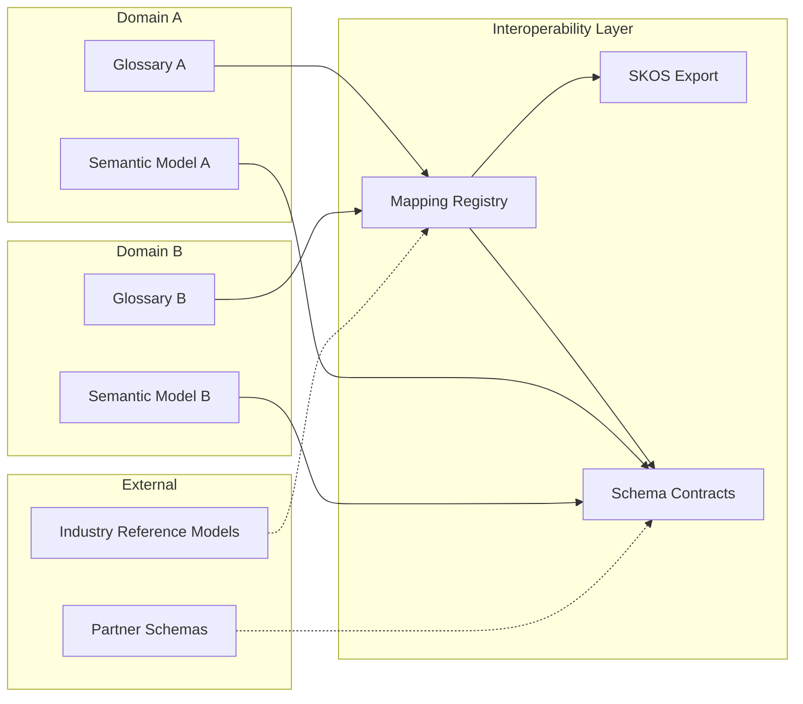

# Semantic Interoperability

## Context

Enterprises operate across business domains, acquired entities, and partner ecosystems—each with its own vocabulary and schema. **Semantic interoperability** ensures that concepts, measures, and models can be aligned, exchanged, and consumed across boundaries without losing meaning or duplicating conflicting definitions.

This document covers **cross-domain mapping and schema exchange patterns** from a modeling perspective. Graph storage and SPARQL operations are in [Knowledge Graph Modeling](../03_Knowledge_Graph_Modeling/README.md); industry vertical ontologies are in [Industry Reference Models](../04_Industry_Reference_Models/README.md).

## Definition

**Semantic interoperability** is the capability to exchange and reconcile business meaning across domains, systems, and organizations—through governed term equivalences, schema mapping patterns, and W3C SKOS/RDF adjacency—without requiring a single monolithic glossary or shared physical schema.

## Scope

| In scope | Out of scope |
| --- | --- |
| Cross-domain term equivalences and mappings | Triple-store operations and graph algorithms |
| Schema exchange patterns (logical, not physical ETL) | Industry ontology content (SID, BIAN, FIBO bodies) |
| W3C SKOS concept schemes and mapping properties | Full OWL reasoning infrastructure |
| API/schema contract alignment for semantics | Message bus or integration platform selection |
| Anti-corruption layers between bounded contexts | Translation/localization workflows |
| RDF serialization as export view | Authoring environment for graph-native ontologies |

## Core concepts

### Mapping types

| Type | Description | Example |
| --- | --- | --- |
| **Exact match** | Source and target have identical meaning | `Customer` ↔ `Client` (same context) |
| **Broad match** | Target is broader than source | `Retail Customer` → `Customer` |
| **Narrow match** | Target is narrower than source | `Customer` → `Premium Customer` (when context allows) |
| **Related match** | Associated but not equivalent | `Policyholder` related to `Customer` |
| **Close match** | Similar but with documented differences | `Sales Customer` close to `Billing Account` |
| **No match** | Explicit non-equivalence | Document why terms must not be merged |

Never map across **different bounded contexts** without documenting context boundaries per [Business Semantic Model](04_Business_Semantic_Model.md).

### Cross-domain mapping registry

Maintain a governed registry of mappings with:

| Field | Purpose |
| --- | --- |
| `mapping_id` | Stable identifier |
| `source_term_id` | Source glossary term |
| `target_term_id` | Target glossary term or external concept |
| `mapping_type` | SKOS mapping relation (see below) |
| `context` | Bounded context or domain scope |
| `confidence` | Human-validated / inferred / provisional |
| `steward` | Accountable for mapping accuracy |
| `effective_date` | When mapping became authoritative |
| `notes` | Documented semantic differences |

### W3C SKOS adjacency

Use SKOS as the **exchange vocabulary** for concept schemes and mappings—not as the primary authoring environment unless coordinated with [Knowledge Graph Modeling](../03_Knowledge_Graph_Modeling/README.md).

| SKOS property | Use |
| --- | --- |
| `skos:Concept` | Represent a glossary term in export |
| `skos:prefLabel` / `skos:altLabel` | Preferred name and synonyms |
| `skos:broader` / `skos:narrower` | Taxonomic hierarchy |
| `skos:exactMatch` | Equivalent across schemes |
| `skos:closeMatch` / `skos:relatedMatch` | Partial or associative alignment |
| `skos:ConceptScheme` | Bounded collection (domain glossary) |

RDF export is an **adjacency layer**: the canonical source remains the governed glossary and formal model; SKOS/RDF enables exchange with partners, catalogs, and graph platforms.

## Architecture pattern

### Schema exchange patterns

| Pattern | When to use | Modeling artifact |
| --- | --- | --- |
| **Shared kernel** | Two domains agree on core concepts | Joint glossary subset + shared formal model |
| **Published language** | Upstream domain defines canonical schema | Upstream glossary + downstream conformist mapping |
| **Anti-corruption layer** | Downstream protects its model from upstream drift | Explicit mapping registry with validation rules |
| **Open host service** | Platform exposes semantic API for multiple consumers | Semantic data product contract ([09](09_Semantic_Data_Products.md)) |
| **Separate ways** | No mapping; contexts remain independent | Documented non-equivalence |

### API and contract alignment

When exchanging semantics via APIs:

- Publish **semantic contracts** specifying entities, measures, and allowed values (see [Semantic Data Products](09_Semantic_Data_Products.md)).
- Version contracts; treat breaking semantic changes like breaking API changes.
- Include **mapping metadata** in catalog entries (DCAT-compatible) for discoverability.

## Implementation guidelines

### Mapping workflow

1. Identify source and target terms in respective glossaries.
2. Determine bounded context for each term.
3. Select mapping type; document semantic differences in notes.
4. Steward review and approval per [Semantic Governance](07_Semantic_Governance.md).
5. Register mapping; optionally export to SKOS for partner exchange.

### Quality checks

- Reject ** transitive exact-match chains** that imply conflicting definitions.
- Flag **provisional mappings** clearly; do not use in certified reporting until validated.
- Reconcile mappings when either source or target term is **deprecated**.

### Industry reference alignment

Map enterprise terms to industry reference concepts (SID, BIAN, FIBO) as **related** or **close** matches—not blind exact matches. Industry models provide **reference patterns**; enterprise glossary remains authoritative for internal use. Details in [Industry Reference Models](../04_Industry_Reference_Models/README.md).

## Related sections

- [Business Semantic Model](04_Business_Semantic_Model.md) — bounded contexts and context maps
- [Semantic Model](05_Semantic_Model.md) — formal model export to RDF
- [Semantic Standards](06_Semantic_Standards.md) — naming and registry conventions
- [Knowledge Graph Modeling](../03_Knowledge_Graph_Modeling/02_RDF.md) — RDF storage and linked data patterns
- [Industry Reference Models](../04_Industry_Reference_Models/README.md) — vertical reference alignment
