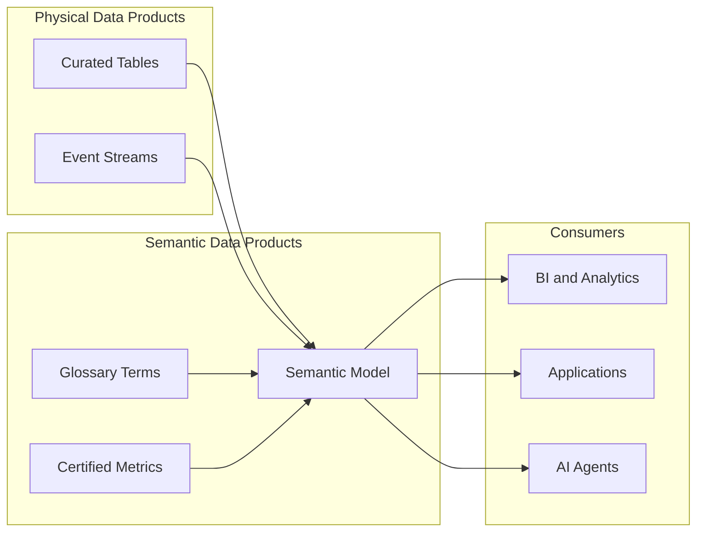

# Semantic Data Products

## Context

Domains need to share **governed business meaning**—not just tables and files—with other teams, analytics platforms, and AI applications. A **semantic data product** packages certified glossary terms, metrics, and semantic models as a discoverable, contract-bound offering with clear ownership, SLAs, and quality guarantees.

This document defines semantic data products from a **modeling perspective**. General data product lifecycle patterns are in [Data Product Architecture](../../../06_Data_Product_Architecture/README.md); analytics-specific packaging is in [Semantic Data Products (Analytics)](../../../06_Analytics_Architecture/01_BI_Architecture/Semantic_Layer_Architecture/Semantic_Data_Products.md).

## Definition

A **semantic data product** is a domain-owned, versioned package of governed business semantics—glossary terms, certified metrics, semantic models, and consumption interfaces—published with a data contract specifying schema, quality rules, ownership, and service levels.

## Scope

| In scope | Out of scope |
| --- | --- |
| Semantic product composition and contracts | Raw dataset / table data products |
| Ownership and lifecycle for semantics | Marketplace infrastructure |
| Quality dimensions for semantic artifacts | Physical pipeline orchestration |
| Discovery and versioning of semantic products | Industry reference model licensing |

## Core concepts

### Semantic product anatomy

| Artifact | Description |
| --- | --- |
| **Glossary slice** | Domain-approved business terms and definitions |
| **Metric set** | Certified measures with calculation logic |
| **Semantic model** | Logical entities, dimensions, relationships |
| **Consumption interface** | Semantic API, BI model connection, or catalog entry |
| **Data contract** | Schema, SLAs, quality rules, breaking-change policy |
| **Lineage** | Traceability to physical sources |

### Relationship to other product types

Physical data products provide **data**; semantic data products provide **meaning** on top of that data. A domain may publish both—a curated fact table (physical) and a semantic model (logical)—as separate or bundled offerings.

### Data contract for semantics

Semantic contracts should specify:

| Element | Example |
| --- | --- |
| **Product ID** | `finance.revenue-semantics.v2` |
| **Owner** | Finance data product team |
| **Included metrics** | `FIN.REVENUE.NET`, `FIN.REVENUE.GROSS` |
| **Semantic model version** | `revenue_model v2.1` |
| **Quality rules** | 100% of certified metrics have glossary links |
| **SLA** | Breaking changes announced 30 days in advance |
| **Access** | Role-based; row-level security on Customer entity |
| **Deprecation policy** | 90-day sunset for retired metric versions |

## Business use cases

- **Domain self-service**: Marketing publishes a `Campaign Performance` semantic product; analytics teams consume without redefining metrics.
- **Cross-domain composition**: Finance and Sales semantic products combine in an enterprise executive dashboard.
- **Regulatory audit**: Auditors receive a versioned semantic product with immutable metric definitions for a reporting period.
- **AI agent grounding**: Agents register semantic products as tools with governed measure definitions.
- **Acquisition integration**: Acquired company's terms are mapped and published as a transitional semantic product.

## Lifecycle

| Phase | Activities |
| --- | --- |
| **Design** | Identify domain terms, metrics, and entities; assign owner |
| **Build** | Implement semantic model; link glossary and metrics |
| **Certify** | Steward review; quality gate on contract completeness |
| **Publish** | Register in catalog/marketplace; expose consumption interface |
| **Operate** | Monitor usage, quality, and SLA adherence |
| **Evolve** | Version changes; communicate breaking updates |
| **Retire** | Deprecate with migration path to successor product |

Governance workflow: [Semantic Governance Framework](../../../00_Architecture_Governance/10_Data_Governance_And_Metadata/01_Metadata_Management/Semantic_Governance/Semantic_Governance_Framework.md).

## Quality dimensions

| Dimension | Check |
| --- | --- |
| **Completeness** | All measures have definitions, owners, and grain |
| **Consistency** | Terms align with enterprise glossary or documented exceptions |
| **Accuracy** | Semantic model totals reconcile with physical sources |
| **Timeliness** | Semantic version published when underlying data product updates |
| **Discoverability** | Catalog metadata, tags, and documentation complete |

## Anti-patterns

| Anti-pattern | Consequence |
| --- | --- |
| Semantic product without physical lineage | Consumers cannot trust or debug figures |
| Bundling uncertified exploratory metrics | Quality guarantees become meaningless |
| No versioning on breaking changes | Downstream dashboards break silently |
| Domain silos without enterprise glossary alignment | Duplicate conflicting definitions across products |

## Related topics

- [Business Glossary](02_Business_Glossary.md) — terms included in semantic products
- [Metrics Layer](01_Metrics_Layer.md) — certified measures in the product
- [Semantic Layer](03_Semantic_Layer.md) — logical model exposed by the product
- [Semantic Interoperability](08_Semantic_Interoperability.md) — cross-domain alignment
- [Data Product Architecture](../../../06_Data_Product_Architecture/README.md) — general data product patterns
- [Semantic Data Products (Analytics)](../../../06_Analytics_Architecture/01_BI_Architecture/Semantic_Layer_Architecture/Semantic_Data_Products.md) — analytics consumption packaging
- [Semantic Governance Framework](../../../00_Architecture_Governance/10_Data_Governance_And_Metadata/01_Metadata_Management/Semantic_Governance/Semantic_Governance_Framework.md) — enterprise governance

## ADR reference

- [ADR 009 Semantic Governance Strategy](../../../00_Architecture_Governance/03_Architecture_Decision_Records/Governance_And_Metadata/ADR_009_Semantic_Governance_Strategy.md)
