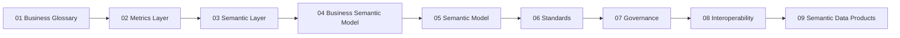

# Semantic Modeling

Canonical home for business semantics modeling—glossary, metrics, semantic layer, formal models, standards, governance, interoperability, and semantic data products.

**Navigation hub:** [Semantics Hub](../../../_hubs/Semantics_Hub.md)

## Semantics overview

**Enterprise semantics** is the governed definition of what business concepts, measures, and relationships *mean*—independent of any single database, BI tool, or vendor platform. This section documents the **modeling artifacts** and **capability chain** that turn shared vocabulary into consumable, certifiable meaning.

### Glossary-first pipeline

Topics follow a **glossary-first** capability chain: shared vocabulary → governed measures → consumption views → business and formal models → standards and operations → packaged delivery.



### Conceptual pillars

| Pillar | Files | Focus |
| --- | --- | --- |
| **Foundation** | 01–03 | Vocabulary, certified measures, logical consumption model |
| **Formal models** | 04–05 | Business-concept maps and formal semantic structure |
| **Standards & operations** | 06–08 | Naming rules, stewardship workflows, cross-domain alignment |
| **Delivery** | 09 | Packaged semantic products with contracts and catalog metadata |

### Relationships to adjacent sections

| Adjacent area | Relationship |
| --- | --- |
| [Analytics Architecture](../../../06_Analytics_Architecture/01_BI_Architecture/Semantic_Layer_Architecture/) | Implements semantic layer, metrics, and BI consumption patterns on platforms |
| [Architecture Governance](../../../00_Architecture_Governance/10_Data_Governance_And_Metadata/01_Metadata_Management/Semantic_Governance/) | Enterprise operating model for stewardship, councils, and policy |
| [Knowledge Graph Modeling](../03_Knowledge_Graph_Modeling/README.md) | RDF/graph storage, ontology deployment, and triple-store operations |
| [Industry Reference Models](../04_Industry_Reference_Models/README.md) | TM Forum SID, BIAN, FIBO, and vertical reference patterns |

## Enterprise artifact inventory

The organization maintains nine governed semantic artifact types. Each maps to one topic file and a typical owner pattern.

| Artifact | Maintain as | Owner pattern | Topic file |
| --- | --- | --- | --- |
| **Business terms** | Glossary entries with stable IDs, definitions, synonyms, hierarchies | Business data stewards | [01 Business Glossary](01_Business_Glossary.md) |
| **Certified measures** | Metric definitions: formula, grain, dimensions, certification status | Metrics council / analytics governance | [02 Metrics Layer](02_Metrics_Layer.md) |
| **Consumption views** | Logical entities, dimensions, relationships for BI/API | Data modeling + analytics architecture | [03 Semantic Layer](03_Semantic_Layer.md) |
| **Business concept maps** | ER diagrams, domain maps, bounded-context views (business-readable) | Domain architects | [04 Business Semantic Model](04_Business_Semantic_Model.md) |
| **Formal semantic models** | Classes, properties, constraints, logical axioms (not graph storage) | Enterprise data architects | [05 Semantic Model](05_Semantic_Model.md) |
| **Naming & classification rules** | Term naming, metadata registries, classification schemes | Standards board | [06 Semantic Standards](06_Semantic_Standards.md) |
| **Modeling stewardship** | Approval workflows, change control, certification gates (modeling view) | Data governance | [07 Semantic Governance](07_Semantic_Governance.md) |
| **Cross-domain mappings** | Term equivalences, schema exchange, SKOS/RDF adjacency | Integration architects | [08 Semantic Interoperability](08_Semantic_Interoperability.md) |
| **Semantic data products** | Packaged, cataloged semantic bundles with SLAs and contracts | Data product owners | [09 Semantic Data Products](09_Semantic_Data_Products.md) |

## Standards alignment map

| Standard / framework | Primary topic file | What to document |
| --- | --- | --- |
| **ISO/IEC 11179** (metadata registries) | [06 Semantic Standards](06_Semantic_Standards.md) | Data element concepts, naming principles, registration |
| **DAMA-DMBOK** (metadata, governance) | [06](06_Semantic_Standards.md), [07](07_Semantic_Governance.md) | Stewardship roles, metadata lifecycle |
| **TOGAF** (information architecture) | README, [04](04_Business_Semantic_Model.md) | Business information maps, architecture views |
| **W3C SKOS / RDF** | [08](08_Semantic_Interoperability.md), boundary in [05](05_Semantic_Model.md) | Concept schemes, mappings; defer graph ops to KG section |
| **DCAT** (data catalog vocabulary) | [09 Semantic Data Products](09_Semantic_Data_Products.md) | Catalog metadata for semantic products |
| **TM Forum SID / BIAN / FIBO** | Cross-link only | Reference via [Industry Reference Models](../04_Industry_Reference_Models/README.md) |

## Corpus boundaries

| Topic | Lives here (`02_Semantic_Modeling`) | Lives elsewhere |
| --- | --- | --- |
| **Semantic layer pattern** | Logical model structure, entity/dimension design | Platform rollout, LookML/dbt/Tabular → [Analytics](../../../06_Analytics_Architecture/01_BI_Architecture/Semantic_Layer_Architecture/) |
| **Governance** | Modeling-side approval gates, certification workflows | Enterprise councils, operating model → [Architecture Governance](../../../00_Architecture_Governance/10_Data_Governance_And_Metadata/01_Metadata_Management/Semantic_Governance/) |
| **Formal semantics** | Class/property/constraint models, logical axioms | RDF triple stores, graph databases, SPARQL → [Knowledge Graph Modeling](../03_Knowledge_Graph_Modeling/README.md) |
| **Industry models** | Concept-to-reference mappings, alignment guidance | SID/BIAN/FIBO content → [Industry Reference Models](../04_Industry_Reference_Models/README.md) |
| **Physical data products** | Semantic product contracts and meaning layers | Table/stream product lifecycle → [Data Product Architecture](../../../06_Data_Product_Architecture/README.md) |

## Topics

| Topic | Status | Description |
| --- | --- | --- |
| [Business Glossary](01_Business_Glossary.md) | complete | Enterprise business terms |
| [Metrics Layer](02_Metrics_Layer.md) | complete | Certified measure definitions |
| [Semantic Layer](03_Semantic_Layer.md) | complete | Logical consumption model |
| [Business Semantic Model](04_Business_Semantic_Model.md) | complete | Business-concept ER and domain maps |
| [Semantic Model](05_Semantic_Model.md) | complete | Formal classes, properties, and constraints |
| [Semantic Standards](06_Semantic_Standards.md) | complete | Naming, classification, and registry patterns |
| [Semantic Governance](07_Semantic_Governance.md) | complete | Modeling-side stewardship workflows |
| [Semantic Interoperability](08_Semantic_Interoperability.md) | complete | Cross-domain alignment and schema exchange |
| [Semantic Data Products](09_Semantic_Data_Products.md) | complete | Governed semantic packages |

## Deferred escalation

Physical subfolders are **deferred** until content maturity warrants deeper navigation. Escalate only when **all** of the following are true:

1. Stubs 04–08 are substantive (not placeholder) and reviewed.
2. The nine root files feel crowded—readers struggle to find topic-specific guidance.
3. A clear split emerges between **core semantics** (01–05) and **delivery & operations** (06–09).

If escalation is approved, use this shallow structure (no further nesting without a new decision):

```
02_Semantic_Modeling/
├── README.md
├── 01_Core_Semantics/
│   ├── 01_Business_Glossary.md … 05_Semantic_Model.md
└── 02_Delivery_And_Operations/
    ├── 06_Semantic_Standards.md … 09_Semantic_Data_Products.md
```

Until then, retain the **flat glossary-first layout** at section root.

## Related sections

- [Semantic Layer Architecture (Analytics)](../../../06_Analytics_Architecture/01_BI_Architecture/Semantic_Layer_Architecture/) — platform implementation
- [Semantic Governance (Governance)](../../../00_Architecture_Governance/10_Data_Governance_And_Metadata/01_Metadata_Management/Semantic_Governance/) — enterprise operating model
- [Knowledge Graph Modeling](../03_Knowledge_Graph_Modeling/README.md) — RDF, ontology deployment, graph storage
- [Industry Reference Models](../04_Industry_Reference_Models/README.md) — TM Forum SID, BIAN, FIBO, and vertical reference patterns
