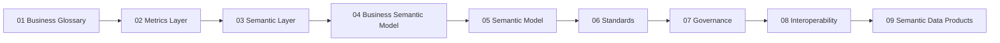

# Semantic Modeling

Canonical home for business semantics modeling—glossary, metrics, semantic layer, and semantic data products.

**Navigation hub:** [Semantics Hub](../../../_hubs/Semantics_Hub.md)

## Semantics pipeline

Topics follow a **glossary-first** capability chain: shared vocabulary → governed measures → consumption views → formal models → standards and operations → packaged delivery.

## Topics

| Topic | Status | Description |
| --- | --- | --- |
| [Business Glossary](01_Business_Glossary.md) | complete | Enterprise business terms |
| [Metrics Layer](02_Metrics_Layer.md) | complete | Certified measure definitions |
| [Semantic Layer](03_Semantic_Layer.md) | complete | Logical consumption model |
| [Business Semantic Model](04_Business_Semantic_Model.md) | stub | Entity-relationship business view |
| [Semantic Model](05_Semantic_Model.md) | stub | Detailed model structure |
| [Semantic Standards](06_Semantic_Standards.md) | stub | Naming and definition conventions |
| [Semantic Governance](07_Semantic_Governance.md) | stub | Modeling-side ownership |
| [Semantic Interoperability](08_Semantic_Interoperability.md) | stub | Cross-domain alignment |
| [Semantic Data Products](09_Semantic_Data_Products.md) | complete | Governed semantic packages |

## Related sections

- [Semantic Layer Architecture (Analytics)](../../../06_Analytics_Architecture/01_BI_Architecture/Semantic_Layer_Architecture/) — platform implementation
- [Semantic Governance (Governance)](../../../00_Architecture_Governance/10_Data_Governance_And_Metadata/01_Metadata_Management/Semantic_Governance/) — enterprise operating model
- [Industry Reference Models](../04_Industry_Reference_Models/README.md) — TM Forum SID, BIAN, FIBO, and vertical reference patterns
