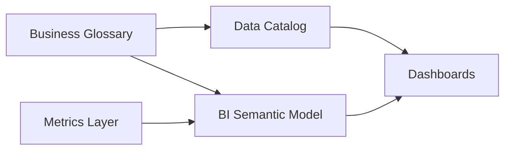

# Business Definitions

## Context

BI users encounter business terms and metric labels inside dashboards, semantic models, and self-service tools. **Business definitions in analytics** describes how approved glossary content is **surfaced at the point of consumption**—not where definitions are authored.

**Canonical source for term definitions:** [Business Glossary](../../../04_Data_Modeling_Architecture/03_Modern/02_Semantic_Modeling/02_Business_Glossary.md)

## Definition

**Business definitions in analytics** is the practice of binding certified glossary terms and metric descriptions to semantic layer objects, catalog entries, and BI metadata so consumers see authoritative meaning without leaving their workflow.

## Surfacing patterns

| Pattern | Where it appears | Implementation |
| --- | --- | --- |
| **Inline description** | Measure/dimension tooltip in BI tool | LookML `description`, Power BI measure description, Tableau field comments |
| **Glossary link** | Catalog or data dictionary panel | Collibra/Alation integration; deep link to term ID |
| **Contextual help** | Dashboard header or info icon | Embedded definition from glossary API |
| **Certification badge** | Field list in self-service | Visual indicator for certified vs exploratory metrics |

## Integration architecture

Definitions are **authored once** in the glossary and **referenced** in analytics metadata—never duplicated with conflicting text.

## Implementation checklist

1. Assign `term_id` from glossary to each dimension label in the semantic model.
2. Copy approved `definition` text into platform description fields via CI/CD, not manual edits.
3. Display certification status (`certified` / `exploratory`) on measures.
4. Block publication of dashboards using uncertified measures for executive audiences.
5. Sync catalog and BI metadata on glossary change events.

## Governance

Approval and stewardship workflow: [Business Definition Governance](../../../00_Architecture_Governance/10_Data_Governance_And_Metadata/01_Metadata_Management/Semantic_Governance/Business_Definition_Governance.md)

## Related topics

- [Business Glossary](../../../04_Data_Modeling_Architecture/03_Modern/02_Semantic_Modeling/02_Business_Glossary.md) — canonical term definitions
- [Metrics Layer](../../../04_Data_Modeling_Architecture/03_Modern/02_Semantic_Modeling/01_Metrics_Layer.md) — measure definitions
- [Semantic Layer Platforms](Semantic_Layer_Platforms.md) — tool-specific metadata fields
- [KPI Standardization](KPI_Standardization.md) — KPI catalog in analytics
