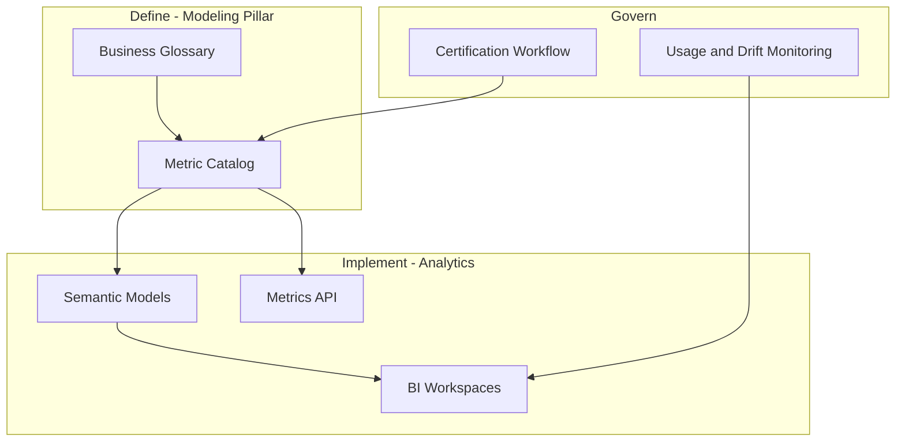

# Enterprise Metrics Layer

## Context

An enterprise metrics layer is the **analytics rollout** of governed business measures—making certified metrics available through semantic models, APIs, and dashboards. This document covers implementation and adoption; metric definitions are maintained in the modeling pillar.

**Canonical source for metric definitions:** [Metrics Layer](../../../04_Data_Modeling_Architecture/03_Modern/02_Semantic_Modeling/01_Metrics_Layer.md)

## Definition

The **enterprise metrics layer (analytics view)** is the deployed, consumable instance of certified metrics across the organization's primary analytics platforms—connected to glossary terms, versioned, and monitored for usage and drift.

## Rollout architecture

## Phased delivery

| Phase | Scope | Outcome |
| --- | --- | --- |
| **MVP** | 10–20 executive metrics | Single semantic model; one BI workspace |
| **Expansion** | Domain metric sets | Per-domain models linked to enterprise catalog |
| **API** | Headless metrics endpoint | Apps and agents consume certified measures |
| **Federation** | Cross-domain composite KPIs | Enterprise dashboard without local redefinition |

## Platform placement

| Primary BI | Recommended implementation |
| --- | --- |
| Looker | Enterprise LookML model with shared `core_metrics` view |
| Power BI | Certified dataset in governed workspace; XMLA deployment |
| Multi-BI | dbt MetricFlow or AtScale as shared metrics engine |

See [Semantic Layer Platforms](Semantic_Layer_Platforms.md) for detailed patterns.

## Success metrics

| KPI | Target |
| --- | --- |
| Executive KPIs from certified layer | ≥ 90% |
| Dashboards with uncertified measures (exec tier) | 0% |
| Metric definition change lead time | ≤ 5 business days with governance |
| Reconciliation incidents (conflicting figures) | Trending down quarter over quarter |

## Related topics

- [Metrics Layer (modeling)](../../../04_Data_Modeling_Architecture/03_Modern/02_Semantic_Modeling/01_Metrics_Layer.md) — canonical definitions
- [Semantic Layer Strategy](Semantic_Layer_Strategy.md) — overall rollout strategy
- [KPI Standardization](KPI_Standardization.md) — KPI catalog practices
- [Universal Metrics Framework](Universal_Metrics_Framework.md) — cross-domain metric framework

## ADR reference

- [ADR 002 Semantic Layer Strategy](../../../00_Architecture_Governance/03_Architecture_Decision_Records/Analytics_Architecture/ADR_002_Semantic_Layer_Strategy.md)
