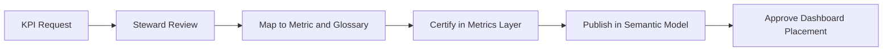

# KPI Standardization

## Context

KPIs are the measures leadership tracks to run the business. **KPI standardization in analytics** ensures every published KPI maps to a certified metric, glossary term, and semantic model object—eliminating "KPI sprawl" across dashboards.

**Canonical metric definitions:** [Metrics Layer](../../../04_Data_Modeling_Architecture/03_Modern/02_Semantic_Modeling/01_Metrics_Layer.md)

**Governance-side KPI standards:** [KPI Standardization (Governance)](../../../00_Architecture_Governance/10_Data_Governance_And_Metadata/01_Metadata_Management/Semantic_Governance/KPI_Standardization.md)

## Definition

**KPI standardization** is the analytics practice of maintaining a governed KPI catalog where each KPI has a unique ID, owner, target metric reference, dimensional context, refresh cadence, and approved visualization tier.

## KPI catalog structure

| Field | Description |
| --- | --- |
| `kpi_id` | Enterprise identifier (e.g., `KPI.CUSTOMER.NPS`) |
| `display_name` | Executive-facing label |
| `metric_ref` | Link to certified metric in metrics layer |
| `glossary_refs` | Business terms used in the KPI name/definition |
| `owner` | Business executive sponsor |
| `frequency` | Daily, weekly, monthly, quarterly |
| `dimensions` | Standard slices (region, product line, channel) |
| `targets` | Thresholds, goals, RAG status rules |
| `tier` | Executive / operational / exploratory |
| `semantic_model_ref` | BI object exposing this KPI |

## Standardization rules

1. **One KPI, one metric** — KPIs reference exactly one certified metric; no dashboard-local calculations.
2. **Naming alignment** — KPI display names use [Business Glossary](../../../04_Data_Modeling_Architecture/03_Modern/02_Semantic_Modeling/02_Business_Glossary.md) preferred terms.
3. **Tiered access** — Executive-tier KPIs require certification; exploratory KPIs are sandbox-only.
4. **Version on change** — KPI definition changes trigger consumer notification and dashboard review.
5. **No duplicate KPIs** — Catalog search before creating new entries; merge synonyms.

## Analytics workflow

## Related topics

- [Metrics Layer (modeling)](../../../04_Data_Modeling_Architecture/03_Modern/02_Semantic_Modeling/01_Metrics_Layer.md)
- [Enterprise Metrics Layer](Enterprise_Metrics_Layer.md) — deployment of certified metrics
- [Metrics And KPI Architecture](../Metrics_And_KPI_Architecture/KPI_Catalog.md) — KPI catalog patterns
- [Business Definitions](Business_Definitions.md) — surfacing definitions in BI
- [KPI Standardization (Governance)](../../../00_Architecture_Governance/10_Data_Governance_And_Metadata/01_Metadata_Management/Semantic_Governance/KPI_Standardization.md)
