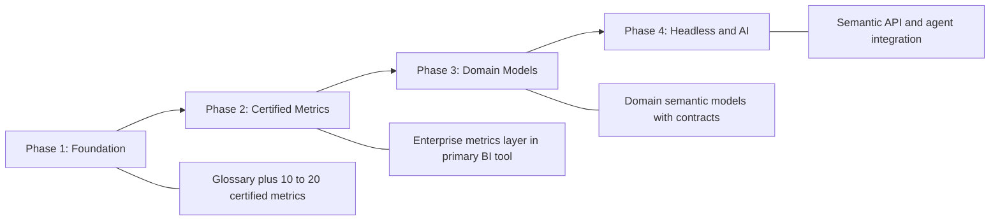

# Semantic Layer Strategy

## Context

Analytics teams need a deliberate strategy for where business logic lives, which tools own the semantic layer, and how domains federate models without fragmenting definitions. This document covers **analytics rollout and platform strategy**—not the semantic layer modeling pattern itself.

**Canonical modeling reference:** [Semantic Layer](../../../04_Data_Modeling_Architecture/03_Modern/02_Semantic_Modeling/03_Semantic_Layer.md)

## Definition

**Semantic layer strategy** is the enterprise approach to building, governing, and consuming logical data models across BI platforms—covering centralization vs federation, build vs buy, and migration from spreadsheet logic.

## Strategic decisions

| Decision | Options | Recommendation |
| --- | --- | --- |
| **Ownership** | Central analytics COE vs domain-owned models | Federated: domains own domain models; COE sets standards |
| **Platform** | Native BI semantic model vs dedicated metrics/semantic platform | Match to primary BI estate; see [Semantic Layer Platforms](Semantic_Layer_Platforms.md) |
| **Logic placement** | Semantic layer vs warehouse views vs dashboard calculations | Certified logic only in semantic/metrics layer |
| **Consumption** | Tool-embedded vs headless API | Headless for apps and agents; embedded for self-service BI |

## Rollout phases

| Phase | Deliverables | Success criteria |
| --- | --- | --- |
| **1 — Foundation** | Glossary, initial metric catalog | Top conflicting terms and metrics resolved |
| **2 — Certified metrics** | [Enterprise Metrics Layer](Enterprise_Metrics_Layer.md) live | 90% of executive KPIs from certified sources |
| **3 — Domain models** | Per-domain semantic models | Domains publish [semantic data products](Semantic_Data_Products.md) |
| **4 — Headless / AI** | Metrics API, agent tools | Apps and agents consume governed semantics |

## Build vs buy matrix

| Approach | When to choose |
| --- | --- |
| **BI-native semantic layer** (Looker, Power BI, Tableau) | Primary consumption is self-service BI in one ecosystem |
| **Dedicated metrics layer** (dbt Semantic Layer, MetricFlow, AtScale) | Multi-BI consumption; headless API required |
| **Catalog-integrated** (Collibra, Alation + integrations) | Glossary and lineage are primary; BI is secondary |

## Governance integration

- Metric and term definitions: [Business Glossary](../../../04_Data_Modeling_Architecture/03_Modern/02_Semantic_Modeling/01_Business_Glossary.md)
- Approval workflow: [Business Definition Governance](../../../00_Architecture_Governance/10_Data_Governance_And_Metadata/01_Metadata_Management/Semantic_Governance/Business_Definition_Governance.md)
- Enterprise operating model: [Enterprise Semantics](../../../00_Architecture_Governance/10_Data_Governance_And_Metadata/01_Metadata_Management/Semantic_Governance/Enterprise_Semantics.md)

## Related topics

- [Semantic Layer (modeling)](../../../04_Data_Modeling_Architecture/03_Modern/02_Semantic_Modeling/03_Semantic_Layer.md) — canonical pattern definition
- [Semantic Layer Platforms](Semantic_Layer_Platforms.md) — vendor and tool patterns
- [Enterprise Metrics Layer](Enterprise_Metrics_Layer.md) — metrics rollout
- [Headless BI Architecture](Headless_BI_Architecture.md) — API-driven consumption
- [KPI Standardization](KPI_Standardization.md) — KPI catalog in analytics

## ADR reference

- [ADR 002 Semantic Layer Strategy](../../../00_Architecture_Governance/03_Architecture_Decision_Records/Analytics_Architecture/ADR_002_Semantic_Layer_Strategy.md)
- [ADR 007 Semantic Layer Strategy](../../../00_Architecture_Governance/03_Architecture_Decision_Records/Data_Architecture/ADR_007_Semantic_Layer_Strategy.md)
