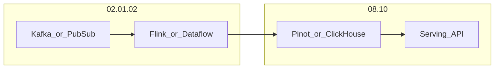

# Real-Time Analytics Architecture

## Definition

Real-time analytics architecture delivers sub-second query and dashboard results on continuously arriving data. It sits **downstream** of stream processing (02.07) and focuses on **serving engines** — not event transport or transformation.

## Boundary with 02.01.02

| Layer | Section | Responsibility |
| --- | --- | --- |
| Ingest & process | 02.01.02 | Events, CDC, stream processors, watermarks |
| Serve & query | 08.10 | OLAP stores, materialized views, low-latency APIs |

## Reference stack

## Related

- [08.10 README](../../README.md)
- [Streaming to Lakehouse](../../02_Data_Engineering_Architecture/01_Data_Ingestion_Architecture/02_Streaming/04_Architecture_Patterns/05_Reference_Architectures/03_Streaming_To_Lakehouse.md)
- [ClickHouse](../08.10.01_ClickHouse/README.md)
