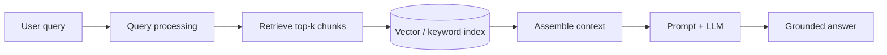

# What Is RAG

## Definition

**Retrieval-Augmented Generation (RAG)** is an architecture pattern that grounds large language model (LLM) responses in **retrieved enterprise knowledge** rather than model weights alone. At query time, the system searches a curated corpus (vector index, keyword index, or hybrid), injects the top-ranked passages into the prompt, and asks the LLM to answer using that evidence.

RAG reduces hallucinations, enables answers on private and fresh data, and provides **citable context** for governance and audit.

## Core flow

## RAG vs alternatives

| Approach | Strengths | Weaknesses | Best when |
| --- | --- | --- | --- |
| **RAG** | Fresh data, citations, lower training cost | Retrieval quality bounds answers | Enterprise Q&A, copilots, support |
| **Fine-tuning** | Style, task format, domain tone | Expensive refresh; private data in weights | Stable task with fixed knowledge |
| **Prompt-only** | Fastest to prototype | No private corpus; stale knowledge | Generic tasks, public knowledge |
| **Tool / agent APIs** | Live systems, actions | Higher latency and orchestration cost | Transactional workflows |

## Enterprise capabilities

- **Ingestion pipeline**: Parse, clean, chunk, embed, and index documents with metadata and ACLs.
- **Retrieval stack**: Dense, sparse, hybrid search, reranking, and query transformation.
- **Generation controls**: Prompt templates, citation requirements, safety filters.
- **Evaluation**: Grounding, faithfulness, latency, and cost per query.
- **Governance**: Source lineage, PII handling, retention, and access policies.

## Related

- [RAG Architecture Overview](02_RAG_Architecture_Overview.md)
- [Retrieval Augmented Generation Pattern](03_Retrieval_Augmented_Generation_Pattern.md)
- [Data Pipelines](../07_Orchestration_And_Pipelines/01_Data_Pipelines.md)
