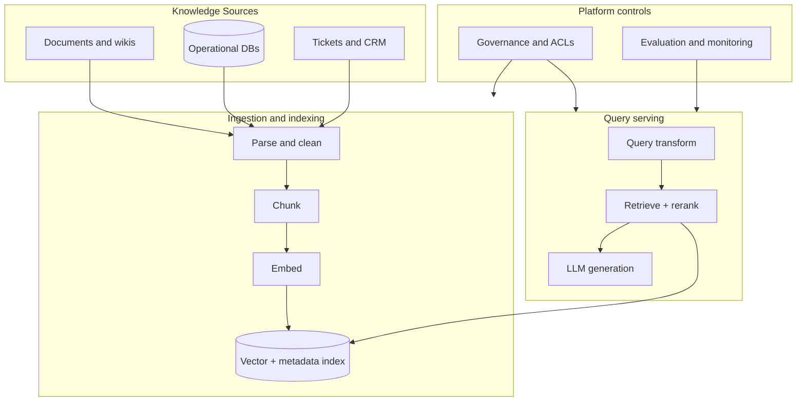

# RAG Architecture Overview

## Context

Enterprise RAG platforms connect **authoritative data sources** to **consumption surfaces** (chat copilots, APIs, agents) through a repeatable ingestion-to-inference pipeline. This overview defines the canonical layers and control points architects must design explicitly.

## Layered architecture

## Layer responsibilities

| Layer | Responsibility | Key topics |
| --- | --- | --- |
| **Sources** | Authoritative content with ownership and freshness SLAs | SharePoint, Confluence, S3, APIs |
| **Ingestion** | Parse → clean → chunk → embed → index with lineage | [Document Parsing](../02_Ingestion_And_Parsing/01_Document_Parsing.md), [Chunking](../03_Chunking_And_Embedding/01_Chunking_Strategies.md) |
| **Storage** | Vector DB + metadata filters + optional keyword index | [Vector Database Architecture](../04_Vector_Storage/01_Vector_Database_Architecture.md) |
| **Retrieval** | Recall + precision via hybrid search and reranking | [Retrieval Mechanisms](../05_Retrieval_And_Ranking/01_Retrieval_Mechanisms.md) |
| **Generation** | Prompting, citations, multi-LLM routing | [Prompt Engineering](../06_Generation_And_Prompting/01_Prompt_Engineering_Framework.md) |
| **Orchestration** | Batch, incremental, and streaming refresh | [Data Pipelines](../07_Orchestration_And_Pipelines/01_Data_Pipelines.md) |
| **Governance** | Security, compliance, cost | [GenAI Governance](../08_Enterprise_Platform/03_GenAI_Governance.md) |

## Non-functional requirements

| NFR | Design implication |
| --- | --- |
| **Freshness** | Incremental indexing, CDC, webhook triggers |
| **Latency** | Cached embeddings, reranker budget, smaller context windows |
| **Accuracy** | Chunking quality, hybrid retrieval, evaluation gates |
| **Security** | Document-level ACLs enforced at retrieval time |
| **Cost** | Embedding batching, index tiering, query caching |

## Related

- [What Is RAG](01_What_Is_RAG.md)
- [Enterprise GenAI Platform](../08_Enterprise_Platform/04_Enterprise_GenAI_Platform.md)
- [GCP RAG Reference](../10_Reference_Architectures/01_GCP_RAG_Reference.md)
