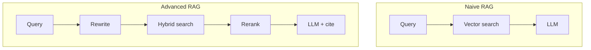

# Retrieval Augmented Generation Pattern

## Pattern intent

The **RAG pattern** separates **knowledge storage** from **reasoning**. Knowledge lives in searchable indexes built from enterprise corpora; the LLM performs language understanding and synthesis over retrieved evidence at request time.

## Pattern structure

| Role | Component | Failure mode if weak |
| --- | --- | --- |
| **Knowledge plane** | Parsed chunks + embeddings + metadata | Irrelevant or stale context |
| **Retrieval plane** | Search, filter, rerank | Missed documents (low recall) or noise (low precision) |
| **Generation plane** | LLM + prompt + guardrails | Hallucination despite good retrieval |
| **Feedback plane** | Evals, thumbs, logging | Silent quality regression |

## Variants

| Variant | Description | When to use |
| --- | --- | --- |
| **Naive RAG** | Single embedding search → prompt | POCs, small corpora |
| **Advanced RAG** | Query rewrite, hybrid search, rerank, compression | Production enterprise search |
| **Modular RAG** | Swappable parsers, retrievers, generators | Multi-tenant platforms |
| **Agentic RAG** | Agent plans retrieval steps and tool calls | Multi-hop research, complex tasks |
| **Graph RAG** | Knowledge graph + vector retrieval | Entity-heavy domains |

## Design rules

1. **Retrieve before generate** — never rely on the model to recall private facts from weights.
2. **Enforce ACLs at retrieval** — filter by user identity and document permissions.
3. **Measure retrieval separately** from generation quality (hit rate, MRR, nDCG).
4. **Version indexes** with embedding model and chunking policy changes.
5. **Prefer citations** in user-facing answers for auditability.

## Related

- [Retrieval Mechanisms](../05_Retrieval_And_Ranking/01_Retrieval_Mechanisms.md)
- [Agentic RAG Architecture](../10_Reference_Architectures/04_Agentic_RAG_Architecture.md)
- [RAG vs Fine Tuning](04_RAG_vs_Fine_Tuning.md)
