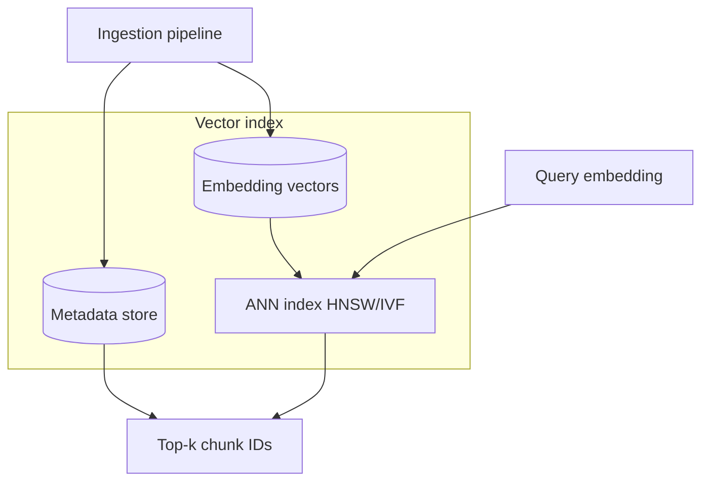

# Vector Database Architecture

## Role in RAG

The **vector database** (or vector-capable index) stores embedding vectors and metadata for each chunk. It supports approximate nearest neighbor (ANN) search to retrieve semantically similar content at query time, usually combined with metadata filters for security and domain scoping.

## Logical components

## Architecture decisions

| Decision | Options | Trade-off |
| --- | --- | --- |
| **Deployment** | Managed SaaS, self-hosted, DB extension | Ops vs control |
| **Index type** | HNSW, IVF, disk-based | Recall vs memory vs cost |
| **Hybrid search** | Native hybrid vs dual indexes | Keyword + semantic quality |
| **Multi-tenancy** | Namespace per tenant vs shared index + ACL filter | Isolation vs cost |
| **Sharding** | By collection, by tenant, by time | Scale-out strategy |

## Data model

Each indexed item typically includes:

- `chunk_id`, `document_id`, `source_uri`
- `embedding` (fixed dimension per model)
- `text` or pointer to object storage
- `metadata` — ACL, product, language, `effective_date`, `chunk_index`

## Related

- [Vector Database Selection](02_Vector_Database_Selection.md)
- [Embedding Models](../03_Chunking_And_Embedding/02_Embedding_Models.md)
- [Metadata Extraction](../02_Ingestion_And_Parsing/03_Metadata_Extraction.md)
