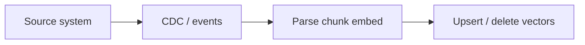

# Incremental and Streaming Ingestion

## Problem

Enterprise corpora change continuously. Full re-indexing is costly and causes retrieval inconsistency. RAG platforms need **incremental**, **CDC-driven**, or **event-stream** ingestion to keep indexes aligned with source systems.

## Patterns

| Pattern | Trigger | Consistency |
| --- | --- | --- |
| **Scheduled delta** | Cron compares `updated_at` | Minutes to hours lag |
| **CDC** | DB binlog / Debezium | Near-real-time |
| **Object events** | S3/GCS Pub/Sub notifications | Seconds |
| **Webhook** | CMS publish event | Seconds |
| **Tombstone deletes** | Delete events remove vectors | Required for GDPR |

## Design rules

1. Propagate **document deletes** and permission revocations to the index.
2. Use **idempotent** chunk IDs (`doc_id + version + chunk_index`).
3. Run **embedding version gates** — re-embed when model changes.
4. Monitor **index lag** and **staleness SLAs** per collection.

## Related

- [Data Pipelines](01_Data_Pipelines.md)
- [Metadata Extraction](../02_Ingestion_And_Parsing/03_Metadata_Extraction.md)
