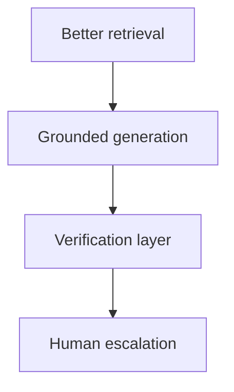

# Hallucination Mitigation

## Sources of hallucination in RAG

| Cause | Mitigation |
| --- | --- |
| Poor retrieval (empty or wrong chunks) | Hybrid search, rerank, query rewrite |
| Context overflow / lost-in-the-middle | Rerank, compress, fewer chunks |
| Model tendency to invent | Low temperature, citation-required prompts |
| Stale index | Incremental ingestion, freshness metadata |
| Ambiguous query | Clarifying questions, disambiguation metadata |

## Defense in depth

## Related

- [Grounding and Faithfulness](02_Grounding_And_Faithfulness.md)
- [GenAI Governance](../08_Enterprise_Platform/03_GenAI_Governance.md)
