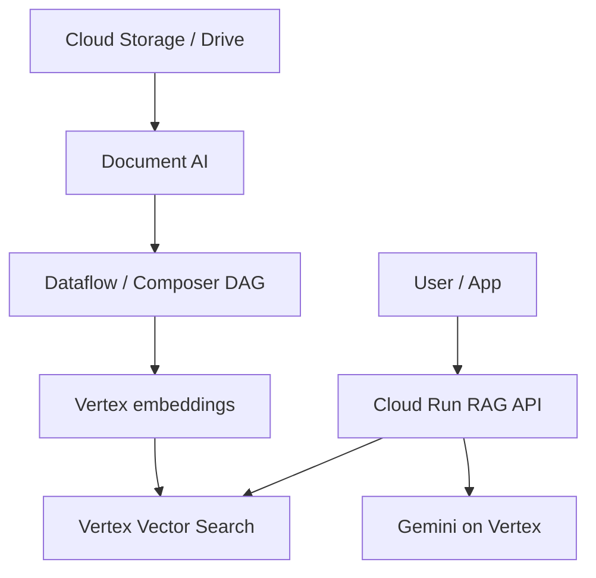

# GCP RAG Reference Architecture

## Overview

Canonical GCP stack for enterprise RAG: **Document AI** and **Cloud Storage** for ingestion, **Vertex AI** embeddings and models, **Vertex AI Vector Search** (or AlloyDB pgvector) for retrieval, **Cloud Run / GKE** for orchestration.

## Component map

| Capability | GCP service |
| --- | --- |
| Parsing | Document AI, Unstructured on GCE |
| Orchestration | Cloud Composer, Workflows |
| Embeddings | `text-embedding` models on Vertex |
| Vector index | Vertex AI Vector Search |
| Generation | Gemini 1.5+ on Vertex |
| Governance | VPC-SC, CMEK, IAM, Model Garden policies |

## Related

- [RAG Architecture Overview](../01_Fundamentals/02_RAG_Architecture_Overview.md)
- [Data Pipelines](../07_Orchestration_And_Pipelines/01_Data_Pipelines.md)
