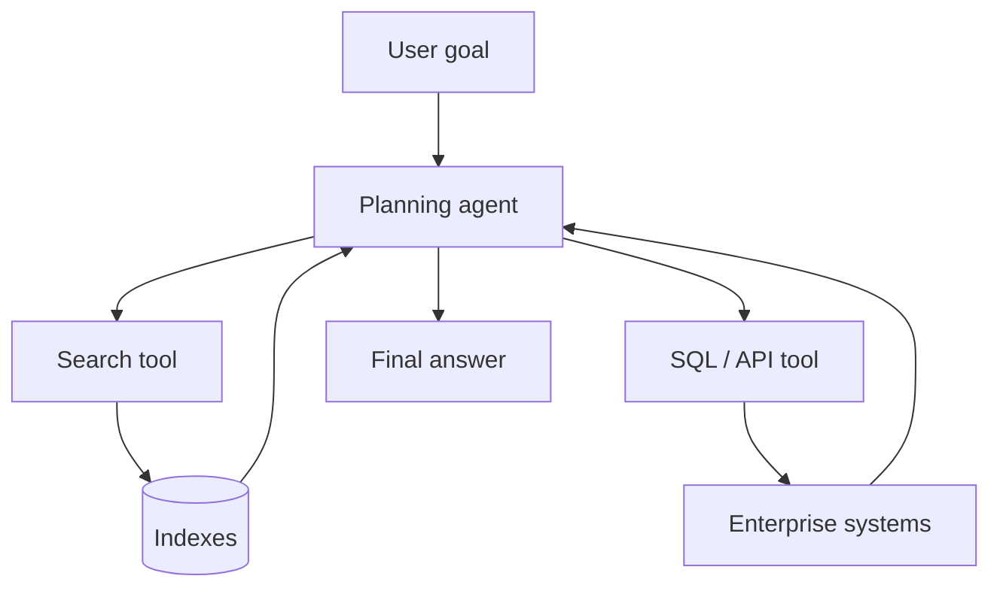

# Agentic RAG Architecture

## Definition

**Agentic RAG** uses an LLM **agent** to plan retrieval: reformulating queries, choosing indexes, calling search tools iteratively, and synthesizing multi-hop answers. It extends naive single-shot RAG for complex research tasks.

## When to adopt

| Signal | Action |
| --- | --- |
| Single retrieval pass insufficient | Add agent loop with max steps |
| Multiple corpora / tools | Agent routing |
| Strict latency SLA | Prefer advanced RAG over agent |

## Related

- [Agentic AI Architecture](../../12_Agentic_AI_Architecture/README.md)
- [Retrieval Augmented Generation Pattern](../01_Fundamentals/03_Retrieval_Augmented_Generation_Pattern.md)
