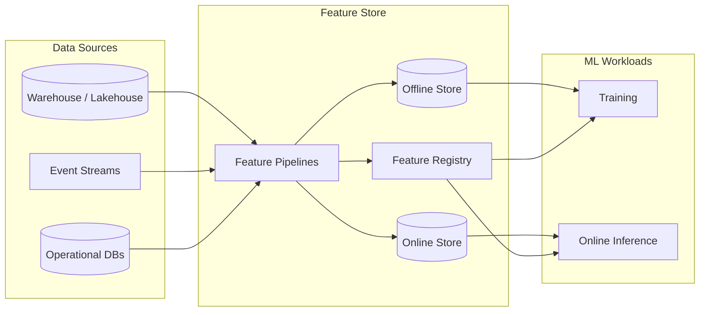

# What Is a Feature Store

## Definition

A **feature store** is a governed platform layer that manages the **lifecycle of ML features** — from definition and engineering through offline training materialization and low-latency online serving. It provides a single contract for how features are named, versioned, computed, stored, discovered, and consumed by training and inference workloads.

The feature store sits between raw data platforms (lakehouse, warehouse, streams) and ML systems (training pipelines, model registries, serving endpoints). It ensures the **same feature logic** powers batch training and real-time prediction.

## Core responsibilities

| Responsibility | Description |
| --- | --- |
| **Feature definition** | Entities, feature groups, schemas, and transformation logic registered as reusable assets |
| **Offline store** | Historical feature values for training, backtesting, and batch scoring at scale |
| **Online store** | Low-latency key-value or wide-column lookups for inference and decisioning |
| **Point-in-time correctness** | Training datasets join features as they existed at event time, preventing leakage |
| **Discovery and reuse** | Catalog, search, and documentation so teams share features across models |
| **Governance** | Ownership, lineage, quality checks, and access control on feature assets |

## Architecture placement

## Feature store vs adjacent capabilities

| Capability | Focus | Relationship |
| --- | --- | --- |
| **Data warehouse / lakehouse** | General-purpose analytics tables | Source of truth for batch feature computation |
| **Stream processor** | Continuous event transformation | Computes real-time features pushed to online store |
| **Model registry** | Model artifacts and versions | Consumes features; does not own feature logic |
| **Vector database** | Embedding storage and similarity search | Complementary for GenAI/RAG; not a substitute for tabular features |
| **MDM / golden record** | Master entity data | Entity keys often align; feature store adds ML-specific signals |

## When to adopt

Adopt a feature store when multiple models reuse overlapping signals, training-serving consistency is hard to maintain, or feature engineering is duplicated across teams. Start with a **hybrid offline/online** pattern and expand governance as feature reuse grows.

## Related

- [Why Feature Store](02_Why_Feature_Store.md)
- [Online vs Offline](03_Online_vs_Offline.md)
- [Feature Registry](../02_Core_Concepts/06_Feature_Registry.md)
- [Feature Store Overview](../../01_ML_Lifecycle/Feature_Store_Overview.md)
