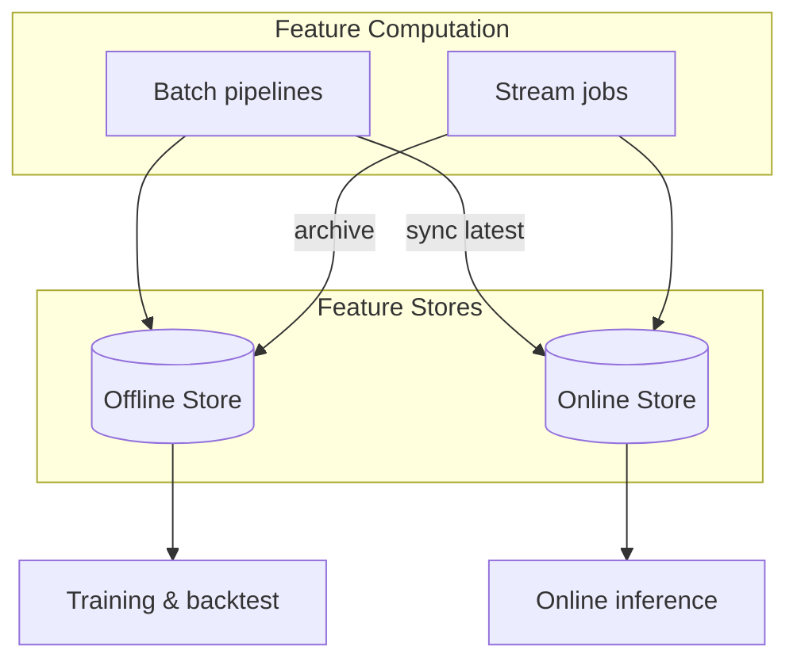

# Online vs Offline Feature Store

## Overview

Feature stores split storage and access patterns into **offline** (throughput-optimized, historical) and **online** (latency-optimized, current-state) tiers. Both are fed from the same feature definitions but differ in storage engine, freshness, and consumer API.

## Comparison

| Dimension | Offline store | Online store |
| --- | --- | --- |
| **Primary use** | Training, backtesting, batch scoring | Real-time inference, decision APIs |
| **Latency** | Seconds to hours (batch scans) | Milliseconds to low seconds |
| **Data volume** | Full history, partitioned by time | Latest values per entity key |
| **Access pattern** | Columnar scans, point-in-time joins | Key-value / row lookup by entity ID |
| **Typical engines** | BigQuery, Snowflake, Parquet on lake | Redis, DynamoDB, Bigtable, Cassandra |
| **Freshness** | Hourly / daily snapshots acceptable | Seconds to minutes for operational models |

## Data flow

## Synchronization strategies

| Strategy | Mechanism | Best when |
| --- | --- | --- |
| **Batch sync** | Scheduled job writes latest partition to online store | Features update hourly/daily |
| **Stream dual-write** | Flink/Spark Streaming updates both tiers | Near-real-time fraud, recommendations |
| **Lambda architecture** | Speed layer (stream) + batch correction | Complex aggregates with periodic reconciliation |
| **On-demand hydrate** | Online miss triggers async backfill | Sparse entity access patterns |

## Design rules

1. **Never train on online store snapshots** without point-in-time alignment — use offline history.
2. **Never recompute heavy aggregates at inference** if they already exist in the online store.
3. **Version sync jobs** alongside feature definition changes to avoid skew.
4. **Monitor lag** between stream event time and online store update time.

## Related

- [Batch Feature Store](../03_Architectural_Patterns/01_Batch_Feature_Store.md)
- [Realtime Feature Store](../03_Architectural_Patterns/02_Realtime_Feature_Store.md)
- [Hybrid Feature Store](../03_Architectural_Patterns/03_Hybrid_Feature_Store.md)
- [Online Feature Store](../../01_ML_Lifecycle/Online_Feature_Store.md)
- [Offline Feature Store](../../01_ML_Lifecycle/Offline_Feature_Store.md)
