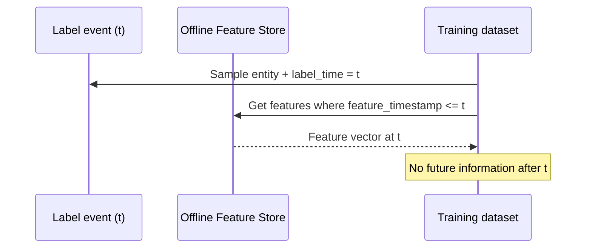

# Training Serving Skew

## Definition

**Training-serving skew** occurs when the feature values or distributions seen during model training differ from those encountered at inference time. Skew degrades model accuracy, breaks monitoring assumptions, and is a leading cause of production ML incidents.

Feature stores address skew by centralizing transformation logic and providing **point-in-time correct** historical retrieval for training alongside **identical definitions** for online materialization.

## Common skew sources

| Source | Training behavior | Serving behavior | Mitigation |
| --- | --- | --- | --- |
| **Different code paths** | SQL in training notebook | Python microservice at inference | Single registered transformation in feature store |
| **Temporal leakage** | Future data included in joins | Only past data available live | Point-in-time joins from offline store |
| **Aggregation window mismatch** | `7d` window computed on batch schedule | Window reset at midnight UTC vs local | Shared window definitions; explicit event time |
| **Missing defaults** | Null filled with training-set median | Null passed through | Centralized imputation policy in feature view |
| **Schema drift** | Old column name in historical export | Renamed column in serving API | Versioned feature groups + compatibility checks |
| **Sampling bias** | Training on labeled subset only | Scoring full population | Document population filters; monitor PSI |

## Point-in-time correctness

Point-in-time (PIT) joins retrieve feature values **as of each training label timestamp**, not as of export time.

## Detection and monitoring

- **Population Stability Index (PSI)** on key features between training and production.
- **Feature distribution dashboards** per model version and segment.
- **Shadow scoring** — run new feature pipeline in parallel before cutover.
- **Canary deployments** with skew alarms on top features.

## Architectural guardrails

1. Register features once; generate both offline and online materialization from the same spec.
2. Block promotion of feature versions failing schema/quality checks.
3. Tie model registry entries to **feature view versions** used in training.
4. Run periodic **backtest replay** with production serving payloads.

## Related

- [Why Feature Store](02_Why_Feature_Store.md)
- [Feature Views](../02_Core_Concepts/05_Feature_Views.md)
- [Quality](../06_Feature_Governance/03_Quality.md)
- [Feature Quality Framework](../../01_ML_Lifecycle/Feature_Quality_Framework.md)
