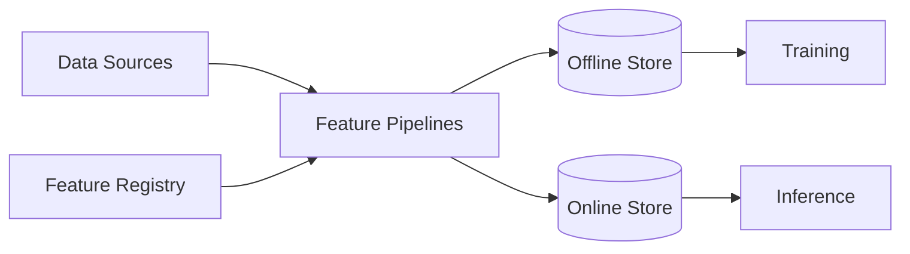

# Feature Registry

## Context

Metadata catalog of definitions, schemas, owners, and deployment status for all features. This topic is part of **08.05 Feature Store Architecture** under `02_Core_Concepts`.

## Scope

| In scope | Out of scope |
| --- | --- |
| Architectural patterns, integration points, and enterprise design choices | Vendor pricing, license negotiations, and hands-on CLI tutorials |
| How this capability fits offline/online feature lifecycles | Individual model hyperparameter tuning |
| Governance, security, and operational considerations | One-off notebook experiments without platform promotion |

## Key design considerations

- Align **entity keys** and **event time** semantics with upstream data products.
- Define **freshness SLAs** and monitoring for materialization jobs affecting this area.
- Plan **schema evolution** and backward-compatible feature view versions.
- Document **ownership** and escalation paths for production incidents.
- Validate **training-serving consistency** when promoting feature changes.

## Architecture notes

Extend this diagram for `Feature Registry`-specific components, storage engines, and control-plane integrations as the topic is elaborated.

## Related

- [Cataloging](../06_Feature_Governance/05_Cataloging.md)
- [Metadata](../06_Feature_Governance/01_Metadata.md)
