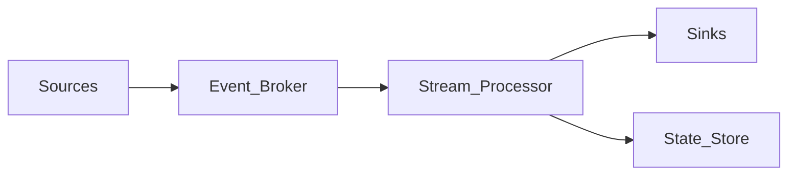

# What Is Stream Processing

## Definition

Stream processing continuously ingests unbounded event sequences, applies transformations in near real time, and emits results with low end-to-end latency — typically seconds to sub-second.

Unlike batch processing, there is no fixed input boundary; the system must handle late data, failures, and elastic scale while preserving correctness guarantees.

## Core concepts

| Concept | Description |
| --- | --- |
| Event stream | Ordered, append-only sequence of records keyed by event time |
| Operator | Stateful or stateless transformation (map, filter, aggregate, join) |
| Window | Bounded slice of event time for aggregations |
| Watermark | Progress marker for event-time completion |
| Sink | Durable output (topic, database, lakehouse table) |

## Architecture landscape

## When to use stream processing

| Scenario | Recommendation |
| --- | --- |
| Fraud detection, alerting | Stream processing required |
| Hourly reporting | Batch may suffice |
| CDC to lakehouse | Stream processing + micro-batch |
| Real-time dashboards | Stream processing + OLAP serving (section 10) |

## Related

- [What Is Event Driven Architecture](09.01.01.01_What_Is_Event_Driven_Architecture.md)
- [Event Time vs Processing Time](../09.01.03_Core_Concepts/09.01.03.02_Event_Time_vs_Processing_Time.md)
- [Flink Architecture](../../09.03_Open_Source/09.03.04_Apache_Flink/09.03.04.01_Flink_Architecture.md)
