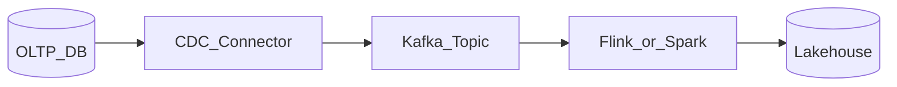

# Change Data Capture (CDC) Overview

## Definition

CDC streams database row-level changes (insert, update, delete) to downstream consumers in near real time, enabling event-driven integration without application code changes in the source system.

## CDC modes

| Mode | Mechanism | Latency | Source impact |
| --- | --- | --- | --- |
| Log-based | Read DB transaction log (WAL, binlog) | Low | Minimal |
| Trigger-based | DB triggers write to change table | Medium | Higher write load |
| Timestamp/query | Polling on `updated_at` | High | Simple but lossy |

**Enterprise default:** log-based CDC (Debezium, native cloud DMS) for operational systems.

## Reference flow

## Governance

- Capture **PII classification** before replication.
- Schema evolution must align with [Event Contracts](../../09.08_Integration_Patterns/09.08.04_Event_Contracts.md).
- Pipeline ingestion entry patterns live in section 02; CDC **streaming path** is canonical here.

## Related

- [Change Data Capture Patterns](09.01.04.02_Change_Data_Capture_Patterns.md)
- [Debezium Architecture](09.01.04.04_Debezium_Architecture.md)
- [Outbox Pattern](09.01.04.03_Outbox_Pattern.md)
