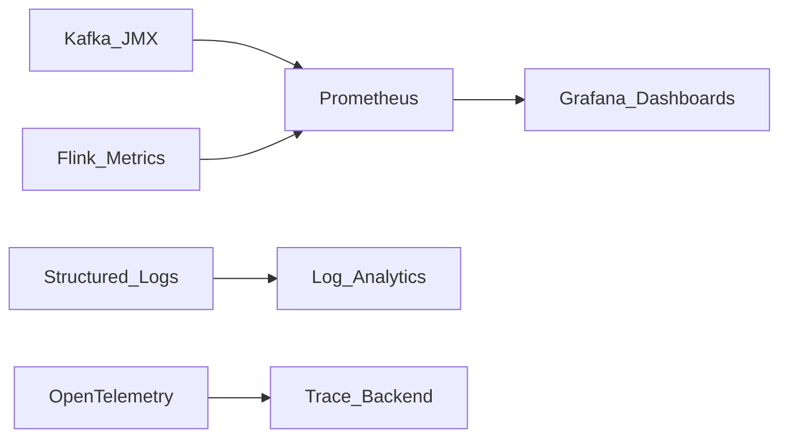

# Stream Observability

## Purpose

Observe streaming pipelines end-to-end: broker health, consumer lag, processing latency, checkpoint success, and data quality — distinct from batch pipeline observability (section 02.04).

## Golden signals for streaming

| Signal | Metrics | Alert threshold example |
| --- | --- | --- |
| Lag | `records-lag-max`, offset lag | Lag > 5 min for SLA tier-1 |
| Throughput | bytes in/out per partition | Drop > 50% vs baseline |
| Latency | end-to-end, p99 processing | p99 > SLA |
| Errors | deserialization, DLQ rate | DLQ rate > 0.1% |
| Checkpoint | duration, failures | 2 consecutive failures |

## Observability stack

## EventOps practices

- **Consumer group dashboards** per domain team.
- **Lineage** from source topic → job → sink (link to section 07.03).
- **Replay runbooks** — documented offset reset procedures with approval gates.
- **SLO dashboards** tied to [Stream SLA Framework](09.01.05.04_Stream_SLA_Framework.md).

## Related

- [EventOps Framework](09.01.05.01_EventOps_Framework.md)
- [Watermarks](../../../09.05_Benchmarks/09.05.02_Watermarks.md)
- [Data Observability](../../../02_Data_Engineering_Architecture/02.04_Data_Observability_Architecture/README.md)
