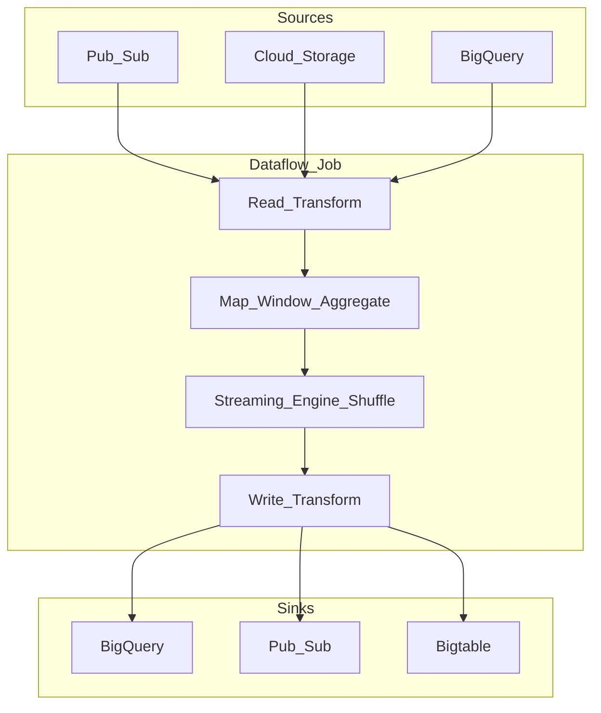

# Google Cloud Dataflow Architecture

Dataflow is Google's **fully managed Apache Beam runner** for batch and stream processing at scale. You author pipelines in Beam (Java, Python, Go); Dataflow provisions workers, executes the DAG, handles autoscaling, and integrates natively with Pub/Sub, BigQuery, Cloud Storage, and Spanner.

## Role in the enterprise

Use Dataflow as the **default GCP stream processor** when teams want managed operations, Beam portability, and tight integration with Pub/Sub and BigQuery — without operating Flink or Spark clusters.

| Choose Dataflow | Consider Flink / Spark instead |
| --- | --- |
| GCP-native streaming to BigQuery / Pub/Sub | Heavy Kafka Streams / ksqlDB on MSK |
| Beam SDK portability across runners | Team standardized on PySpark only |
| Managed autoscaling and Streaming Engine | Sub-10 ms latency with custom JVM tuning |
| FinOps via CUDs on 24/7 streams | On-prem or multi-cloud identical ops model |

## Core concepts

| Concept | Definition |
| --- | --- |
| **Pipeline** | Directed acyclic graph (DAG) of transforms over a `PCollection` |
| **PCollection** | Distributed dataset (bounded = batch, unbounded = stream) |
| **PTransform** | Operation: map, filter, group, window, join, I/O |
| **Worker** | VM executing pipeline stages; autoscaled by Dataflow service |
| **Runner** | Dataflow service orchestrates Beam pipeline on GCP |
| **Window** | Time boundary for aggregations (fixed, sliding, session) |
| **Trigger** | When pane results emit (event time, processing time) |
| **State & timers** | Per-key state for streaming joins and complex logic |
| **Shuffle** | Data redistribution between stages (batch: Dataflow Shuffle; stream: Streaming Engine) |

## Reference topology

## Architectural differentiators (vs. Flink / Spark Streaming)

| Dimension | Dataflow (Beam) | Apache Flink | Spark Structured Streaming |
| --- | --- | --- | --- |
| **Operations** | Fully managed runner, autoscaling | Managed or self-hosted cluster | Spark cluster (Dataproc / EMR / Databricks) |
| **Programming model** | Beam (portable); Dataflow-native I/O | Flink DataStream / Table API | DataFrame / SQL |
| **Shuffle / state** | Streaming Engine (off-worker) | RocksDB on TaskManagers | State store on executors |
| **Event time** | First-class watermarks in Beam | Native watermarks | Supported with constraints |
| **Exactly-once** | Pipeline streaming mode + sink contracts | Checkpoint + 2PC sinks | Micro-batch idempotency |
| **Batch** | Same SDK; Dataflow Shuffle | Batch on Flink | Unified batch/stream |
| **Portability** | Beam pipelines run on Flink, Spark, etc. | Flink-specific | Spark-specific |

### Streaming Engine

Streaming Engine moves shuffle and stateful processing into the **Dataflow service backend**, reducing worker memory pressure and enabling smaller worker machine types. **Always enable** for production streaming jobs.

### Autoscaling

Dataflow horizontal autoscaling adds/removes workers based on CPU utilization, backlog (for Pub/Sub sources), and throughput signals. Configure `maxNumWorkers` to cap cost; set `numWorkers` for minimum parallelism.

### FlexRS (batch only)

Flexible Resource Scheduling combines standard and preemptible VMs at ~40% discount on vCPU/memory for **batch** jobs with flexible start window (up to 6 hours).

## Pipeline modes

| Mode | Semantics | Cost | Use when |
| --- | --- | --- | --- |
| **Exactly-once streaming** | No duplicate outputs to supported sinks | Higher | Financial, billing, audit |
| **At-least-once streaming** | Duplicates possible | Lower | Metrics, logs, idempotent sinks |
| **Batch** | Bounded input, shuffle via Dataflow Shuffle | Per-job duration | ETL, backfill, daily aggregates |

## Performance tuning (summary)

- Enable **Streaming Engine** and prefer **resource-based billing** (Streaming Engine Compute Units).
- Right-size worker machine type — Streaming Engine allows smaller workers (e.g., `n4-standard-2`).
- Minimize hot keys in `GroupByKey` — causes shuffle skew.
- Use **fusion**-friendly transforms; avoid unnecessary materialization.
- For Pub/Sub sources: align `maxNumWorkers` with subscription throughput.
- Batch: enable **Dataflow Shuffle** (default) and consider **FlexRS** for cost-sensitive schedules.

## Security and governance

- IAM: `roles/dataflow.admin`, `roles/dataflow.worker`, least-privilege service account per pipeline.
- **Private IP** workers with VPC peering for data-plane isolation.
- Customer-managed encryption keys (CMEK) for persistent disk.
- Dataflow templates for governed, parameterized job launches.
- Audit logs via Cloud Logging; lineage to Dataproc Metastore optional.

## Learning guide

For hands-on depth — usage, scenarios, limits, costing, configuration recipes, evaluation, and benchmarks — see the [Dataflow Learning Guide](09.02.02.05_Dataflow_Learning_Guide/README.md).

## Related

- [Pub/Sub Architecture](09.02.02.01_Pub_Sub_Architecture.md)
- [Beam Dataflow Model](../../../09.03_Open_Source/09.03.06_Beam/09.03.06.01_Beam_Dataflow_Model.md)
- [Flink Architecture](../../../09.03_Open_Source/09.03.04_Apache_Flink/09.03.04.01_Flink_Architecture.md)
- [Streaming to Lakehouse](../../../09.04_Architecture_Patterns/09.04.05_Reference_Architectures/09.04.05.03_Streaming_To_Lakehouse.md)
- [Official Dataflow docs](https://cloud.google.com/dataflow/docs)
- [Official pricing](https://cloud.google.com/dataflow/pricing)
