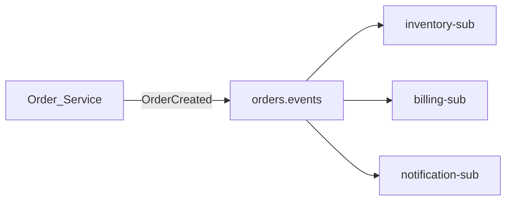

# 4. Pub/Sub Scenarios

## Scenario catalog

| # | Scenario | Pattern | Pub/Sub role |
| ---: | --- | --- | --- |
| 1 | Microservice domain events | Event notification | Topic per bounded context; subscription per consumer |
| 2 | Order fulfillment saga | Choreography | Order events fan-out to inventory, payment, shipping services |
| 3 | Real-time analytics | Stream ingest | Topic → Dataflow → BigQuery / Bigtable |
| 4 | CDC to data lake | CDC fan-out | Datastream → Pub/Sub → multiple warehouse subscribers |
| 5 | Audit and compliance log | Immutable stream | Topic with retention + BigQuery subscription |
| 6 | IoT telemetry ingress | High-volume ingest | Batched publish from gateway; regional topics |
| 7 | Serverless webhooks | Push to Cloud Run | Push subscription with OIDC auth |
| 8 | Mobile / client backend events | API → Pub/Sub | Backend validates and publishes; no direct client access |
| 9 | Cache invalidation | Fan-out | Config change event → CDN/Redis invalidation workers |
| 10 | ML feature pipeline | Near-real-time features | Events → Dataflow → Vertex AI feature store |
| 11 | Cross-team data products | Data mesh | Domain topics with schema contracts and IAM boundaries |
| 12 | Multi-cloud bridge | Import topic | Kinesis/MSK/Confluent import into GCP processing |
| 13 | Dead-letter remediation | DLQ replay | Failed messages to DLQ topic → manual/automated replay sub |
| 14 | Scheduled job triggers | Event-driven batch | Scheduler publishes to topic → Cloud Run worker |
| 15 | Fraud detection | Low-latency rules | Streaming pull → in-memory rules → alert topic |

## Detailed patterns

### Microservice domain events



- One topic per aggregate or bounded context event stream.
- Schema registry (Pub/Sub schema or Apicurio) for contract governance.
- See [Event Contracts](../../../09.08_Integration_Patterns/09.08.04_Event_Contracts.md).

### CDC fan-out

Datastream captures row changes → publishes to Pub/Sub → subscriptions feed BigQuery, Spanner replica, search index, and cache warmers **without** coupling source systems.

### Real-time analytics

```
Publishers → Pub/Sub → Dataflow (windowed aggregations) → BigQuery materialized views / Bigtable serving
```

Align windowing with [Windowing Strategies](../../../09.04_Architecture_Patterns/09.04.02_Stream_Processing_Patterns/09.04.02.01_Windowing_Strategies.md).

### Serverless event processing

Push subscription to Cloud Run with concurrency > 1; use idempotency keys in datastore for side effects. Scale to zero when idle — ideal for sporadic enterprise workflows.

### IoT and telemetry

Gateways batch device readings; use **ordering keys** per device when sequence matters. Filter subscriptions by `device_type` attribute for specialized pipelines.

## Scenario selection guide

| Requirement | Recommended scenario shape |
| --- | --- |
| < 100 ms notification | Push to Cloud Run in same region |
| > 100k msg/s sustained | Streaming pull + Dataflow or GKE with batching |
| Many downstream teams | Fan-out subscriptions with filters |
| Regulatory audit | Retention + BigQuery subscription + CMEK |
| Kafka estate migration | Import topic or dual-write bridge period |

## Related

- [Real-Time Configuration](09.02.02.04.07_Real_Time_Configuration.md)
- [Limitations](09.02.02.04.05_Limitations_And_Scenarios.md)
- [Outbox Pattern](../../../09.01_Fundamentals/09.01.04_CDC_Architecture/09.01.04.03_Outbox_Pattern.md)
