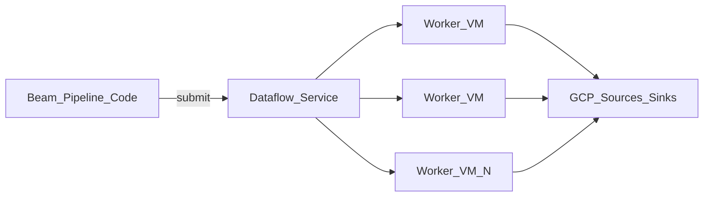

# 1. Dataflow Overview

## What is Google Cloud Dataflow?

Dataflow is a **fully managed service for executing Apache Beam pipelines** on Google Cloud. It runs batch and streaming data processing jobs with autoscaling workers, integrated monitoring, and native connectors to Pub/Sub, BigQuery, Cloud Storage, Spanner, and Bigtable.

You write **one pipeline**; Dataflow handles provisioning, scaling, shuffling, and fault recovery.

## Mental model



- **Beam** = programming model (portable across runners).
- **Dataflow** = managed GCP runner optimized for cloud I/O.
- **Workers** = Compute Engine VMs running your transforms (not user-managed directly).

## Batch vs streaming

| Type | Input | Execution | Billing profile |
| --- | --- | --- | --- |
| **Batch** | Bounded (GCS, BQ table, file sets) | Runs to completion | Pay for job duration + shuffle |
| **Streaming** | Unbounded (Pub/Sub, Kafka via IO) | Long-running until cancelled | 24/7 worker + Streaming Engine cost |

Same Beam SDK supports both — change source/sink and `PipelineOptions` streaming flag.

## When to use Dataflow

| Use Dataflow when… | Consider alternatives when… |
| --- | --- |
| Primary platform is GCP | Team mandate is Databricks / Spark only |
| Pub/Sub → BigQuery is core pattern | Ultra-low-latency CEP on Kafka with Flink ops team |
| Want managed autoscaling without cluster ops | Need Beam portability on existing Flink cluster |
| Batch ETL with FlexRS cost optimization | Simple scheduled SQL suffices (BigQuery scheduled queries) |
| Event-time windowing with managed watermarks | Lightweight transforms — Dataflow overhead unnecessary |

## Dataflow in the GCP streaming stack

```
Sources (Pub/Sub, GCS, BQ) → Dataflow (Beam) → Sinks (BQ, Pub/Sub, Bigtable, GCS)
```

Pub/Sub handles **transport**; Dataflow handles **computation**. See [Pub/Sub Learning Guide](../09.02.02.04_Pub_Sub_Learning_Guide/README.md) for messaging depth.

## Key capabilities

- Horizontal and vertical autoscaling
- Streaming Engine (managed shuffle/state backend)
- Exactly-once and at-least-once streaming modes
- Dataflow templates (flex and classic) for parameterized jobs
- SQL support via Beam SQL and BigQuery federation patterns
- Integration with Cloud Monitoring, Logging, Error Reporting
- FlexRS for discounted batch workloads
- Committed use discounts (CUDs) for steady streaming spend

## Learning path

Continue to [Architecture](09.02.02.05.02_Architecture.md) or jump to [Scenarios](09.02.02.05.04_Scenarios.md).

## Related

- [Dataflow Architecture](../09.02.02.02_Dataflow_Architecture.md)
- [How to Use](09.02.02.05.03_How_To_Use.md)
