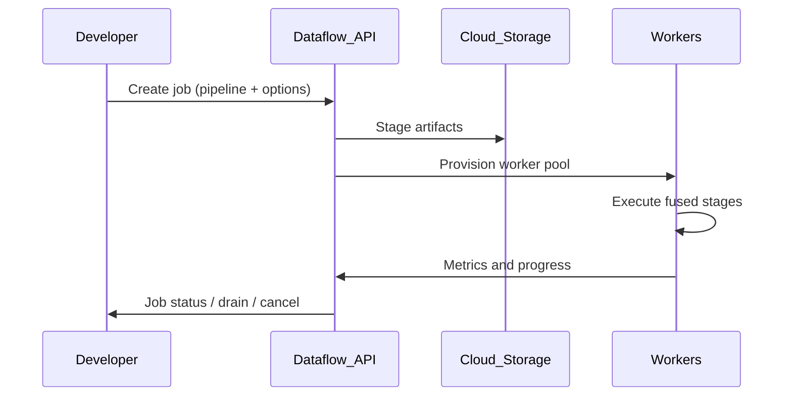

# 2. Architecture of Cloud Dataflow

## Service components

| Component | Responsibility |
| --- | --- |
| **Dataflow service** | Job scheduling, worker lifecycle, autoscaling, shuffle coordination |
| **Worker pool** | VMs executing fused pipeline stages |
| **Streaming Engine** | Managed shuffle + state for streaming (off-worker) |
| **Dataflow Shuffle** | Managed shuffle for batch pipelines |
| **Job graph** | Optimized execution plan from Beam pipeline (fusion, combiner lifting) |
| **Stager** | Stages pipeline artifacts to Cloud Storage before worker launch |

## Execution lifecycle



1. Submit pipeline with `PipelineOptions` (project, region, worker config, streaming).
2. Dataflow stages code and dependencies to GCS.
3. Workers boot with Dataflow worker harness.
4. Runner translates Beam graph to optimized Dataflow job graph.
5. Autoscaler adjusts worker count during execution.
6. Job completes (batch) or runs until cancelled/drained (streaming).

## Worker architecture

Default batch worker (without Streaming Engine shuffle on worker): **1 vCPU, 3.25 GiB RAM**, persistent disk.

Streaming with Streaming Engine: smaller disks suffice — workers hold less shuffle/state data.

| Setting | Purpose |
| --- | --- |
| `workerMachineType` | CPU/memory per worker (`n1-standard-4`, `n4-highmem-2`, etc.) |
| `diskSizeGb` | Local disk for staging and temp |
| `numWorkers` | Initial / minimum workers |
| `maxNumWorkers` | Autoscale ceiling |
| `autoscalingAlgorithm` | `THROUGHPUT_BASED` (streaming) or `NONE` |

## Shuffle and state

### Batch — Dataflow Shuffle

Shuffle data moves through the **Dataflow Shuffle service** rather than worker disks — better performance and scalability for large joins/group-bys. Billed per GiB shuffled.

### Streaming — Streaming Engine

Stateful transforms (`GroupByKey`, windows, side inputs) use Streaming Engine backend:

- Reduces worker memory for large state
- Enables smaller machine types
- Billed via **Streaming Engine Compute Units** (resource-based) or legacy **data processed** (GiB)

Enable resource-based billing:

```
--dataflowServiceOptions=enable_streaming_engine_resource_based_billing
```

## Event time and watermarks

Beam propagates **watermarks** through the DAG. When watermarks pass window end + allowed lateness, panes fire. Dataflow implements watermark aggregation across fused stages.

Critical for: [Windowing Strategies](../../../09.04_Architecture_Patterns/09.04.02_Stream_Processing_Patterns/09.04.02.01_Windowing_Strategies.md) and [Watermarks](../../../09.05_Benchmarks/09.05.02_Watermarks.md).

## Fault tolerance

| Job type | Recovery mechanism |
| --- | --- |
| **Streaming** | Checkpointing + persistent state in Streaming Engine; restart from last consistent position |
| **Batch** | Stage-level retry; FlexRS workers may be preempted and restarted |
| **Sources** | Pub/Sub: subscription cursor; GCS: file ranges re-read |

**Drain** — graceful shutdown completing in-flight windows before stop.

## Networking

- Workers in project VPC (default or custom) via **Private Google Access**.
- **Private IP** configuration keeps workers off public internet.
- Firewall rules for worker ↔ shuffle ↔ GCP APIs.

## IAM and service accounts

Pipeline runs as a **worker service account** needing:

- Read sources (Pub/Sub subscriber, GCS objectViewer, BigQuery dataViewer)
- Write sinks (BigQuery dataEditor, Pub/Sub publisher)
- Dataflow worker permissions (`dataflow.worker`, storage for staging bucket)

## Dataflow vs raw Beam on Flink runner

Same Beam pipeline code can target `FlinkRunner` or `DataflowRunner`. Dataflow adds GCP-managed I/O transforms, autoscaling policies, and Streaming Engine — not available when self-running Flink.

## Related

- [Overview](09.02.02.05.01_Overview.md)
- [How to Use](09.02.02.05.03_How_To_Use.md)
- [Streaming Engine docs](https://cloud.google.com/dataflow/docs/streaming-engine)
