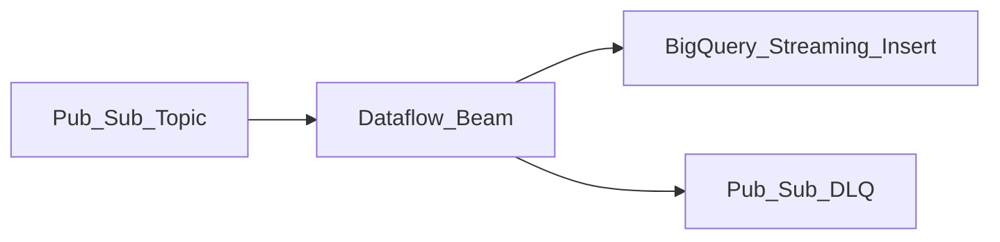

# 4. Dataflow Scenarios

## Scenario catalog

| # | Scenario | Type | Pattern |
| ---: | --- | --- | --- |
| 1 | Pub/Sub → BigQuery streaming ETL | Streaming | Real-time warehouse ingest |
| 2 | CDC changelog processing | Streaming | Datastream → Dataflow → BQ + cache |
| 3 | Real-time dashboards | Streaming | Windowed aggregates → Bigtable serving |
| 4 | Log analytics pipeline | Streaming | GCS/Pub/Sub logs → parse → BQ |
| 5 | Fraud detection rules | Streaming | Stateful CEP-style filters |
| 6 | Sessionization | Streaming | Session windows per user |
| 7 | Daily batch ETL | Batch | GCS raw → transform → BQ curated |
| 8 | Backfill reprocessing | Batch | Replay GCS archive after schema change |
| 9 | ML feature computation | Streaming | Beam → Vertex AI Feature Store |
| 10 | Data quality validation | Streaming | Great Expectations / custom rules → DLQ topic |
| 11 | Multi-tenant SaaS metering | Streaming | Usage events → billing aggregates |
| 12 | IoT anomaly detection | Streaming | Pub/Sub telemetry → z-score windows |
| 13 | Order pipeline enrichment | Streaming | Join stream with side input (dim tables) |
| 14 | GDPR deletion propagation | Batch | Orchestrated delete signals across stores |
| 15 | Hybrid cloud ingest | Streaming | Import topic → Dataflow → lakehouse |

## Detailed patterns

### Pub/Sub → BigQuery (canonical GCP pattern)



- Parse JSON/Avro; apply schema validation.
- Use `WRITE_APPEND` with partitioning on `event_date`.
- Dead-letter malformed records to Pub/Sub DLQ topic.
- See [Streaming to Lakehouse](../../../09.04_Architecture_Patterns/09.04.05_Reference_Architectures/09.04.05.03_Streaming_To_Lakehouse.md).

### CDC fan-out with Dataflow

Datastream publishes row changes to Pub/Sub. Dataflow:

1. Deduplicates by primary key + sequence
2. Routes to typed BigQuery tables
3. Publishes cache-invalidation events

### Real-time serving layer

```
Pub/Sub → Dataflow (1-min tumbling windows) → Bigtable row keys by entity_id
```

Front-end reads Bigtable for sub-second dashboards; BigQuery for historical drill-down.

### Batch FlexRS ETL

Nightly job: read partitioned Avro in GCS → aggregate → load BQ. Enable FlexRS for ~40% compute discount with 6-hour scheduling flexibility.

### Side-input enrichment

Streaming order events enriched with product catalog from BigQuery side input (periodically refreshed) or Spanner lookup — watch hot-key skew on popular products.

## Scenario selection

| Requirement | Dataflow approach |
| --- | --- |
| < 1 min analytics latency | Streaming, 30–60 s windows |
| Hourly regulatory report | Batch scheduled via Cloud Composer / Workflows |
| Exactly-once billing | Streaming exactly-once + BQ dedup keys |
| Cost-sensitive batch | FlexRS + right-sized workers |
| Complex joins at scale | Streaming Engine + sufficient `maxNumWorkers` |

## Related

- [Pub/Sub Scenarios](../09.02.02.04_Pub_Sub_Learning_Guide/09.02.02.04.04_Scenarios.md)
- [Real-Time Configuration](09.02.02.05.07_Real_Time_Configuration.md)
- [Windowing Strategies](../../../09.04_Architecture_Patterns/09.04.02_Stream_Processing_Patterns/09.04.02.01_Windowing_Strategies.md)
