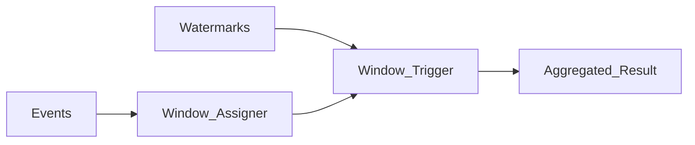

# Windowing Strategies

## Purpose

Windows bound unbounded streams into finite sets for aggregations (counts, sums, sessionization). Choice of window type drives correctness, latency, and state cost.

## Window types

| Type | Behavior | Typical use |
| --- | --- | --- |
| Tumbling | Fixed, non-overlapping slices | Per-minute metrics |
| Sliding | Fixed size, fixed slide interval | Moving averages |
| Session | Gap-based dynamic boundaries | User activity sessions |
| Global | Single window per key (caution) | Rare; needs triggers |

## Event time vs processing time

Always prefer **event time** windows for business correctness. Processing-time windows are acceptable only for operational telemetry where ordering is unimportant.

## Late data handling

Pair windows with **watermarks** and **allowed lateness** policies. See [Watermarks and Late Data](09.04.02.02_Watermarks_and_Late_Data.md) and the canonical [Watermarks](../../09.05_Benchmarks/09.05.02_Watermarks.md) deep dive.

## Expert guidance

- Session windows explode state for high-cardinality keys — cap cardinality or pre-aggregate.
- Sliding windows with small slide intervals multiply state; prefer tumbling + downstream rollups when possible.
- Align window size with SLA: alerting windows should close before user-facing SLA breach.

## Related

- [Event Time vs Processing Time](../../09.01_Fundamentals/09.01.03_Core_Concepts/09.01.03.02_Event_Time_vs_Processing_Time.md)
- [Stream Processing Patterns](09.04.02.03_Stream_Table_Duality.md)
