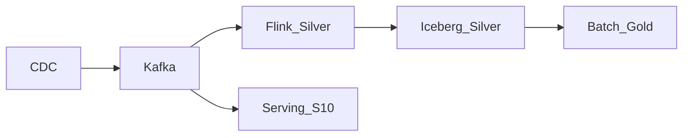

# Streaming to Lakehouse

## Pattern

Continuously land curated stream outputs into lakehouse tables (Delta Lake, Iceberg, Hudi) for batch analytics, ML features, and compliance — while keeping Kafka as the real-time system of motion.

## Medallion streaming alignment

| Layer | Stream role | Table type |
| --- | --- | --- |
| Bronze | Raw CDC / events | Append-only, schema-on-read |
| Silver | Cleansed, conformed | Upserts, deduped keys |
| Gold | Aggregates for BI | Materialized metrics |

## Design decisions

- **Upsert semantics** — primary keys from CDC; handle out-of-order updates with event time.
- **Compaction** — align Kafka retention with lakehouse time travel requirements.
- **Schema evolution** — backward-compatible Avro/Protobuf in schema registry.
- **Latency SLA** — bronze near-real-time; gold may remain micro-batch.

## Related

- [CDC Overview](../../09.01_Fundamentals/09.01.04_CDC_Architecture/09.01.04.01_CDC_Overview.md)
- [Lakehouse Architecture](../../../03_Data_Storage_Architecture/03.03_Lakehouse/Lakehouse_Architecture.md)
- [Real-Time Analytics Architecture](../../../10_Real_Time_Analytics_Architecture/10.05_Streaming_Analytics/Real_Time_Analytics_Architecture.md)
