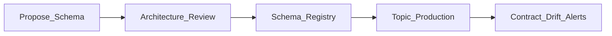

# Event Contracts

## Definition

An event contract is the **published API** between event producers and consumers: schema, compatibility rules, SLAs, and ownership — analogous to REST OpenAPI for async events.

## Contract components

| Element | Description |
| --- | --- |
| Schema | Avro, Protobuf, or JSON Schema in registry |
| Compatibility mode | BACKWARD, FULL, etc. |
| Ownership | Producer team, on-call, deprecation policy |
| SLA | Availability, max lag, payload size limits |
| Security | Classification, encryption requirements |

## Compatibility strategy

- **Backward compatible** changes (add optional fields) — default for most enterprises.
- **Breaking changes** — new subject/version or new topic with dual-write migration period.
- **Contract testing** — consumer-driven tests in CI (Pact, schema validation).

## Governance workflow

## Related

- [Event Schema Management](09.08.03_Event_Schema_Management.md)
- [Event Versioning](09.08.05_Event_Versioning.md)
- [Data Contracts](../../../06_Data_Product_Architecture/06.08_Data_Contracts/Data_Contracts.md)
