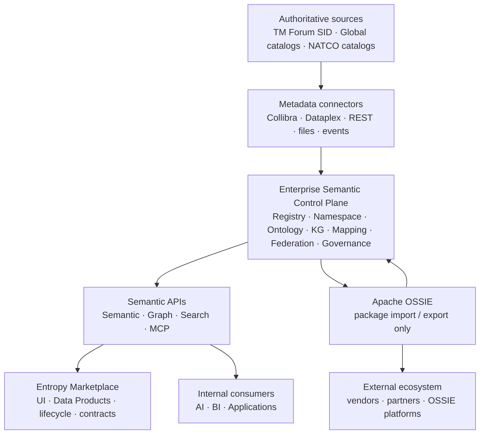
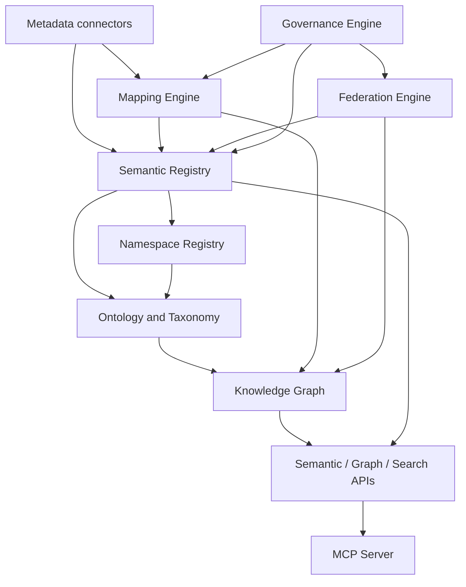
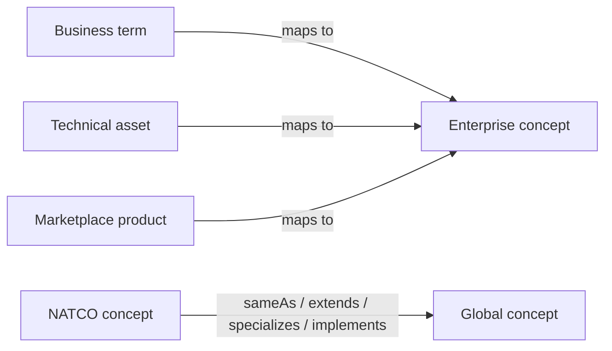
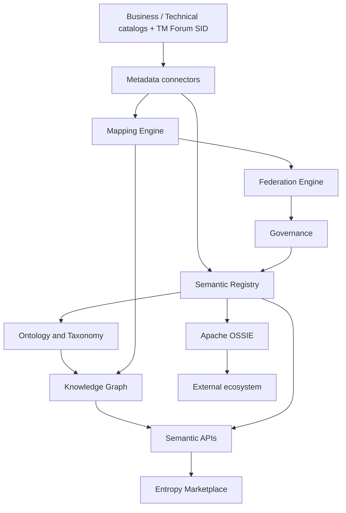

---

## title: Enterprise Semantic Control Plane Architecture
section: "10.05.01.05"
status: draft
template: architecture
owner: Enterprise Architecture
last_reviewed: 2026-07-22
tags:
  - semantic-platform
  - enterprise-semantics
  - metadata
  - ontology
  - knowledge-graph
  - ossie
  - marketplace
canonical: true

# Enterprise Semantic Control Plane

## Purpose

The **Enterprise Semantic Control Plane** is the enterprise-wide semantic backbone for data, metadata, and business knowledge.

It federates metadata from **Global** and **NATCO** business and technical catalogs, aligns them to enterprise semantic concepts, enriches the **Entropy Data Marketplace**, and publishes standardized semantic packages via **Apache OSSIE** for interoperability with external ecosystems.

Unlike metadata catalogs, the Semantic Control Plane is the **System of Record for Enterprise Meaning**.

Federation operating model: [Multi-NATCO Federation](07.%20Multi-NATCO%20Federation.md).  
SoR boundaries (DA-01): [Systems of Record](08.%20Systems%20of%20Record.md).

## Vision

One enterprise semantic model that enables:

- Consistent business terminology
- Common enterprise ontology
- Cross-NATCO semantic alignment
- AI-ready enterprise knowledge
- Data product enrichment
- Open semantic interoperability

## Design principles


| Principle               | Description                                                  |
| ----------------------- | ------------------------------------------------------------ |
| **Headless platform**   | Backend services only. UI is provided by Entropy Marketplace |
| **API first**           | Every capability is exposed through APIs                     |
| **Federated ownership** | Global and NATCO teams continue owning their metadata        |
| **Semantic governance** | Enterprise meaning is centrally governed                     |
| **Standards based**     | TM Forum SID and Apache OSSIE adopted wherever possible      |
| **Extensible**          | New catalogs and domains can be added without redesign       |


---

## Architecture overview

### A. Control plane context (main spine)




### B. Control plane internals




### C. Mapping and federation (who links to whom)




### D. Reference topology

```text
                 Authoritative sources
   TM Forum SID · Global Biz/Tech · NATCO Biz/Tech
                         │
                         ▼
                 Metadata connectors
                         │
    ╔════════════════════▼════════════════════╗
    ║   ENTERPRISE SEMANTIC CONTROL PLANE     ║
    ║   (SoR for Enterprise Meaning · headless)║
    ║                                         ║
    ║  Semantic Registry · Namespace Registry ║
    ║  Ontology & Taxonomy · Knowledge Graph  ║
    ║  Mapping Engine · Federation Engine     ║
    ║  Governance Engine                      ║
    ╚════════════════════╤════════════════════╝
                         │
                         ▼
                   Semantic APIs
              (+ Graph · Search · MCP)
                         │
          ┌──────────────┼──────────────┐
          ▼              ▼              ▼
   Entropy Marketplace   AI / BI      Applications
   (UI · products SoR)
          │
          ▼
     Apache OSSIE  ←→  External ecosystem
     (packages only)
```

---

## Platform responsibilities

### What the control plane owns

Canonical semantic backbone:

- Enterprise concepts and business meaning
- Canonical ontology / taxonomy
- Namespace management (`global`, NATCO scopes)
- Knowledge graph
- Semantic mappings (business / technical / product)
- Federation (Global ↔ NATCO)
- Governance, validation, audit

### What the platform does **not** own

The platform does **not** replace existing metadata systems.

**Canonical SoR freeze (DA-01):** [Systems of Record Boundaries](08.%20Systems%20of%20Record.md).


| Capability                    | System of record                                 |
| ----------------------------- | ------------------------------------------------ |
| Business glossary / terms     | Collibra / Dataplex (per unit)                   |
| Technical metadata            | Collibra / Dataplex (per unit)                   |
| Data products                 | **Entropy Marketplace**                          |
| Industry standards (source)   | **TM Forum SID**                                 |
| **Enterprise meaning**        | **Semantic Control Plane**                       |
| Semantic interchange packages | **Apache OSSIE** (exchange only — **not** a SoR) |


---

## Platform components

### 1. Semantic Registry

Stores enterprise semantic concepts (e.g. Customer, Account, SIM, Product, Contract).

**Canonical schema (DA-04):** [Semantic Registry Schema](11.%20Semantic%20Registry%20Schema.md).  
**Pilot SID seed (DA-03):** [TM Forum SID Pilot Slice](10.%20TM%20Forum%20SID%20Pilot%20Slice.md).


| Capability         | Notes                                                 |
| ------------------ | ----------------------------------------------------- |
| CRUD               | Create / read / update / retire concepts              |
| Versioning         | Immutable URI; monotonic `version` + `effective_from` |
| Status / lifecycle | Draft → review → approved → deprecated                |
| Ownership          | Global or NATCO steward                               |


### 2. Namespace Registry

Maintains semantic namespaces (e.g. Global, Germany, Turkey, UK).

**Canonical model (DA-02):** [Namespace Registry](09.%20Namespace%20Registry.md).


| Capability        | Notes                                                    |
| ----------------- | -------------------------------------------------------- |
| Hierarchy         | `global` + `natco-{iso}` (+ optional `import-`* staging) |
| Ownership / scope | Global COE vs NATCO Data Office                          |
| Visibility        | `enterprise` | `natco` | `restricted` | `staging`        |


### 3. Ontology & Taxonomy

Enterprise knowledge modeling: ontology, taxonomy, classification, hierarchies, canonical definitions.

**Canonical structure (DA-06):** [Ontology and Taxonomy](13.%20Ontology%20and%20Taxonomy.md).  
**Predicates (DA-07):** [Predicate Catalog](14.%20Predicate%20Catalog.md).

### 4. Knowledge Graph

Connects semantic objects (e.g. Customer —owns→ Account —contains→ SIM —belongsTo→ Product).

**Canonical logical model (DA-13):** [Knowledge Graph Logical Model](18.%20Knowledge%20Graph%20Logical%20Model.md).


| Capability             | Notes                  |
| ---------------------- | ---------------------- |
| Traversal / neighbors  | Context for API and AI |
| Relationship discovery | Suggested edges        |
| Impact analysis        | Change blast radius    |


Detail: [03. Enterprise Knowledge Graph](../03.%20Enterprise%20Knowledge%20Graph/).

### 5. Mapping Engine

Maps external metadata into enterprise concepts.

**Canonical contracts (DA-08/09/10):** [Mapping Contracts](15.%20Mapping%20Contracts.md).


| From                     | To      | Mapping type         |
| ------------------------ | ------- | -------------------- |
| Business term            | Concept | `mapsTo` (DA-08)     |
| Technical table / column | Concept | `represents` (DA-09) |
| Marketplace product      | Concept | `implements` (DA-10) |


Supports confidence scoring. See also [Business](../05.%20Enterprise%20Mapping/01.%20Business%20Mapping.md) / [Technical](../05.%20Enterprise%20Mapping/02.%20Technical%20Mapping.md) / [Data Product](../05.%20Enterprise%20Mapping/03.%20Data%20Product%20Mapping.md) mapping.

### 6. Federation Engine

Aligns Global and NATCO semantics.

**Canonical rules (DA-11):** [Federation Engine Rules](16.%20Federation%20Engine%20Rules.md).


| Capability | Predicates / behavior                                |
| ---------- | ---------------------------------------------------- |
| Alignment  | `sameAs`, `extends`, `specializes`, `implements`     |
| Quality    | Conflict detection, harmonization, resolve algorithm |


Product binding: [Mapping Contracts](15.%20Mapping%20Contracts.md) § DA-10 · [Multi-NATCO Federation](07.%20Multi-NATCO%20Federation.md).

### 7. Governance Engine

Stewardship, approval workflow, policies, versioning, audit, lineage of semantic change.

**Canonical model (DA-12):** [Governance Engine](17.%20Governance%20Engine.md).

---

## Metadata sources


| Scope      | Sources                                           | Ownership   |
| ---------- | ------------------------------------------------- | ----------- |
| **Global** | Business catalog, technical catalog, TM Forum SID | Global unit |
| **NATCO**  | Business catalog, technical catalog               | That NATCO  |


Each NATCO owns and maintains its own metadata. The control plane **consumes** via connectors and does not replace catalog solutions.

---

## Metadata connectors


| Connector       | Role                              |
| --------------- | --------------------------------- |
| Collibra        | Business / technical (where used) |
| Dataplex        | Technical (where used)            |
| REST APIs       | Generic catalog / tool ingress    |
| File import     | Bulk / bootstrap                  |
| Event streaming | Incremental sync                  |


Responsibilities: ingestion, synchronization, change detection, incremental updates.

---

## Runtime APIs (headless)

Backend services only — no first-party semantics UI in the control plane.


| API              | Capabilities                                                          |
| ---------------- | --------------------------------------------------------------------- |
| **Semantic API** | Lookup, search, expand, validate, compare, resolve                    |
| **Graph API**    | Traverse, neighbors, path analysis, dependency analysis               |
| **Search API**   | Full-text, semantic, hybrid, vector                                   |
| **MCP Server**   | Context retrieval, semantic lookup, prompt enrichment, tool execution |


See [APIs](../07.%20Engineering/01.%20APIs.md).

---

## Apache OSSIE

**Not** a metadata repository. Provides **semantic interoperability**.


| Does                                                | Does not                                 |
| --------------------------------------------------- | ---------------------------------------- |
| Package / import / export / version semantic models | Own enterprise metadata                  |
| Exchange definitions with NATCOs, partners, tools   | Replace the control plane or Marketplace |


Package content: concepts, ontology, taxonomy, relationships, business glossary extracts, namespace definitions.

See [Apache Ossie](../02.%20Ontology/08.%20Apache%20Ossie.md).

---

## Integration with Marketplace


| Concern                                    | Owner                      |
| ------------------------------------------ | -------------------------- |
| UI / discovery UX                          | **Entropy Marketplace**    |
| Data products, lifecycle, contracts, ports | **Entropy Marketplace**    |
| Enterprise meaning                         | **Semantic Control Plane** |


Marketplace **consumes** Semantic, Search, and Graph APIs. The control plane **enriches** Marketplace products with enterprise meaning (mappings / `authoritativeDefinitions`).

---

## Consumers


| Internal                            | External                   |
| ----------------------------------- | -------------------------- |
| Entropy Marketplace                 | Vendors                    |
| AI agents                           | Partners                   |
| BI platforms                        | OSSIE-compatible platforms |
| Applications                        |                            |
| Domain experts (via Marketplace UI) |                            |


---

## Foundation platform


| Service                              | Role                           |
| ------------------------------------ | ------------------------------ |
| PostgreSQL                           | Transactional / registry store |
| Neo4j                                | Knowledge graph                |
| pgVector                             | Embeddings / vector search     |
| Redis                                | Cache                          |
| Kafka                                | Change events                  |
| Object storage                       | Packages / artifacts           |
| IAM                                  | Identity and access            |
| Monitoring / logging / observability | Operations                     |


---

## End-to-end flow




```text
Business / Technical catalogs + TM Forum SID
        → Metadata connectors
        → Semantic Registry → Ontology → Knowledge Graph
        → Mapping Engine → Federation Engine → Governance
        → Semantic APIs → Marketplace (+ AI / BI / Apps)
        → Apache OSSIE → External ecosystem
```

---

## Expected outcomes

- One enterprise semantic backbone
- Federated semantic governance (Global + NATCO ownership retained)
- Cross-NATCO alignment
- Canonical enterprise ontology
- AI-ready semantic context (API + MCP)
- Marketplace semantic enrichment (headless control plane)
- Open interoperability through Apache OSSIE
- Consistent enterprise vocabulary

---

## Related

- [Multi-NATCO Federation](07.%20Multi-NATCO%20Federation.md)
- [Vision](01.%20Vision.md)
- [Enterprise Semantics Plan](06.%20Enterprise%20Semantics%20Plan.md)
- [Entropy Semantics](../02.%20Ontology/09.%20Entropy%20Semantics.md)
- [Apache Ossie](../02.%20Ontology/08.%20Apache%20Ossie.md)
- [Data Product Mapping](../05.%20Enterprise%20Mapping/03.%20Data%20Product%20Mapping.md)
- [APIs](../07.%20Engineering/01.%20APIs.md)
- Runtime UI / products: [Entropy Data](https://www.entropy-data.com/)

