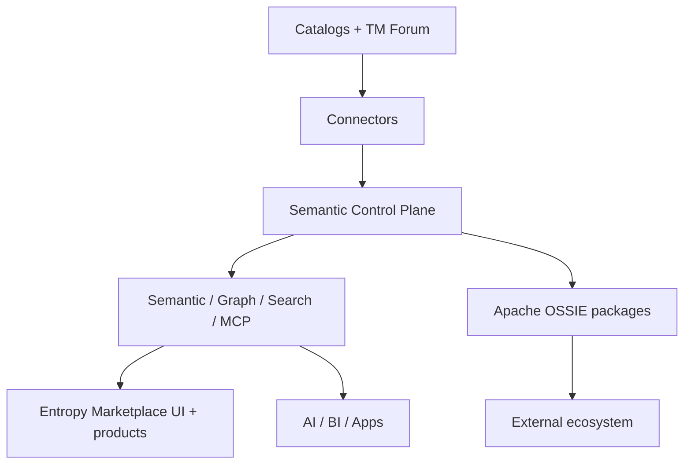

# Enterprise Semantics Plan

## Purpose and outcomes

Deliver enterprise semantics that are:

1. Governed once in the **Semantic Control Plane**
2. Accessible via **headless APIs** (and Marketplace UI)
3. Linked to **data products** (Marketplace SoR)
4. Related to **Business Catalog** information (federated)
5. Linked to the **Technical Catalog** (federated)

**Outcomes:** consistent meaning; reusable mappings; AI-ready context; OSSIE interoperability.

## Scope boundaries

| In scope | Out of scope (v1) |
| --- | --- |
| Control plane components, three crosswalks, APIs, one-domain MVP | Full OWL reasoning, copilots as launch |
| Ossie package exchange | OSSIE as metadata repository |
| Soft→hard product binding gates | Replacing catalogs or Marketplace |
| Headless platform | First-party control-plane UI |

Canonical: [Architecture](05.%20Architecture.md) · [Vision](01.%20Vision.md)

## Target architecture (summary)

| Layer | Role |
| --- | --- |
| **Semantic Control Plane** | SoR for enterprise meaning (registry, namespace, ontology, KG, mapping, federation, governance) |
| **Entropy Marketplace** | UI + SoR for data products; consumes APIs; enriched by mappings |
| **Catalogs** | SoR for business / technical metadata (Collibra / Dataplex) |
| **Apache OSSIE** | Package import / export only |

## Semantic inventory (what to maintain)

| Asset | System of record | Detail |
| --- | --- | --- |
| Business terms (prose) | Collibra / Dataplex | Federated; mapped in |
| Enterprise concepts | Semantic Registry | Identity, URI, lifecycle |
| Namespaces | Namespace Registry | `global`, `natco-*` |
| Ontology / taxonomy | Ontology engine | Hierarchies, classifications |
| Relationships / KG | Knowledge Graph | Typed edges, traversal |
| Crosswalks | Mapping Engine | Business / technical / product |
| Federation edges | Federation Engine | sameAs / extends / specializes / implements |
| Governance metadata | Governance Engine | Approval, audit, policy |
| Data products | Entropy Marketplace | Enriched via product mapping |
| Interchange packages | Apache OSSIE | Versioned export/import |

**Do not maintain as truth:** BI-local measures, dashboard labels, spreadsheet glossaries, pipeline comments.

## Ontology and interchange

| Topic | Decision | Doc |
| --- | --- | --- |
| Meaning SoR | Semantic Control Plane | [Architecture](05.%20Architecture.md) |
| Marketplace UX | Entropy Marketplace (+ [Entropy Semantics](../02.%20Ontology/09.%20Entropy%20Semantics.md) as product-facing semantics UX) | Marketplace integration |
| Interchange | Apache OSSIE packages | [Apache Ossie](../02.%20Ontology/08.%20Apache%20Ossie.md) |
| Product links | Mapping Engine + ODPS/ODCS `authoritativeDefinitions` | [Data Product Mapping](../05.%20Enterprise%20Mapping/03.%20Data%20Product%20Mapping.md) |
| Lifecycle | Governance Engine + release gates | [Ontology Lifecycle](../05.%20Enterprise%20Mapping/04.%20Ontology%20Lifecycle.md) |
| APIs | Semantic, Graph, Search, MCP | [APIs](../07.%20Engineering/01.%20APIs.md) |

## Linkage contracts

| Crosswalk | Rule |
| --- | --- |
| [Business Mapping](../05.%20Enterprise%20Mapping/01.%20Business%20Mapping.md) | Catalog term → enterprise concept |
| [Technical Mapping](../05.%20Enterprise%20Mapping/02.%20Technical%20Mapping.md) | Asset / column → concept (`represents`) |
| [Data Product Mapping](../05.%20Enterprise%20Mapping/03.%20Data%20Product%20Mapping.md) | Product / port / field → concept |

**Product binding:** Global → `global/*` only. NATCO → `global/*` **required** where applicable + `natco-*/*` **optional**. Soft warn → hard gate at maturity 4.

Shared link attributes: `source_id`, `target_uri`, `mapping_type`, `confidence`, `owner`, `status`, `effective_from`, `version`, `namespace`, `natco_code`, `source_system`.

## Operating model

| Body | Responsibility |
| --- | --- |
| Global Semantic Council / COE | TM Forum adoption, global concepts, disputes |
| NATCO stewards | Local catalog quality, NATCO concepts, mappings |
| Catalog platform owners | Collibra / Dataplex connectors |
| Control plane platform team | Registry, APIs, KG, governance workflows |
| Marketplace platform team | Products, UI, consume semantic APIs |

## MVP sequence

See [Roadmap](../09.%20Roadmap.md). Condensed:

1. Stand up control plane spine (registry + namespace + APIs)
2. Import TM Forum into `global/`; stand up one `natco-*`
3. Connectors: business + technical for pilot NATCO
4. Mapping Engine: ≥5 technical + business maps; ≥1 global + ≥1 NATCO product bind
5. Federation edges NATCO→global; Governance approval path
6. Ossie export; Marketplace enrichment via APIs
7. Measure; onboard next NATCO

## Success metrics (pilot)

| Metric | Target |
| --- | --- |
| Concepts with stable URI | 100% of pilot approved concepts |
| Products with concept binding | 100% of new pilot products |
| Technical assets mapped | ≥5 |
| API | Lookup / expand / validate / resolve |
| Ossie | Validated export for `global` + pilot NATCO |

## Locked decisions

1. **Semantic Control Plane** = SoR for enterprise meaning (headless, API-first).
2. **Entropy Marketplace** = UI + SoR for data products; consumes control-plane APIs.
3. Catalogs (Collibra / Dataplex) remain SoR for glossary and technical metadata.
4. **Apache OSSIE** = package exchange only — not a metadata repository.
5. Namespaces: `global` (TM Forum–seeded) + `natco-*`; federation predicates required for alignment.
6. NATCO products bind **`global/*` required** (where applicable) + **`natco-*/*` optional**.
7. KG is part of the control plane for context — not a second meaning SoR.
8. Pilot one NATCO against global before rolling out all NATCOs.

**SoR freeze detail (DA-01):** [Systems of Record Boundaries](08.%20Systems%20of%20Record.md).

## Document index

| Phase | Docs |
| --- | --- |
| Spine | [README](../00.%20README.md), [Vision](01.%20Vision.md), [Architecture](05.%20Architecture.md), [Systems of Record](08.%20Systems%20of%20Record.md), [Namespace Registry](09.%20Namespace%20Registry.md), [TM Forum SID Pilot](10.%20TM%20Forum%20SID%20Pilot%20Slice.md), [Registry Schema](11.%20Semantic%20Registry%20Schema.md), [Canonical Entity Inventory](12.%20Canonical%20Entity%20Inventory.md), [Ontology and Taxonomy](13.%20Ontology%20and%20Taxonomy.md), [Predicate Catalog](14.%20Predicate%20Catalog.md), [Mapping Contracts](15.%20Mapping%20Contracts.md), [Federation Engine Rules](16.%20Federation%20Engine%20Rules.md), [Governance Engine](17.%20Governance%20Engine.md), [KG Logical Model](18.%20Knowledge%20Graph%20Logical%20Model.md), [Ossie Package Contract](19.%20Ossie%20Package%20Contract.md), [Pilot Content Pack](20.%20Pilot%20Content%20Pack.md), [Data Architecture Runbook](21.%20Data%20Architecture%20Runbook.md), [Federation](07.%20Multi-NATCO%20Federation.md), this plan |
| Linkage | [01. Business Mapping](../05.%20Enterprise%20Mapping/01.%20Business%20Mapping.md), [02. Technical Mapping](../05.%20Enterprise%20Mapping/02.%20Technical%20Mapping.md), [03. Data Product Mapping](../05.%20Enterprise%20Mapping/03.%20Data%20Product%20Mapping.md) — contracts frozen in [Mapping Contracts](15.%20Mapping%20Contracts.md) |
| Core | [Concepts](../04.%20Enterprise%20Semantics/02.%20Concepts.md), [Relationships](../04.%20Enterprise%20Semantics/04.%20Semantic%20Relationships.md), [Context](../04.%20Enterprise%20Semantics/07.%20Context%20Model.md), [KG](../03.%20Enterprise%20Knowledge%20Graph/01.%20Knowledge%20Graph.md) |
| Ontology / exchange | [Ontology](../02.%20Ontology/01.%20Ontology.md), [Ossie](../02.%20Ontology/08.%20Apache%20Ossie.md), [Entropy Semantics UX](../02.%20Ontology/09.%20Entropy%20Semantics.md) |
| Mapping | [Business](../05.%20Enterprise%20Mapping/01.%20Business%20Mapping.md), [Technical](../05.%20Enterprise%20Mapping/02.%20Technical%20Mapping.md), [Product](../05.%20Enterprise%20Mapping/03.%20Data%20Product%20Mapping.md), [Lifecycle](../05.%20Enterprise%20Mapping/04.%20Ontology%20Lifecycle.md) |
| Engineering | [APIs](../07.%20Engineering/01.%20APIs.md) |
| MVP | [Roadmap](../09.%20Roadmap.md) |
