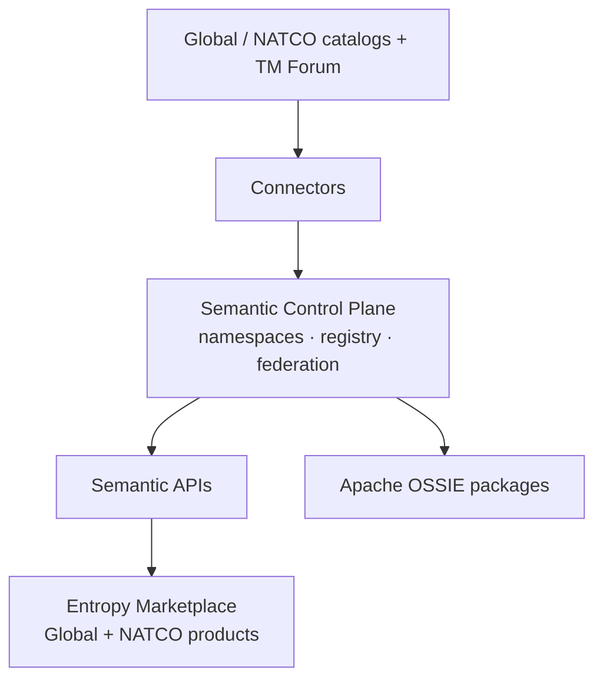

# Multi-NATCO Federation

## Purpose

Define how **Global** and **NATCO** units share meaning and products: catalogs stay federated SoRs; the **Semantic Control Plane** owns enterprise meaning; **Entropy Marketplace** owns products (UI); **Federation Engine** aligns namespaces.

Canonical: [Architecture](05.%20Architecture.md).

## Scope

| In scope | Out of scope |
| --- | --- |
| Namespace hierarchy, federation predicates, product bindings | Legal entity / org-chart design |
| Catalog → control plane contribution | One technical catalog vendor for all NATCOs |
| Marketplace Global / NATCO product layers | Separate marketplace installs per NATCO |

## Operating model

| Unit | Owns | Does not own |
| --- | --- | --- |
| **Global unit** | `global/` concepts, global products, TM Forum import + extensions, cross-NATCO dispute resolution | NATCO-only concepts, local catalog prose |
| **Each NATCO** | Local catalogs, `natco-*/` concepts, local products, local mappings | Breaking changes to global meaning without Global approval |
| **Semantic Control Plane** | Enterprise meaning, KG, mapping/federation/governance engines, APIs | Catalog UI, product lifecycle UI |
| **Entropy Marketplace** | Data products, discovery UI, contracts / ports | Enterprise meaning SoR |

## Platform split



| Concern | Decision |
| --- | --- |
| Meaning SoR | Semantic Control Plane (headless) | Detail: [Systems of Record](08.%20Systems%20of%20Record.md) |
| Product SoR + UI | Entropy Marketplace (central; Global + NATCO layers) | |
| Catalog SoR | Collibra / Dataplex (federated) | |
| Interchange | Apache OSSIE (packages only — not a SoR) | |

## Namespace topology

Canonical model (DA-02): [Namespace Registry](09.%20Namespace%20Registry.md).

```text
Semantic Control Plane — Namespace Registry
 ├── global                 # TM Forum SID + Global extensions
 ├── natco-{iso}            # e.g. natco-de; federates to global/
 └── import-*              # optional staging → promote via Governance

Entropy Marketplace (UI + products)
 ├── Global layer products   → bind global/* only
 └── NATCO layer products   → bind global/* (required) + natco-*/* (optional)
```

## Cross-namespace relationship predicates

Canonical list: [Predicate Catalog](14.%20Predicate%20Catalog.md) § Federation.  
**Engine rules (DA-11):** [Federation Engine Rules](16.%20Federation%20Engine%20Rules.md).

| Predicate | From → To | When |
| --- | --- | --- |
| `sameAs` | NATCO → global | Same meaning; local label only |
| `specializes` / `isA` | NATCO → global | Stricter subtype |
| `implements` | NATCO → global | Local operationalization of abstract global |
| `extends` | NATCO → global | Adds local attributes; keeps global core |
| `relatedTo` | either | Weak link; avoid as default |

NATCO→global edges are **mandatory** for concepts used in cross-NATCO reporting. Purely local concepts may stay NATCO-only (`scope=natco`).

## Product binding policy

| Product | Bindings |
| --- | --- |
| **Global** | `global/*` only |
| **NATCO** | **Required** `global/*` when applicable; **optional** `natco-*/*` |

```text
NATCO_Product
  ├── → global/*      # consistency
  └── → natco-*/*     # local freedom
```

Cross-NATCO consumers resolve **global** bindings first; NATCO bindings are additive.

## Catalogue landscape

| Capability | Tooling | Role |
| --- | --- | --- |
| Business Catalog | Collibra (all NATCOs) | Enrich NATCO concepts via Mapping Engine |
| Technical Catalog | Collibra **or** Dataplex | `represents` → concepts |
| Meaning | Semantic Control Plane | Registry, ontology, KG, federation |
| Products / UI | Entropy Marketplace | ODPS/ODCS; consume APIs |
| Interchange | Apache OSSIE | Package import/export |

### Enrichment flow

1. Term/KPI approved in Collibra  
2. Steward maps to **global** (`sameAs`) **or** creates NATCO concept + federation edge  
3. Mapping Engine stores crosswalk; Registry updated  
4. Marketplace product binds via product mapping / `authoritativeDefinitions`  

### Technical → concepts

| Pattern | Connector |
| --- | --- |
| Collibra technical | Asset/column ID → `represents` → concept IRI |
| Dataplex technical | Entry name/ID → `represents` → concept IRI |

`source_system` = `collibra` \| `dataplex`. See [Technical Mapping](../05.%20Enterprise%20Mapping/02.%20Technical%20Mapping.md).

## Governance

| Body | Responsibility |
| --- | --- |
| Global Semantic Council / COE | TM Forum, global extensions, disputes |
| NATCO stewards | Catalog quality, NATCO namespace, local mappings |
| Catalog owners | Connector SLAs |
| Control plane team | Registry, APIs, federation, governance workflows |
| Marketplace team | Products, UI, binding gates |

## Pilot sequence

1. Stand up `global/`; import TM Forum SID; approve core slice.  
2. Stand up one `natco-*`; enrich Collibra terms; federate to global.  
3. Bind one global + one NATCO product (dual-bind rules).  
4. Map ≥5 technical assets.  
5. Export Ossie; validate API expand across namespaces.  

## Related

- [Federation Engine Rules](16.%20Federation%20Engine%20Rules.md)
- [Governance Engine](17.%20Governance%20Engine.md)
- [Architecture](05.%20Architecture.md)
- [Enterprise Semantics Plan](06.%20Enterprise%20Semantics%20Plan.md)
- [Business Mapping](../05.%20Enterprise%20Mapping/01.%20Business%20Mapping.md)
- [Technical Mapping](../05.%20Enterprise%20Mapping/02.%20Technical%20Mapping.md)
- [Data Product Mapping](../05.%20Enterprise%20Mapping/03.%20Data%20Product%20Mapping.md)
- [APIs](../07.%20Engineering/01.%20APIs.md)
