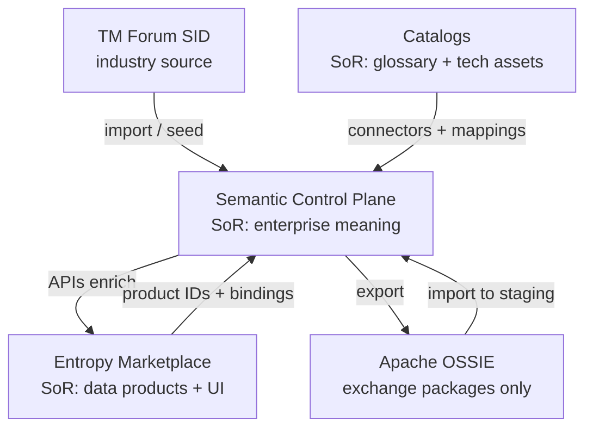

# Systems of Record Boundaries (DA-01)

## Purpose

Freeze **who owns what** for the Enterprise Semantic landscape: **meaning**, **catalogs**, **Marketplace**, and **Apache OSSIE**. This is the Data Architecture sign-off artifact for roadmap task **DA-01**.

Canonical architecture: [Architecture](05.%20Architecture.md).

## Decision (locked)

| # | Decision |
| --- | --- |
| 1 | **Semantic Control Plane** is the only SoR for **enterprise meaning** (concepts, ontology, namespaces, semantic mappings, federation edges, semantic governance). |
| 2 | **Business / Technical Catalogs** (Collibra / Dataplex) remain SoR for **local glossary prose** and **technical asset inventory**. |
| 3 | **Entropy Marketplace** is the only SoR for **data products** (lifecycle, ports, contracts, discovery UI). |
| 4 | **Apache OSSIE** is **not** a SoR — it is a **package exchange** format/store for import/export only. |
| 5 | **TM Forum SID** is the **authoritative industry source** for seeding `global/`; once imported and approved, enterprise meaning is owned by the Control Plane. |
| 6 | The **Knowledge Graph** materializes context; it is **not** a second SoR for concept prose or product definition. |

## SoR matrix (primary)

| Capability / artifact | Semantic Control Plane (meaning) | Catalogs (Collibra / Dataplex) | Entropy Marketplace | Apache OSSIE |
| --- | --- | --- | --- | --- |
| Enterprise concept definition (canonical) | **SoR** | Reference / mapped source | Consumes via API | Package extract only |
| Business term / glossary prose | Mapping target only | **SoR** | May display linked term | May include extract |
| KPI / metric *business* definition in catalog | Mapping target | **SoR** (until certified into Registry) | Display / bind | Package extract |
| Canonical metric *as enterprise concept* | **SoR** (Registry) | Mapped from | Binds via product mapping | Package extract |
| Namespace (`global`, `natco-*`) | **SoR** | — | May mirror labels in UX | Namespace defs in package |
| Ontology / taxonomy structure | **SoR** | — | Browse via UX | Package extract |
| Federation edges (NATCO↔global) | **SoR** | — | — | May export edges |
| Business ↔ concept mapping | **SoR** (Mapping Engine) | Source IDs live in catalog | — | Optional in package |
| Technical asset inventory (tables, columns) | Mapped reference | **SoR** | — | — |
| Technical ↔ concept mapping (`represents`) | **SoR** (Mapping Engine) | Source asset IDs | — | Optional in package |
| Data product identity / lifecycle / ports | Mapping target | — | **SoR** | — |
| ODCS / ODPS contracts | Validates meaning links | — | **SoR** | — |
| Product ↔ concept binding | **SoR** for *meaning side* of link | — | **SoR** for *product side* + `authoritativeDefinitions` storage on product | — |
| Marketplace UI / discovery UX | API provider | — | **SoR** (UI) | — |
| Semantic governance (approve / deprecate concept) | **SoR** | Catalog workflow for *terms* | Soft/hard gates on *products* | Release gate on packages |
| Interchange package (versioned YAML/JSON) | Produces / consumes | — | — | **Exchange artifact** (not SoR) |
| Industry SID content (pre-import) | — | — | — | — (source = **TM Forum**) |
| Industry SID *after* import + approval | **SoR** (as `global/` concepts) | — | — | Re-export allowed |

**Legend:** **SoR** = create / update / delete authority · *Mapped reference* = pointers only · *Exchange artifact* = portable copy, not master.

## SoR matrix (by question)

| Question | Answer | System |
| --- | --- | --- |
| What does “Customer” *mean* enterprise-wide? | Canonical concept URI + definition | **Control Plane** |
| What wording did NATCO-DE approve in the glossary? | Local term prose | **Collibra** |
| Which table column holds customer id? | Asset metadata | **Collibra or Dataplex** |
| Which concept does that column represent? | `represents` mapping | **Control Plane** |
| What is the Customer 360 data product? | Product + ports + contract | **Marketplace** |
| Which concept(s) does that product implement? | Binding / `authoritativeDefinitions` | **Both**: product record in Marketplace; meaning validity in Control Plane |
| How do we share the model with a partner? | Ossie package | **OSSIE exchange** (copy derived from Control Plane) |
| Where do we edit after partner import? | Staging → Governance → Registry | **Control Plane** (never “edit in OSSIE”) |

## Ownership RACI (summary)

| Artifact | Responsible | Accountable | Consulted | Informed |
| --- | --- | --- | --- | --- |
| Enterprise concepts (`global/`) | Data Architecture + Global stewards | Global Semantic Council / COE | NATCO stewards | Marketplace, BI, AI |
| NATCO concepts (`natco-*/`) | NATCO stewards | NATCO Data Office | Global COE (if federated) | Marketplace (local) |
| Catalog terms / assets | Catalog stewards | Catalog owners | Control Plane (mapping) | — |
| Data products | Product owners | Marketplace platform | Control Plane (bindings) | Consumers |
| Ossie packages | Control Plane release | Data Architecture (contract) | Partners / NATCOs | External ecosystem |
| Mappings | Domain stewards | Data Architecture (contract) | Catalog + Product owners | Platform eng |

## Write rules (must / must not)

| Actor | May write | Must not write |
| --- | --- | --- |
| Control Plane APIs / stewards | Concepts, namespaces, ontology, mappings, federation, KG edges, governance status | Catalog term prose as master; product lifecycle fields |
| Catalog users | Glossary / technical metadata in Collibra/Dataplex | Canonical concept IRIs (propose via mapping / change request) |
| Marketplace users | Products, ports, contracts, `authoritativeDefinitions` URLs on products | Concept definition text as master |
| Ossie consumers | Import packages into **staging** | Treat package file as live SoR; bypass Governance |

## Conflict resolution

| Conflict | Winner | Action |
| --- | --- | --- |
| Catalog term wording ≠ concept label | **Concept** (meaning); term keeps local synonym | Mapping `sameAs` / synonym; do not fork concept |
| Two NATCO concepts claim different meaning for same global | **Global concept** | Federation conflict → Global Council |
| Product binding points to deprecated concept | **Control Plane status** | Block hard-gate publish; force rebind |
| Ossie package ≠ Registry | **Registry** | Re-export; quarantine import until reconciled |
| TM Forum update vs local extension | **Versioned deprecate** on Control Plane | `replaced_by`; notify NATCOs |

## Boundary diagram

## Anti-patterns (explicitly forbidden)

1. Using Collibra as the enterprise concept SoR “because terms already exist.”  
2. Duplicating full glossary prose into the Control Plane as master text.  
3. Storing product lifecycle or access grants in the Control Plane.  
4. Treating Ossie object storage / Git packages as the place to edit meaning.  
5. Letting Marketplace UI invent concepts without Registry approval (draft propose → Governance only).  
6. Declaring Knowledge Graph nodes the master definition without Registry URI.

## Sign-off (DA-01 exit)

| Check | Owner | Status |
| --- | --- | --- |
| SoR matrix reviewed | Data Architecture | Ready for review |
| Global Semantic Council / COE agreement | Council / COE | Pending |
| Marketplace platform acknowledges product SoR + API consumer role | Marketplace | Pending |
| Catalog owners acknowledge federated SoR + connector role | Catalog owners | Pending |
| Platform Engineering builds to these boundaries | Platform Eng | Pending |

**Exit criteria (from Roadmap):** Signed off with Global Council / COE → then start **DA-02** ([Namespace Registry](09.%20Namespace%20Registry.md)).

## Related

- [Architecture](05.%20Architecture.md)
- [Enterprise Semantics Plan](06.%20Enterprise%20Semantics%20Plan.md)
- [Multi-NATCO Federation](07.%20Multi-NATCO%20Federation.md)
- [Apache Ossie](../02.%20Ontology/08.%20Apache%20Ossie.md)
- [Data Product Mapping](../05.%20Enterprise%20Mapping/03.%20Data%20Product%20Mapping.md)
- [Roadmap — DA-01](../09.%20Roadmap.md)
