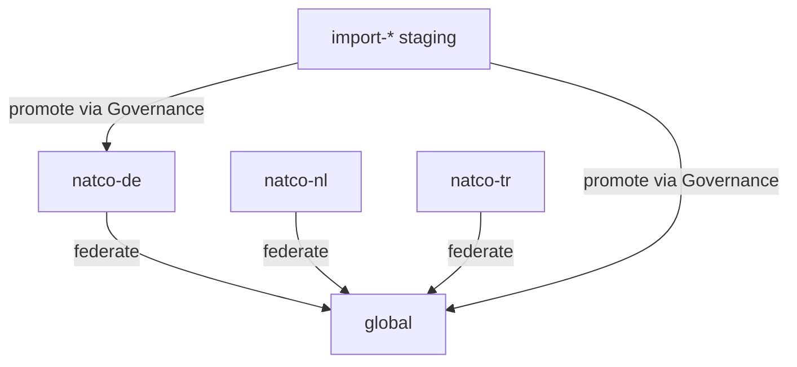

# Namespace Registry Model (DA-02)

## Purpose

Define the **Namespace Registry** in the Semantic Control Plane: hierarchy, identity, ownership, visibility, and lifecycle for `global` and `natco-{code}` namespaces. Data Architecture deliverable for roadmap task **DA-02**.

Depends on: [Systems of Record (DA-01)](08.%20Systems%20of%20Record.md).  
Operating model: [Multi-NATCO Federation](07.%20Multi-NATCO%20Federation.md).

## Decision (locked)

| # | Decision |
| --- | --- |
| 1 | Exactly one **`global`** namespace — enterprise shared meaning (TM Forum–seeded). |
| 2 | One namespace per NATCO: slug **`natco-{code}`** (`code` = lowercase ISO 3166-1 alpha-2, e.g. `natco-de`). |
| 3 | Namespace Registry is SoR for namespace **metadata** (not for concept prose — that is Semantic Registry). |
| 4 | Concepts **must** belong to exactly one namespace; cross-namespace meaning uses **Federation Engine** edges (not copy-paste). |
| 5 | Marketplace layers align to namespaces: Global products ↔ `global`; NATCO products ↔ that NATCO’s namespace (+ required `global` binds). |
| 6 | Optional **`import-*`** namespaces may stage industry/partner packages; they are not production SoR until promoted into `global` or `natco-*`. |

## Hierarchy

```text
Namespace Registry
 ├── global                         # enterprise root (TM Forum SID + Global extensions)
 ├── natco-de                       # Germany
 ├── natco-nl                       # Netherlands
 ├── natco-tr                       # Turkey
 ├── natco-gb                       # United Kingdom
 ├── …                              # one per operating NATCO
 └── import-{source}               # optional staging (e.g. import-tmforum-raw, import-partner-x)
        └── promote → global | natco-*
```



There is **no** parent/child containment of NATCO under `global` in the registry tree — relationship is **federation**, not inheritance of the namespace object itself.

## Slug and identity rules

| Rule | Spec |
| --- | --- |
| Slug pattern | `^[a-z][a-z0-9-]*$` |
| Global | Exact slug: `global` |
| NATCO | `natco-` + ISO 3166-1 alpha-2 lowercase (`natco-de`, not `natco-DE` or `germany`) |
| Import | `import-` + short source token (`import-tmforum`, `import-partner-acme`) |
| Stability | Slug **never changes** after create; rename = new namespace + migrate (discouraged) |
| Display name | Human label separate from slug (e.g. slug `natco-de`, label `Germany`) |
| URI base | `https://semantics.{enterprise}/ns/{slug}/` |
| Concept URI | `https://semantics.{enterprise}/ns/{slug}/{conceptId}` |

## Namespace record schema

| Field | Required | Description |
| --- | --- | --- |
| `namespace_id` | yes | Stable UUID / internal id |
| `slug` | yes | Unique slug (rules above) |
| `kind` | yes | `global` \| `natco` \| `import` |
| `display_name` | yes | UI label |
| `description` | yes | Purpose / scope text |
| `owner_org` | yes | Global unit or NATCO legal/ops code |
| `steward_group` | yes | Group accountable for content quality |
| `natco_code` | if kind=natco | ISO alpha-2 |
| `status` | yes | `planned` \| `active` \| `frozen` \| `retired` |
| `visibility` | yes | See visibility model below |
| `default_locale` | yes | e.g. `en`, `de` |
| `allowed_locales` | yes | Locales permitted for labels/synonyms |
| `bootstrap_source` | no | e.g. `tmforum-sid`, `collibra:{env}` |
| `ossie_package_prefix` | yes | Export package naming prefix |
| `created_at` / `updated_at` | yes | Audit |
| `version` | yes | Monotonic metadata version |

## Ownership

| Kind | Responsible (content) | Accountable | May create namespace | May retire namespace |
| --- | --- | --- | --- | --- |
| `global` | Global stewards + Data Architecture | Global Semantic Council / COE | Platform + COE only | COE only |
| `natco` | NATCO stewards | NATCO Data Office | Platform on NATCO request + COE notify | NATCO + COE |
| `import` | Data Architecture | COE | Data Architecture / Platform | Data Architecture |

### Write rights inside a namespace (concepts)

| Role | `global` | Own `natco-*` | Other `natco-*` | `import-*` |
| --- | --- | --- | --- | --- |
| Global steward / COE | R/W (governed) | R | R | R/W staging |
| NATCO steward | R (approved) | R/W (governed) | R if visibility allows | R if granted |
| Marketplace consumer | R approved | R per policy | R per policy | no |
| Anonymous / broad read | Policy-controlled approved only | Policy | Policy | no |

Breaking change to **approved** `global` concepts requires Governance Engine + NATCO notification SLA (see Federation).

## Visibility model

Visibility controls **who can resolve / browse** namespace content via APIs and Marketplace UX — not who owns write.

| Visibility | Meaning | Typical use |
| --- | --- | --- |
| `enterprise` | All authenticated enterprise principals may read **approved** concepts | `global` default |
| `natco` | Only principals of that NATCO (+ Global COE) | Default for `natco-*` drafts; may widen for approved |
| `restricted` | Named groups only | Sensitive / regulatory slices |
| `staging` | Platform + Data Architecture only | `import-*` |

### Recommended defaults

| Namespace | Default visibility (approved) | Default visibility (draft) |
| --- | --- | --- |
| `global` | `enterprise` | `restricted` (stewards + COE) |
| `natco-*` | `enterprise` for federated concepts; `natco` for `scope=natco`-only | `natco` |
| `import-*` | `staging` | `staging` |

Cross-NATCO consumers **must** prefer `global` bindings; NATCO-local concepts with `visibility=natco` are not used for enterprise-wide reporting.

## Lifecycle

```text
planned → active → frozen → retired
```

| Status | Behavior |
| --- | --- |
| `planned` | Metadata only; no concept publish |
| `active` | Normal authoring + federation + Ossie export |
| `frozen` | Read-only (incident / migration); no new concepts |
| `retired` | No new binds; existing URIs resolve with `deprecated` / redirect policy |

Namespace retirement does **not** delete historical URIs; concepts move to `deprecated` with `replaced_by` where needed.

## Alignment to Marketplace

| Marketplace layer | Namespace(s) for bindings |
| --- | --- |
| Global products | `global` only |
| NATCO products | `global` (**required** when applicable) + own `natco-{code}` (**optional**) |

Namespace Registry does not store products; it constrains **valid binding targets** enforced by Mapping Engine / Marketplace gates.

## Alignment to catalogs and Ossie

| Concern | Rule |
| --- | --- |
| Collibra enrichment | Writes concepts into the NATCO’s `natco-{code}` (or maps to existing `global`) — never invents a parallel namespace slug |
| Ossie export | One package (or package set) per **active** namespace slug |
| Ossie import | Lands in `import-*` or steward-designated staging; promote via Governance into `global` / `natco-*` |

## AuthZ sketch (API)

| Operation | Who |
| --- | --- |
| `GET /namespaces` | Authenticated; filter by visibility |
| `GET /namespaces/{slug}` | Per visibility |
| `POST /namespaces` | Platform admin + COE (global/natco); DA for import |
| `PATCH /namespaces/{slug}` | Owner steward group + COE |
| `POST /namespaces/{slug}/freeze\|retire` | Accountable role only |

Concept CRUD remains on Semantic Registry APIs, scoped by namespace write rights above.

## Pilot bootstrap (content checklist)

| Step | Action |
| --- | --- |
| 1 | Create `global` (`kind=global`, `visibility` defaults above, `bootstrap_source=tmforum-sid`) |
| 2 | Create pilot `natco-{code}` for chosen NATCO |
| 3 | Register steward groups and owner_org |
| 4 | Confirm Marketplace layer ↔ slug mapping |
| 5 | Block any second “enterprise” namespace (no `main`, no `enterprise` slug in v1) |

**v1 reserved / forbidden slugs:** `main`, `default`, `enterprise`, `shared`, `public` — use `global` only for shared meaning.

## Sign-off (DA-02 exit)

| Check | Owner | Status |
| --- | --- | --- |
| Hierarchy + slug rules agreed | Data Architecture | Ready for review |
| Ownership / visibility matrix agreed | Global COE + pilot NATCO | Pending |
| Marketplace binding alignment confirmed | Marketplace | Pending |
| Platform Engineering can implement Registry API fields | Platform Eng | Pending |

**Exit criteria:** Documented model accepted → proceed **DA-03** ([TM Forum SID Pilot Slice](10.%20TM%20Forum%20SID%20Pilot%20Slice.md)) and **DA-04** ([Semantic Registry Schema](11.%20Semantic%20Registry%20Schema.md)).

## Related

- [Systems of Record](08.%20Systems%20of%20Record.md)
- [Multi-NATCO Federation](07.%20Multi-NATCO%20Federation.md)
- [Architecture](05.%20Architecture.md)
- [Concepts](../04.%20Enterprise%20Semantics/02.%20Concepts.md)
- [Apache Ossie](../02.%20Ontology/08.%20Apache%20Ossie.md)
- [Roadmap](../09.%20Roadmap.md)
