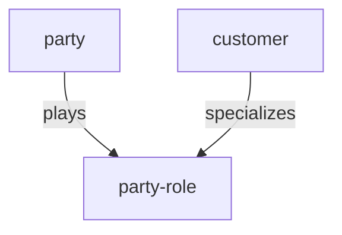
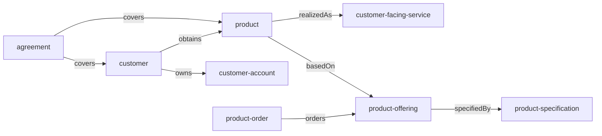

# Ontology and Taxonomy Structure (DA-06)

## Purpose

Define the **pilot ontology and taxonomy** for the Semantic Control Plane: group hierarchy, entity specialization, classification scheme, and how they relate to the [Canonical Entity Inventory (DA-05)](12.%20Canonical%20Entity%20Inventory.md). Data Architecture deliverable for **DA-06**.

Predicates: [Predicate Catalog (DA-07)](14.%20Predicate%20Catalog.md).  
Schema: [Semantic Registry Schema (DA-04)](11.%20Semantic%20Registry%20Schema.md).

## Decision (locked)

| # | Decision |
| --- | --- |
| 1 | Pilot ontology lives in namespace **`global`** only; NATCO ontologies **federate** to it. |
| 2 | **Taxonomy** = navigational `group` hierarchy + optional classification tags — not a second concept SoR. |
| 3 | **Ontology** = entities + properties + typed relationships (predicates from DA-07). |
| 4 | Specialization uses `specializes` / `isA` (Customer → PartyRole); composition uses domain predicates (`owns`, `basedOn`, …). |
| 5 | Classification (PII, etc.) is a **tag/taxonomy facet**, not SID ABE duplication. |

## Taxonomy — subject-area groups

```text
global/
 ├── group-party
 │     ├── party
 │     └── party-role
 ├── group-customer
 │     ├── customer          (also specializes party-role)
 │     ├── customer-account
 │     ├── product-order
 │     └── agreement
 ├── group-product
 │     ├── product-specification
 │     ├── product-offering
 │     └── product
 └── group-service
       └── customer-facing-service
```

| Group | SID domain | Purpose |
| --- | --- | --- |
| `group-party` | Common | Parties and roles |
| `group-customer` | Customer | Commercial relationship & ordering |
| `group-product` | Product | Catalogue and product instances |
| `group-service` | Service | Customer-visible service realization |

Membership edge: Concept ──`memberOf`──> Group (also stored as `group_id` on the concept for convenience).

### Future taxonomy extension (post-pilot)

```text
global/
 ├── group-resource          # deferred
 ├── group-partner           # deferred
 └── group-enterprise        # deferred
```

Do not create empty groups in MVP.

## Ontology — specialization tree



| Child | Predicate | Parent | Notes |
| --- | --- | --- | --- |
| `customer` | `specializes` | `party-role` | SID: Customer is a PartyRole |
| *(none else in pilot)* | | | Keep tree shallow for MVP |

## Ontology — composition / business graph (pilot)



Cardinality (logical):

| Edge | Cardinality |
| --- | --- |
| customer → owns → customer-account | 1:N |
| customer → obtains → product | 1:N |
| product → basedOn → product-offering | N:1 |
| product-offering → specifiedBy → product-specification | N:1 |
| product → realizedAs → customer-facing-service | 1:N |
| product-order → orders → product-offering | N:M (via order items; model N:M at pilot) |
| agreement → covers → customer / product | N:M |

## Classification taxonomy (facets)

Applied via `classification` on concepts/assets or `classifiedAs` edges — **not** separate SID entities in MVP.

| Tag | Meaning | Typical use |
| --- | --- | --- |
| `PII` | Personally identifiable | party, customer, contact-medium |
| `commercial` | Commercial sensitivity | agreement, customer-account |
| `operational` | Runtime / fulfillment | product, customer-facing-service |
| `catalogue` | Sellable definition | product-offering, product-specification |

Pilot recommendation: mark `customer`, `party`, `contact-medium` (when created) with `PII`.

## Property attachment (ontology layer)

| Entity | Shared property refs (from inventory) |
| --- | --- |
| party, party-role, customer, … | `external-identifier` |
| customer-account, product, order, service | `status` |
| product-offering, agreement | `valid-for` |
| party-role, customer | `contact-medium` |

Create Tier B `shared_property` drafts when implementing Registry load (stretch from DA-05).

## What ontology owns vs does not

| Owns | Does not own |
| --- | --- |
| Structure of meaning in `global` | Catalog glossary prose |
| Group taxonomy + specialization | Physical ERD / table design |
| Declared business relationships | Lineage engine graphs (may mirror via KG) |

## Publication

- Approved ontology slice → Ossie package for `global` (after DA-14)  
- Marketplace / APIs read structure via Semantic + Graph APIs  
- NATCO ontologies add local entities only when federated or scoped `natco`

## Sign-off (DA-06 exit)

| Check | Owner | Status |
| --- | --- | --- |
| Group taxonomy + specialization agreed | Data Architecture | **Done** |
| Composition graph matches inventory | Data Architecture | **Done** |
| Stewards accept classification facets | Domain stewards | Pending |
| Aligns with Predicate Catalog | Data Architecture | See DA-07 |

**Exit criteria:** Ontology outline published → use with **DA-07** for edge instances; **DA-13** ([Knowledge Graph Logical Model](18.%20Knowledge%20Graph%20Logical%20Model.md)).

## Related

- [Canonical Entity Inventory](12.%20Canonical%20Entity%20Inventory.md)
- [Predicate Catalog](14.%20Predicate%20Catalog.md)
- [Ontology](../02.%20Ontology/01.%20Ontology.md)
- [Roadmap](../09.%20Roadmap.md)
