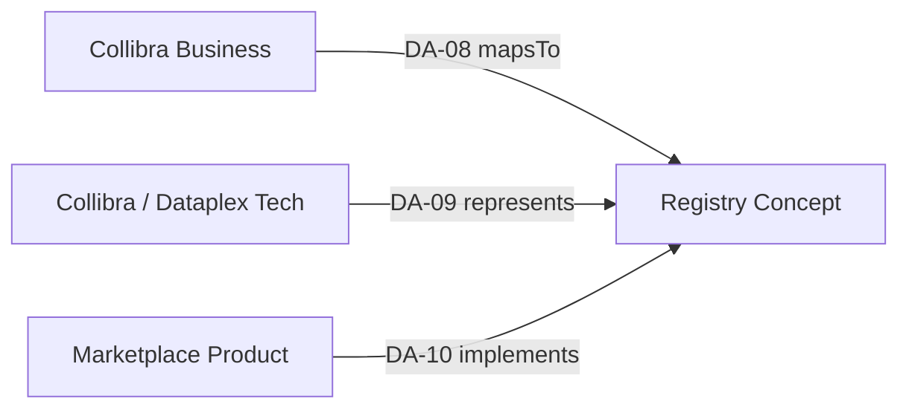

# Mapping Contracts (DA-08 · DA-09 · DA-10)

## Purpose

Freeze the **Mapping Engine contracts** for:

| ID | Contract | Predicate (primary) |
| --- | --- | --- |
| **DA-08** | Business (Collibra → concept) | `mapsTo` |
| **DA-09** | Technical (Collibra/Dataplex → concept) | `represents` |
| **DA-10** | Product (Marketplace → concept) | `implements` (+ ODPS/ODCS `authoritativeDefinitions`) |

Depends on: [Semantic Registry Schema](11.%20Semantic%20Registry%20Schema.md) · [Predicate Catalog](14.%20Predicate%20Catalog.md) · [Systems of Record](08.%20Systems%20of%20Record.md).

Detail docs: [Business Mapping](../05.%20Enterprise%20Mapping/01.%20Business%20Mapping.md) · [Technical Mapping](../05.%20Enterprise%20Mapping/02.%20Technical%20Mapping.md) · [Data Product Mapping](../05.%20Enterprise%20Mapping/03.%20Data%20Product%20Mapping.md).

## Shared rules (all contracts)

| # | Rule |
| --- | --- |
| 1 | `target_uri` must resolve to a Registry concept with `status=approved` for **active** mappings (draft/review allowed only while mapping `status=draft`). |
| 2 | Prefer **`global/*`** targets when meaning is shared; use `natco-*/*` only for local-only meaning. |
| 3 | Mapping Engine is SoR for the **crosswalk record**; source systems remain SoR for source objects. |
| 4 | Shared attributes on every mapping: `mapping_id`, `source_id`, `source_system`, `target_uri`, `target_namespace`, `predicate` / `mapping_type`, `confidence`, `owner`, `status`, `effective_from`, `version`, `natco_code` (or `global`). |
| 5 | Lifecycle: `draft` → `active` → `deprecated` (deprecate + remap on concept deprecation within SLA). |
| 6 | `confidence`: `asserted` (steward) \| `suggested` (machine — not active until promoted). |



---

# DA-08 — Business mapping contract

## Intent

Bind **Collibra** glossary terms / KPIs / business entities to Control Plane concepts; enrich NATCO semantics without forking Collibra prose.

## SoR

| Object | SoR |
| --- | --- |
| Term / KPI prose & approval | Collibra |
| Concept | Semantic Registry |
| Crosswalk | Mapping Engine |

## Schema

| Field | Required | Description |
| --- | --- | --- |
| `mapping_id` | yes | Stable id |
| `source_id` | yes | Collibra term / asset GUID |
| `source_system` | yes | `collibra` |
| `source_type` | yes | `glossary_term` \| `kpi` \| `business_entity` |
| `natco_code` | yes | Owning NATCO (`global` only if Global Collibra term) |
| `predicate` | yes | `mapsTo` |
| `target_uri` | yes | Concept IRI |
| `target_namespace` | yes | `global` \| `natco-{code}` |
| `mapping_type` | yes | `exact` \| `close` \| `broad` \| `narrow` \| `related` |
| `global_link_predicate` | no | If target is NATCO concept: `sameAs` \| `specializes` \| `implements` \| `extends` to global |
| `confidence` | yes | `asserted` \| `suggested` |
| `owner` | yes | NATCO / Global steward |
| `status` | yes | `draft` \| `active` \| `deprecated` |
| `effective_from` | yes | Timestamp |
| `version` | yes | Monotonic |
| `notes` | no | Rationale |

## Cardinality & policy

| Rule | Detail |
| --- | --- |
| Prefer global | Do not invent NATCO twin if `mapsTo` global + synonym suffices |
| Primary link | Each in-scope approved Collibra entry has **exactly one** active `exact` mapping |
| KPI | Map to `kind=metric` concept (prefer `global`) |
| Synonyms | Many Collibra terms may `close`/`related` → one concept |
| Federation | If NATCO concept created, federation edge to global required for cross-NATCO use |

## Pilot examples (templates)

| Collibra term (example) | mapping_type | target_uri |
| --- | --- | --- |
| “Customer” / “Kunde” | `exact` | `…/ns/global/customer` |
| “Customer Account” | `exact` | `…/ns/global/customer-account` |
| “Product” / “Subscription” | `exact` / `close` | `…/ns/global/product` |
| Local-only fee name | `exact` | `…/ns/natco-de/…` (+ federate if needed) |

## Enrichment flow

1. Collibra entry `approved`  
2. Search `global` Tier A inventory  
3. Map `exact` to global **or** create NATCO concept + federation  
4. Activate mapping (`status=active`, `confidence=asserted`)  

---

# DA-09 — Technical mapping contract

## Intent

Annotate **technical assets** (tables, columns, …) with `represents` → concept / property IRIs. Same schema for **Collibra** or **Dataplex** (`source_system` differs).

## SoR

| Object | SoR |
| --- | --- |
| Asset inventory | Collibra **or** Dataplex (per NATCO) |
| Concept | Semantic Registry |
| Crosswalk | Mapping Engine |

## Schema

| Field | Required | Description |
| --- | --- | --- |
| `mapping_id` | yes | Stable id |
| `source_id` | yes | Catalog asset / field id |
| `source_system` | yes | `collibra` \| `dataplex` |
| `source_type` | yes | `dataset` \| `table` \| `column` \| `api_field` \| `pipeline` \| `topic` \| `other` |
| `natco_code` | yes | Owning NATCO |
| `predicate` | yes | `represents` (default) \| `documents` (loose) |
| `target_uri` | yes | Concept or property IRI |
| `target_namespace` | yes | `global` \| `natco-{code}` |
| `mapping_type` | yes | `represents` \| `implements` \| `documents` \| `suggested` |
| `confidence` | yes | `asserted` \| `suggested` |
| `owner` | yes | Technical owner / steward |
| `status` | yes | `draft` \| `active` \| `deprecated` |
| `effective_from` | yes | Timestamp |
| `version` | yes | Monotonic |
| `grain_note` | no | e.g. surrogate key for entity |
| `qualified_name` | no | Human-readable FQN for debug |

## Grain guidance

| Asset | Typical target |
| --- | --- |
| Table / dataset | Entity IRI (prefer `global`) |
| Column / API field | Property IRI (`shared_property` / `inline_property`) |
| Pipeline | Optional `documents` only |

Prefer **column-level** mappings for AI grounding.

## Rules

1. Prefer `global` when asset implements shared meaning.  
2. Active `represents` / `implements` ⇒ target `approved`.  
3. `suggested` cannot become active without steward promotion.  
4. Does **not** replace lineage (`flowsTo` / pipeline edges live elsewhere; may mirror in KG).  
5. On concept deprecation, remap within agreed SLA.

## Connector identity

| System | `source_id` |
| --- | --- |
| Collibra | Stable asset GUID / qualified name |
| Dataplex | Fully qualified entry / resource name |

## Pilot examples (templates)

| Asset (example) | source_type | target |
| --- | --- | --- |
| `cust.customer` table | table | `global/customer` |
| `cust.customer.customer_id` | column | `global/external-identifier` (or customer identity property) |
| `prod.subscription` | table | `global/product` |
| `svc.cfs_instance` | table | `global/customer-facing-service` |

---

# DA-10 — Product mapping contract

## Intent

Bind **Entropy Marketplace** products (and ports/fields) to approved concepts using Mapping Engine records **and** ODPS/ODCS `authoritativeDefinitions`.

## SoR

| Object | SoR |
| --- | --- |
| Product / ports / contracts / UI | Entropy Marketplace |
| Concept | Semantic Registry |
| Binding validity | Mapping Engine + Control Plane status |
| `authoritativeDefinitions` storage | On Marketplace product/contract (product side) |

## Dual-write pattern

1. Product owner sets `authoritativeDefinitions` URLs on product / contract / field.  
2. Mapping Engine stores normalized mapping row(s) for query, gates, and reverse lookup.  
3. Control Plane validates URI + `approved` status.

```yaml
authoritativeDefinitions:
  - type: "semantics"
    url: "https://semantics.{enterprise}/ns/global/customer"
```

## Schema (Mapping Engine row)

| Field | Required | Description |
| --- | --- | --- |
| `mapping_id` | yes | Stable id |
| `source_id` | yes | Marketplace product id (+ optional port / field path) |
| `source_system` | yes | `entropy-marketplace` |
| `source_type` | yes | `data_product` \| `output_port` \| `contract` \| `field` |
| `contract_version` | yes | ODCS / product version |
| `natco_code` | yes | `global` \| NATCO code |
| `predicate` | yes | `implements` \| `exposes` \| `measures` |
| `target_uri` | yes | Concept / metric IRI |
| `target_namespace` | yes | `global` \| `natco-{code}` |
| `link_level` | yes | `product` \| `contract` \| `field` |
| `confidence` | yes | `asserted` \| `suggested` |
| `owner` | yes | Product owner |
| `status` | yes | `draft` \| `active` \| `deprecated` |
| `effective_from` | yes | Timestamp |
| `version` | yes | Binding version |

## Binding policy (locked)

| Product class | Bindings |
| --- | --- |
| **Global** | `global/*` **only** |
| **NATCO** | **Required** `global/*` when a global concept applies; **optional** additional `natco-*/*` |

| Situation | Action |
| --- | --- |
| Global concept exists for the meaning | Always include `global/*` on NATCO product |
| Local enrichment needed | Also link `natco-*/*` (federate that concept to global) |
| Pure local, no global yet | `natco-*/*` only; propose global extension if cross-NATCO |

Cross-NATCO consumers resolve **global** bindings first.

## Gates

| Mode | Behavior |
| --- | --- |
| Soft (until maturity 4) | Warn if no semantics `authoritativeDefinitions`; warn NATCO if global counterpart missing |
| Hard (maturity 4+) | Block certify / active publish without ≥1 approved concept; NATCO must link `global/*` when applicable; metrics products need metric concepts |

## Pilot examples (templates)

### Global product

```yaml
# Product: global-customer-360
authoritativeDefinitions:
  - type: semantics
    url: https://semantics.{enterprise}/ns/global/customer
  - type: semantics
    url: https://semantics.{enterprise}/ns/global/customer-account
```

### NATCO product (dual bind)

```yaml
# Product: natco-de-kunden-360
authoritativeDefinitions:
  - type: semantics
    url: https://semantics.{enterprise}/ns/global/customer        # required
  - type: semantics
    url: https://semantics.{enterprise}/ns/natco-de/kundenkonto  # optional
```

## Reverse lookup

Concept page / API must list all active products/contracts that `implements` / expose it (“which products implement Customer?”).

---

## Sign-off (DA-08 / 09 / 10 exit)

| Check | Owner | Status |
| --- | --- | --- |
| Business schema + prefer-global rules | Data Architecture | **Done** |
| Technical schema + Collibra/Dataplex identity | Data Architecture | **Done** |
| Product dual-bind + gates + dual-write | Data Architecture | **Done** |
| Marketplace accepts gates / authoritativeDefinitions | Marketplace | Pending |
| Catalog owners accept connector field mapping | Catalog owners | Pending |
| Platform can persist Mapping Engine rows | Platform Eng | Pending |

**Exit criteria:** Contracts locked → **DA-15** ([Pilot Content Pack](20.%20Pilot%20Content%20Pack.md)); **DA-11** ([Federation Engine Rules](16.%20Federation%20Engine%20Rules.md)); **DA-17** product bind specs.

## Related

- [Business Mapping](../05.%20Enterprise%20Mapping/01.%20Business%20Mapping.md)
- [Technical Mapping](../05.%20Enterprise%20Mapping/02.%20Technical%20Mapping.md)
- [Data Product Mapping](../05.%20Enterprise%20Mapping/03.%20Data%20Product%20Mapping.md)
- [Predicate Catalog](14.%20Predicate%20Catalog.md)
- [Canonical Entity Inventory](12.%20Canonical%20Entity%20Inventory.md)
- [Multi-NATCO Federation](07.%20Multi-NATCO%20Federation.md)
- [Roadmap](../09.%20Roadmap.md)
