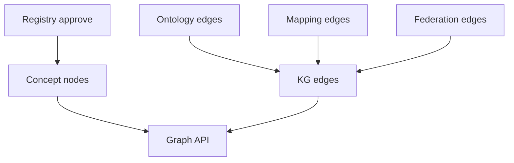

# Knowledge Graph Logical Model (DA-13)

## Purpose

Define the **logical** Knowledge Graph model (node classes, edge catalog, materialization rules, query intents)—not physical Neo4j schema. Data Architecture deliverable for **DA-13**.

Depends on: [Predicate Catalog](14.%20Predicate%20Catalog.md) · [Mapping Contracts](15.%20Mapping%20Contracts.md) · [Ontology and Taxonomy](13.%20Ontology%20and%20Taxonomy.md) · [Systems of Record](08.%20Systems%20of%20Record.md).  
Narrative: [Knowledge Graph](../03.%20Enterprise%20Knowledge%20Graph/01.%20Knowledge%20Graph.md).

## Decision (locked)

| # | Decision |
| --- | --- |
| 1 | KG is a **projection / materialization** of Registry + Mapping + Federation + selected context — **not** a second SoR for concept prose or products. |
| 2 | Every meaning node is keyed by **concept URI** (or external URI for catalog/product stubs). |
| 3 | Only **`approved`** concepts and **`approved`/`active`** edges are materialised for default Graph API consumers. |
| 4 | Physical store (Neo4j) is Platform Engineering; this doc owns the **logical** model only. |
| 5 | Pilot scope = Tier A entities + groups + mapping/federation/ontology edges from DA-05..11. |

## Node classes

| Class | Key | Source of truth | Pilot examples |
| --- | --- | --- | --- |
| `Concept` | concept URI | Semantic Registry | `global/customer`, `global/product` |
| `Group` | concept URI (`kind=group`) | Registry | `global/group-customer` |
| `BusinessTerm` | catalog source_id + system | Collibra (stub node) | Collibra GUID |
| `TechnicalAsset` | catalog source_id + system | Collibra/Dataplex stub | table/column FQN |
| `DataProduct` | Marketplace product id | Marketplace stub | ODPS product id |
| `Metric` | concept URI (`kind=metric`) | Registry | when metrics added |
| `Policy` | policy id | Governance | POL-SEM-* refs |
| `Namespace` | namespace slug | Namespace Registry | `global`, `natco-de` |

### Node properties (logical)

| Property | On | Notes |
| --- | --- | --- |
| `uri` / `id` | all | Primary key |
| `label` | all | Display |
| `namespace` | Concept/Group | Slug |
| `kind` | Concept | entity, group, … |
| `status` | Concept/edges | approved filter |
| `source_system` | Term/Asset/Product | collibra, dataplex, entropy-marketplace |
| `natco_code` | scoped nodes | ISO / global |

## Edge catalog (logical)

Materialise predicates from [Predicate Catalog](14.%20Predicate%20Catalog.md):

| Family | Predicates (pilot) |
| --- | --- |
| Ontology | `memberOf`, `specializes`, `plays`, `owns`, `obtains`, `basedOn`, `specifiedBy`, `realizedAs`, `orders`, `covers`, `hasProperty` |
| Federation | `sameAs`, `specializes`, `implements`, `extends` |
| Mapping | `mapsTo`, `represents`, `implements` (product) |
| Context (optional v1) | `ownedBy`, `partOf`, `governedBy` |

### Edge properties

`predicate`, `status`, `confidence`, `owner`, `version`, `effective_from`, `edge_id`.

## Materialization rules

| Rule | Behavior |
| --- | --- |
| M1 | On `concept.approved` → upsert Concept/Group node |
| M2 | On `concept.deprecated` → mark node deprecated; keep for resolve |
| M3 | On mapping/federation/ontology edge `approved`/`active` → upsert edge |
| M4 | On edge deprecate → soft-delete or status=deprecated (retain history) |
| M5 | Stub BusinessTerm/TechnicalAsset/DataProduct nodes created when first mapped |
| M6 | Do not copy full Collibra/Marketplace payloads — ids + label + link only |
| M7 | Default Graph API depth cap = 3; approved-only unless elevated role |



## Pilot subgraph (expected)

```text
(group-customer)<-memberOf-(customer)-specializes->(party-role)<-plays-(party)
(customer)-owns->(customer-account)
(customer)-obtains->(product)-basedOn->(product-offering)-specifiedBy->(product-specification)
(product)-realizedAs->(customer-facing-service)
(product-order)-orders->(product-offering)
(agreement)-covers->(customer)
(agreement)-covers->(product)

(BusinessTerm)-mapsTo->(customer)
(TechnicalAsset)-represents->(customer)
(DataProduct)-implements->(customer)
(natcoConcept)-sameAs->(customer)   # when pilot NATCO federates
```

## Query intents (Graph API)

| Intent | Pattern |
| --- | --- |
| Products for concept | `(DataProduct)-[:implements]->(Concept)` |
| Assets for concept | `(TechnicalAsset)-[:represents]->(Concept)` |
| Terms for concept | `(BusinessTerm)-[:mapsTo]->(Concept)` |
| Enterprise meaning | Federation resolve then return global Concept |
| Impact of deprecate | Reverse `implements` / `represents` / `mapsTo` / federation |
| Neighbors | Out/in edges depth 1–3 |

Detail: [Graph Queries](../03.%20Enterprise%20Knowledge%20Graph/05.%20Graph%20Queries.md).

## Out of scope (logical model)

- Instance-level MDM (real-world customer instances as graph SoR)  
- Replacing lineage engines (may later ingest `flowsTo` as context)  
- Neo4j indexes, clustering, backups (Platform)  

## Sign-off (DA-13 exit)

| Check | Owner | Status |
| --- | --- | --- |
| Node/edge classes agreed | Data Architecture | **Done** |
| Materialization rules M1–M7 agreed | Data Architecture | **Done** |
| Aligns to Predicate + Mapping contracts | Data Architecture | **Done** |
| Platform can implement projection jobs | Platform Eng | Pending |

**Exit criteria:** Logical model complete → Platform Neo4j mapping; supports Graph API and **DA-16/17** ([Pilot Content Pack](20.%20Pilot%20Content%20Pack.md)) reverse lookup.

## Related

- [Knowledge Graph](../03.%20Enterprise%20Knowledge%20Graph/01.%20Knowledge%20Graph.md)
- [Nodes](../03.%20Enterprise%20Knowledge%20Graph/02.%20Nodes.md)
- [Relationships](../03.%20Enterprise%20Knowledge%20Graph/03.%20Relationships.md)
- [Predicate Catalog](14.%20Predicate%20Catalog.md)
- [Architecture](05.%20Architecture.md)
- [Roadmap](../09.%20Roadmap.md)
