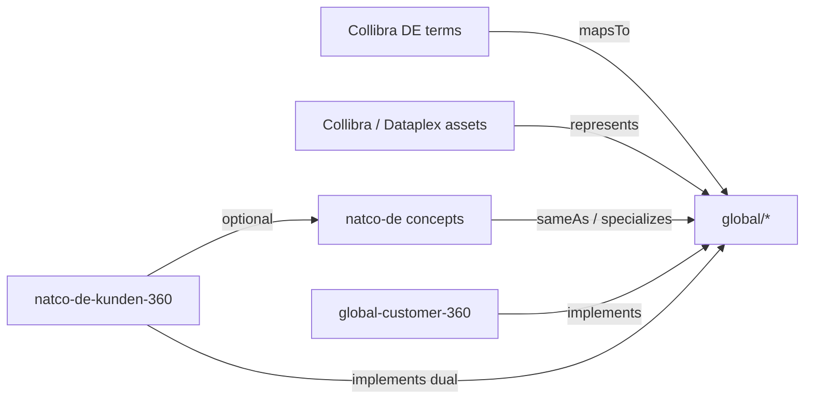

# Pilot Content Pack (DA-15 · DA-16 · DA-17)

## Purpose

Author **load-ready pilot content** for Mapping Engine, Federation Engine, and Marketplace bind specs—without requiring live connectors. Data Architecture deliverable for **DA-15**, **DA-16**, and **DA-17**.

Depends on: [Mapping Contracts](15.%20Mapping%20Contracts.md) · [Federation Engine Rules](16.%20Federation%20Engine%20Rules.md) · [Canonical Entity Inventory](12.%20Canonical%20Entity%20Inventory.md) · [Predicate Catalog](14.%20Predicate%20Catalog.md).

## Decision (locked)

| # | Decision |
| --- | --- |
| 1 | Pilot NATCO = **`natco-de`** (illustrative Germany). Replace Collibra/Dataplex/`source_id` values when connectors land. |
| 2 | All mapping / federation / bind records start as **`status: draft`** until target concepts are **`approved`** (Governance) and stewards assert. |
| 3 | Prefer **`global/*`** targets for shared meaning; NATCO concepts used only when local enrichment is required. |
| 4 | URI base: `https://semantics.{enterprise}/ns/...` — replace `{enterprise}` at implementation. |
| 5 | Placeholder catalog IDs use stable synthetic GUIDs (`col-…`, `dpx-…`, `mkt-…`) so rows remain unique when real IDs swap in. |

## Pilot scope checklist

| ID | Requirement | Count in this pack | Status |
| --- | --- | --- | --- |
| **DA-15** | ≥5 business + ≥5 technical maps | 6 business · 6 technical | **Deliverable ready** |
| **DA-16** | NATCO→global federation edges | 5 edges (+ 1 local-only note) | **Deliverable ready** |
| **DA-17** | ≥1 global + ≥1 NATCO product bind | 1 global · 1 NATCO (dual-bind) | **Deliverable ready** |



---

# DA-15 — Pilot mapping records

> Contracts: [Mapping Contracts § DA-08 / DA-09](15.%20Mapping%20Contracts.md).  
> Load into Mapping Engine when connectors can resolve `source_id`; until then treat as steward templates.

## Business mappings (`mapsTo`) — 6 records

```yaml
# --- biz-01 Customer ---
mapping_id: map-biz-de-customer-001
source_id: col-term-de-customer-001
source_system: collibra
source_type: glossary_term
natco_code: de
predicate: mapsTo
target_uri: https://semantics.{enterprise}/ns/global/customer
target_namespace: global
mapping_type: exact
confidence: asserted
owner: natco-de-customer-steward
status: draft
effective_from: "2026-07-22T00:00:00Z"
version: 1
notes: "Collibra term 'Kunde' / Customer → global customer"

# --- biz-02 Customer Account ---
mapping_id: map-biz-de-customer-account-001
source_id: col-term-de-customer-account-001
source_system: collibra
source_type: glossary_term
natco_code: de
predicate: mapsTo
target_uri: https://semantics.{enterprise}/ns/global/customer-account
target_namespace: global
mapping_type: exact
confidence: asserted
owner: natco-de-customer-steward
status: draft
effective_from: "2026-07-22T00:00:00Z"
version: 1
notes: "Customer Account / Kundenkonto"

# --- biz-03 Product ---
mapping_id: map-biz-de-product-001
source_id: col-term-de-product-001
source_system: collibra
source_type: glossary_term
natco_code: de
predicate: mapsTo
target_uri: https://semantics.{enterprise}/ns/global/product
target_namespace: global
mapping_type: exact
confidence: asserted
owner: natco-de-product-steward
status: draft
effective_from: "2026-07-22T00:00:00Z"
version: 1

# --- biz-04 Product Offering ---
mapping_id: map-biz-de-product-offering-001
source_id: col-term-de-offering-001
source_system: collibra
source_type: glossary_term
natco_code: de
predicate: mapsTo
target_uri: https://semantics.{enterprise}/ns/global/product-offering
target_namespace: global
mapping_type: exact
confidence: asserted
owner: natco-de-product-steward
status: draft
effective_from: "2026-07-22T00:00:00Z"
version: 1

# --- biz-05 CFS ---
mapping_id: map-biz-de-cfs-001
source_id: col-term-de-cfs-001
source_system: collibra
source_type: glossary_term
natco_code: de
predicate: mapsTo
target_uri: https://semantics.{enterprise}/ns/global/customer-facing-service
target_namespace: global
mapping_type: exact
confidence: asserted
owner: natco-de-service-steward
status: draft
effective_from: "2026-07-22T00:00:00Z"
version: 1

# --- biz-06 Subscription (close → Product) ---
mapping_id: map-biz-de-subscription-001
source_id: col-term-de-subscription-001
source_system: collibra
source_type: glossary_term
natco_code: de
predicate: mapsTo
target_uri: https://semantics.{enterprise}/ns/global/product
target_namespace: global
mapping_type: close
confidence: asserted
owner: natco-de-product-steward
status: draft
effective_from: "2026-07-22T00:00:00Z"
version: 1
notes: "Local 'Subscription' treated as close to TM Forum Product instance"
```

## Technical mappings (`represents`) — 6 records

```yaml
# --- tech-01 customer table (Collibra) ---
mapping_id: map-tech-de-cust-table-001
source_id: col-asset-de-cust-customer-001
source_system: collibra
source_type: table
natco_code: de
predicate: represents
target_uri: https://semantics.{enterprise}/ns/global/customer
target_namespace: global
mapping_type: represents
confidence: asserted
owner: natco-de-data-engineering
status: draft
effective_from: "2026-07-22T00:00:00Z"
version: 1
qualified_name: "cust.customer"
grain_note: "One row per customer_id"

# --- tech-02 customer_id column ---
mapping_id: map-tech-de-cust-id-001
source_id: col-asset-de-cust-customer-id-001
source_system: collibra
source_type: column
natco_code: de
predicate: represents
target_uri: https://semantics.{enterprise}/ns/global/customer
target_namespace: global
mapping_type: represents
confidence: asserted
owner: natco-de-data-engineering
status: draft
effective_from: "2026-07-22T00:00:00Z"
version: 1
qualified_name: "cust.customer.customer_id"
grain_note: "Surrogate / business key for Customer"

# --- tech-03 account table ---
mapping_id: map-tech-de-acct-table-001
source_id: col-asset-de-acct-001
source_system: collibra
source_type: table
natco_code: de
predicate: represents
target_uri: https://semantics.{enterprise}/ns/global/customer-account
target_namespace: global
mapping_type: represents
confidence: asserted
owner: natco-de-data-engineering
status: draft
effective_from: "2026-07-22T00:00:00Z"
version: 1
qualified_name: "cust.customer_account"

# --- tech-04 product / subscription (Dataplex) ---
mapping_id: map-tech-de-prod-table-001
source_id: dpx-entry-de-prod-subscription-001
source_system: dataplex
source_type: table
natco_code: de
predicate: represents
target_uri: https://semantics.{enterprise}/ns/global/product
target_namespace: global
mapping_type: represents
confidence: asserted
owner: natco-de-data-engineering
status: draft
effective_from: "2026-07-22T00:00:00Z"
version: 1
qualified_name: "projects/de-lake/datasets/prod/tables/subscription"

# --- tech-05 CFS instance (Dataplex) ---
mapping_id: map-tech-de-cfs-table-001
source_id: dpx-entry-de-svc-cfs-001
source_system: dataplex
source_type: table
natco_code: de
predicate: represents
target_uri: https://semantics.{enterprise}/ns/global/customer-facing-service
target_namespace: global
mapping_type: represents
confidence: asserted
owner: natco-de-service-engineering
status: draft
effective_from: "2026-07-22T00:00:00Z"
version: 1
qualified_name: "projects/de-lake/datasets/svc/tables/cfs_instance"

# --- tech-06 product_order (Collibra) ---
mapping_id: map-tech-de-order-table-001
source_id: col-asset-de-order-001
source_system: collibra
source_type: table
natco_code: de
predicate: represents
target_uri: https://semantics.{enterprise}/ns/global/product-order
target_namespace: global
mapping_type: represents
confidence: asserted
owner: natco-de-data-engineering
status: draft
effective_from: "2026-07-22T00:00:00Z"
version: 1
qualified_name: "ord.product_order"
```

## Activation gate (DA-15)

| Gate | Action |
| --- | --- |
| Concepts `approved` | Promote matching maps `draft` → `active` |
| Real `source_id` | Replace synthetic GUIDs via connector sync |
| Steward sign-off | NATCO DE + Global domain stewards |

---

# DA-16 — Pilot federation edges

> Rules: [Federation Engine Rules](16.%20Federation%20Engine%20Rules.md).  
> NATCO concepts below are **illustrative** drafts for federation demos; prefer mapping Collibra directly to `global` when no local enrichment is needed (F2).

## NATCO concept stubs (for federation demos)

| concept_id | preferred_label | Intent |
| --- | --- | --- |
| `kunden` | Kunden | DE synonym for Customer → `sameAs` global |
| `kundenkonto` | Kundenkonto | Account with DE billing quirks → `extends` |
| `abonement` | Abonnement | Product instance subtype → `specializes` |
| `tarifoption` | Tarifoption | Offering packaging → `implements` |
| `anschluss-dienst` | Anschluss-Dienst | CFS operationalization → `implements` |

```yaml
# --- fed-01 Kunden sameAs Customer ---
edge_id: fed-de-kunden-customer-001
predicate: sameAs
from_uri: https://semantics.{enterprise}/ns/natco-de/kunden
to_uri: https://semantics.{enterprise}/ns/global/customer
from_namespace: natco-de
to_namespace: global
status: draft
owner: natco-de-customer-steward
version: 1
effective_from: "2026-07-22T00:00:00Z"
notes: "Primary reporting edge; label/synonym only"

# --- fed-02 Kundenkonto extends Customer Account ---
edge_id: fed-de-kundenkonto-account-001
predicate: extends
from_uri: https://semantics.{enterprise}/ns/natco-de/kundenkonto
to_uri: https://semantics.{enterprise}/ns/global/customer-account
from_namespace: natco-de
to_namespace: global
status: draft
owner: natco-de-customer-steward
version: 1
effective_from: "2026-07-22T00:00:00Z"
notes: "Adds DE-specific billing cycle attributes; core meaning unchanged"

# --- fed-03 Abonnement specializes Product ---
edge_id: fed-de-abonement-product-001
predicate: specializes
from_uri: https://semantics.{enterprise}/ns/natco-de/abonement
to_uri: https://semantics.{enterprise}/ns/global/product
from_namespace: natco-de
to_namespace: global
status: draft
owner: natco-de-product-steward
version: 1
effective_from: "2026-07-22T00:00:00Z"
notes: "Stricter: active subscription instance only"

# --- fed-04 Tarifoption implements Product Offering ---
edge_id: fed-de-tarifoption-offering-001
predicate: implements
from_uri: https://semantics.{enterprise}/ns/natco-de/tarifoption
to_uri: https://semantics.{enterprise}/ns/global/product-offering
from_namespace: natco-de
to_namespace: global
status: draft
owner: natco-de-product-steward
version: 1
effective_from: "2026-07-22T00:00:00Z"

# --- fed-05 Anschluss-Dienst implements CFS ---
edge_id: fed-de-anschluss-cfs-001
predicate: implements
from_uri: https://semantics.{enterprise}/ns/natco-de/anschluss-dienst
to_uri: https://semantics.{enterprise}/ns/global/customer-facing-service
from_namespace: natco-de
to_namespace: global
status: draft
owner: natco-de-service-steward
version: 1
effective_from: "2026-07-22T00:00:00Z"
```

## Cross-NATCO resolve path (documented)

```text
Consumer asks: "What does Kunden mean for cross-NATCO reporting?"
  1. Resolve URI → natco-de/kunden
  2. Federation Engine: approved sameAs → global/customer
  3. Expand: return global preferred_label, properties, related maps
  4. Product reverse-lookup uses global/customer (not natco URI)
```

| Case | Resolve result |
| --- | --- |
| `sameAs` | Treat as global for metrics / Global Marketplace |
| `specializes` / `implements` / `extends` | Use global as parent; retain NATCO URI for local context |
| No federation + `scope=natco` | Invisible to enterprise-wide consumers |

**Local-only (no federation):** e.g. DE-only fee name concept — omit from this pack; do not bind to cross-NATCO products (F1).

---

# DA-17 — Pilot product binding specs

> Contract: [Mapping Contracts § DA-10](15.%20Mapping%20Contracts.md).  
> Marketplace remains SoR for products; these rows + `authoritativeDefinitions` are the bind contract for owners.

## Global product — `global-customer-360`

```yaml
# Marketplace product (illustrative)
product_id: mkt-global-customer-360
product_name: global-customer-360
layer: global
natco_code: global
contract_version: "1.0.0"

authoritativeDefinitions:
  - type: semantics
    url: https://semantics.{enterprise}/ns/global/customer
  - type: semantics
    url: https://semantics.{enterprise}/ns/global/customer-account

# Mapping Engine rows
mappings:
  - mapping_id: map-prod-global-c360-customer-001
    source_id: mkt-global-customer-360
    source_system: entropy-marketplace
    source_type: data_product
    contract_version: "1.0.0"
    natco_code: global
    predicate: implements
    target_uri: https://semantics.{enterprise}/ns/global/customer
    target_namespace: global
    link_level: product
    confidence: asserted
    owner: global-customer-product-owner
    status: draft
    effective_from: "2026-07-22T00:00:00Z"
    version: 1

  - mapping_id: map-prod-global-c360-account-001
    source_id: mkt-global-customer-360
    source_system: entropy-marketplace
    source_type: data_product
    contract_version: "1.0.0"
    natco_code: global
    predicate: implements
    target_uri: https://semantics.{enterprise}/ns/global/customer-account
    target_namespace: global
    link_level: product
    confidence: asserted
    owner: global-customer-product-owner
    status: draft
    effective_from: "2026-07-22T00:00:00Z"
    version: 1
```

## NATCO product — `natco-de-kunden-360` (dual-bind)

```yaml
product_id: mkt-natco-de-kunden-360
product_name: natco-de-kunden-360
layer: natco
natco_code: de
contract_version: "1.0.0"

authoritativeDefinitions:
  # Required global binds
  - type: semantics
    url: https://semantics.{enterprise}/ns/global/customer
  - type: semantics
    url: https://semantics.{enterprise}/ns/global/customer-account
  # Optional local enrichment
  - type: semantics
    url: https://semantics.{enterprise}/ns/natco-de/kundenkonto

mappings:
  - mapping_id: map-prod-de-k360-customer-001
    source_id: mkt-natco-de-kunden-360
    source_system: entropy-marketplace
    source_type: data_product
    contract_version: "1.0.0"
    natco_code: de
    predicate: implements
    target_uri: https://semantics.{enterprise}/ns/global/customer
    target_namespace: global
    link_level: product
    confidence: asserted
    owner: natco-de-customer-product-owner
    status: draft
    effective_from: "2026-07-22T00:00:00Z"
    version: 1

  - mapping_id: map-prod-de-k360-account-001
    source_id: mkt-natco-de-kunden-360
    source_system: entropy-marketplace
    source_type: data_product
    contract_version: "1.0.0"
    natco_code: de
    predicate: implements
    target_uri: https://semantics.{enterprise}/ns/global/customer-account
    target_namespace: global
    link_level: product
    confidence: asserted
    owner: natco-de-customer-product-owner
    status: draft
    effective_from: "2026-07-22T00:00:00Z"
    version: 1

  - mapping_id: map-prod-de-k360-kundenkonto-001
    source_id: mkt-natco-de-kunden-360
    source_system: entropy-marketplace
    source_type: data_product
    contract_version: "1.0.0"
    natco_code: de
    predicate: implements
    target_uri: https://semantics.{enterprise}/ns/natco-de/kundenkonto
    target_namespace: natco-de
    link_level: product
    confidence: asserted
    owner: natco-de-customer-product-owner
    status: draft
    effective_from: "2026-07-22T00:00:00Z"
    version: 1
    notes: "Requires fed-de-kundenkonto-account-001 approved before hard gate"
```

## Reverse-lookup expectations

| Query | Expected hits (when `active`) |
| --- | --- |
| Products implementing `global/customer` | `global-customer-360`, `natco-de-kunden-360` |
| Products implementing `global/customer-account` | both products above |
| Products implementing `natco-de/kundenkonto` | `natco-de-kunden-360` only |
| Cross-NATCO consumer path | Prefer global URIs; expand federation for NATCO-only binds |

API sketch: `GET /semantics/concepts/{id}/products` → list active `implements` / `exposes` / `measures` mappings.

---

## Sign-off (DA-15 / 16 / 17 exit)

| Check | Owner | Status |
| --- | --- | --- |
| ≥5 biz + ≥5 tech draft maps authored | Data Architecture | **Done** |
| ≥5 NATCO→global federation edges + resolve path | Data Architecture | **Done** |
| ≥1 global + ≥1 NATCO (dual-bind) product specs | Data Architecture | **Done** |
| Stewards assert / promote to `active` | NATCO DE + Global stewards | Pending |
| Real catalog / Marketplace IDs substituted | Integration / Marketplace | Pending |
| Concepts `approved` before hard gates | Governance / COE | Pending |

**Exit criteria:** Content pack ready for Mapping/Federation load → **DA-18** runbook; enables Ossie export after approval ([Ossie Package Contract](19.%20Ossie%20Package%20Contract.md)).

## Related

- [Mapping Contracts](15.%20Mapping%20Contracts.md)
- [Federation Engine Rules](16.%20Federation%20Engine%20Rules.md)
- [Canonical Entity Inventory](12.%20Canonical%20Entity%20Inventory.md)
- [Governance Engine](17.%20Governance%20Engine.md)
- [Data Architecture Runbook](21.%20Data%20Architecture%20Runbook.md)
- [Roadmap](../09.%20Roadmap.md)
