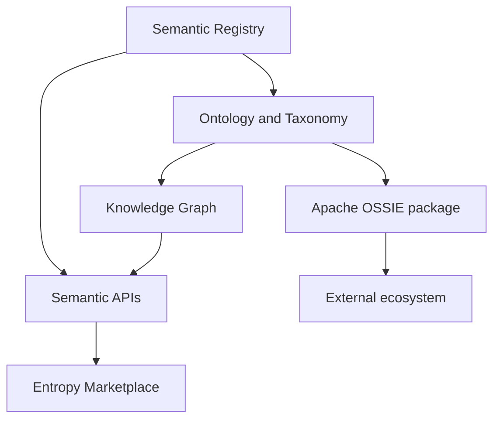

# Ontology

## Purpose

Define **ontology** as the knowledge-modeling capability inside the **Semantic Control Plane**—canonical definitions, taxonomy, and hierarchies that feed the Knowledge Graph and OSSIE packages. Not a second glossary and not a BI semantic layer.

## Scope

| In scope | Out of scope |
| --- | --- |
| Boundaries, publication, interchange | Full enterprise OWL reasoning (v1) |
| Relationship to catalogs, Marketplace, APIs | Industry ontology licensing negotiations |

## Definition

An **enterprise ontology** is the versioned set of concepts, classes, properties, and taxonomies maintained in the control plane (**Ontology & Taxonomy** + **Semantic Registry**), exposed via APIs, and packaged for interchange as **[Apache Ossie](https://github.com/apache/ossie)** artifacts.

## Boundaries

| Artifact | Role | Home |
| --- | --- | --- |
| Business glossary | Human definitions | Collibra / Dataplex (federated) |
| Enterprise concepts | Canonical meaning | **Semantic Control Plane** (Registry) |
| Ontology / taxonomy | Structure and classification | **Control plane Ontology engine** |
| Knowledge Graph | Connected context | **Control plane KG** |
| Data products | Implement meaning | **Entropy Marketplace** |
| Interchange packages | Share models | **Apache OSSIE** (exchange only) |
| Product-facing semantics UX | Browse / bind in UI | **Entropy Marketplace** / [Entropy Semantics](09.%20Entropy%20Semantics.md) |
| BI semantic layer | Tool-local consumption | Analytics (consume APIs / Ossie) |

## Standards (v1)

| Standard | Role |
| --- | --- |
| Control plane Registry + Ontology | Authoring SoR for meaning |
| **Apache Ossie** | Primary open interchange |
| ODCS / ODPS `authoritativeDefinitions` | Product → concept links in Marketplace |
| SKOS / OWL / RDF / SHACL / JSON-LD | Optional formalization / import-export |

## Publication model



1. Curate concepts in Registry / namespaces (`global`, `natco-*`)  
2. Structure via Ontology & Taxonomy; materialize edges in KG  
3. Map products / assets via Mapping Engine  
4. Validate and export Ossie packages  
5. Serve lookup / expand / validate via APIs  

## Namespace / identity

```text
https://semantics.{enterprise}/ns/{namespace}/{conceptId}
https://semantics.{enterprise}/ossie/{namespace}/versions/{ver}
```

Stable IDs never change; status and version carry lifecycle.

## Related

- [Architecture](../01.%20Foundation/05.%20Architecture.md)
- [Apache Ossie](08.%20Apache%20Ossie.md)
- [Entropy Semantics](09.%20Entropy%20Semantics.md)
- [Ontology Lifecycle](../05.%20Enterprise%20Mapping/04.%20Ontology%20Lifecycle.md)
- [APIs](../07.%20Engineering/01.%20APIs.md)
- [Knowledge Graph](../03.%20Enterprise%20Knowledge%20Graph/01.%20Knowledge%20Graph.md)
