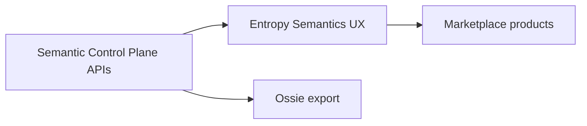

# Entropy Semantics

## Purpose

Document **[Entropy Data Semantics](https://docs.entropy-data.com/concepts/semantics)** as the **Marketplace-facing semantics experience** (namespaces, concepts, diagrams, product bindings)—consuming and presenting meaning owned by the **Semantic Control Plane**.

Demos: [Marketplace](https://demo.entropy-data.com/demo772521358141/marketplace) · [Semantics path](https://demo.entropy-data.com/demo550915228902/semantics/main/customers)

## Platform decision

| Concern | System of record / role |
| --- | --- |
| **Enterprise meaning** | **Semantic Control Plane** (headless) |
| **Data products + UI** | **Entropy Marketplace** |
| **Semantics UX in Marketplace** | Entropy Semantics (namespaces UX, bindings, reverse lookup) |
| **Interchange** | **Apache OSSIE** packages |
| **Product ↔ meaning** | Mapping Engine + ODPS/ODCS `authoritativeDefinitions` |

Architecture: [Architecture](../01.%20Foundation/05.%20Architecture.md).

## How it fits the control plane



- Stewards and product owners **use Marketplace / Entropy Semantics UI**  
- Writes that change enterprise meaning go through **control-plane Governance** (API-backed)  
- Namespaces align to Namespace Registry: `global`, `natco-*`  

## Multi-NATCO namespace model

| Namespace | Owner | Bootstrap |
| --- | --- | --- |
| `global` | Global unit | TM Forum SID + extensions |
| `natco-{code}` | NATCO | Collibra enrichment + federation to global |

Product bindings: Global → `global/*`; NATCO → `global/*` required + `natco-*/*` optional. See [Multi-NATCO Federation](../01.%20Foundation/07.%20Multi-NATCO%20Federation.md).

## authoritativeDefinitions (Marketplace)

```yaml
authoritativeDefinitions:
  - type: "semantics"
    url: "https://…/semantics/global/Customer"
  - type: "semantics"
    url: "https://…/semantics/natco-de/Kundenkonto"   # optional for NATCO
```

Attach at product, contract, or field level. Reverse lookup on concept pages lists implementing products.

## Related

- [Architecture](../01.%20Foundation/05.%20Architecture.md)
- [Ontology](01.%20Ontology.md)
- [Apache Ossie](08.%20Apache%20Ossie.md)
- [Data Product Mapping](../05.%20Enterprise%20Mapping/03.%20Data%20Product%20Mapping.md)
- Docs: [Entropy Semantics](https://docs.entropy-data.com/concepts/semantics)
